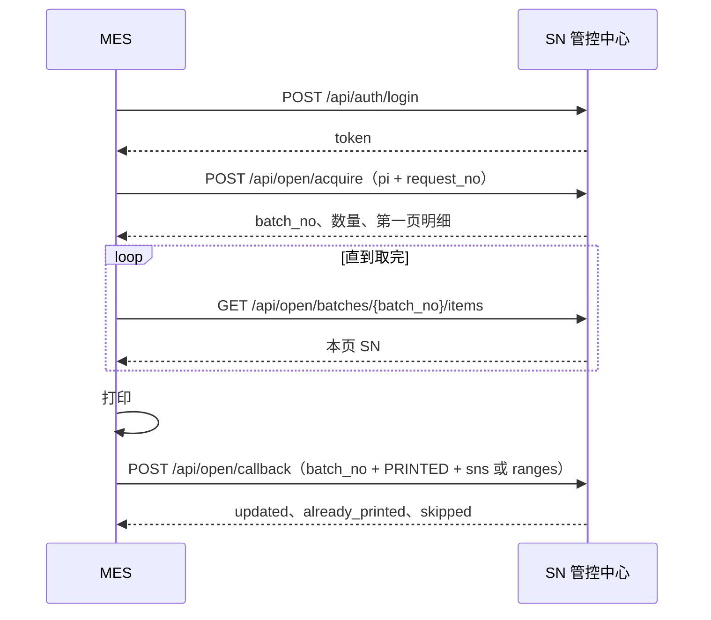

# MES 对接接口文档

> **读者**：工厂 MES、现场打印系统的对接方（被调方：SN 管控中心）　**对应代码**：`app/api/routes/open.py`、`app/api/routes/auth.py`、`app/services/acquire.py`　**更新**：2026-10-09
> **相关**：本文自成一体，对接方只需要本文；在线版见 `/docs` 的 `open` 分组

MES 主动调用本系统。本系统不向 MES 推送，也不回调 MES。号池只在本系统。MES 领取、取明细、打完后回写；生成、分配、转厂留在工作台，不提供给 MES。

页面上的领取、打印和这里的领取、回调改的是同一批号。一边领走之后，另一边就没有待领取的号。

在线说明见发布地址上的 `/docs`，分组 `open`。本文是给对接使用的契约。

---

## 1. 地址与约定

MES 与浏览器走同一台应用宿主机、同一个 Web 端口。Docker 部署时是 nginx 端口（`WEB_PORT`，默认 80），业务进程不直接对 MES 开放；单机方式（`start.py`）是 8000。

| 项 | 约定 |
| --- | --- |
| 基址 | Docker 部署：`http://{主机}:{WEB_PORT}`，默认 `http://{主机}`；单机方式：`http://{主机}:8000` |
| 协议 | HTTP，JSON，UTF-8 |
| 请求头 | `Content-Type: application/json`；登录后加 `Authorization: Bearer {token}` |
| 字段名 | 请求体用 snake_case。查询参数也用 snake_case；驼峰会自动转成下划线（`factoryCode` 等同 `factory_code`） |
| 多余字段 | 请求体里未定义的字段忽略 |
| 时间 | `yyyy-MM-dd HH:mm:ss` |
| 成功 | HTTP 200，响应体就是业务 JSON，没有再包一层 `code` / `data` |
| 失败 | HTTP 状态见错误码表，响应体 `{ "code", "message", "params" }`。`message` 为中文，对接以 `code` 为准 |
| 追踪 | 可带 `X-Request-ID`。未带时服务端生成，并在响应头 `X-Request-ID` 回传 |
| 超时 | Docker 部署时 nginx 读超时 600 秒，单次请求体上限 50 MB |

令牌默认有效 12 小时（`ACCESS_TOKEN_TTL_SECONDS`）。改密、重置密码、停用账户后，旧令牌立即失效。

分页从第 1 页起。`page` 小于 1 按 1 处理。`page_size` 最大 5000，超过按 5000；传 0 或负数按 20。列表形态：

```json
{
  "items": [],
  "total": 0,
  "page": 1,
  "page_size": 1000,
  "total_capped": false
}
```

`total_capped` 为 `true` 时，`total` 只是下限（只读查号计数封顶 10 万），不能当成精确总数翻页。批次明细的 `total` 是精确值，`total_capped` 恒为 `false`。

### 1.1 账户与工厂

MES 使用本系统账户，角色取值如下。

| `role` | 谁 | 领取 `POST /api/open/acquire` | 明细 | 回调 | 只读查号 |
| --- | --- | --- | --- | --- | --- |
| `factory_operator` | 厂区操作员，必须绑定一个工厂 | 只能本厂。`factory_code` 可省略；若传，必须等于本厂 | 只能读本厂批次 | 只能回调本厂批次 | `factory_code` 必须是本厂 |
| `admin` | 总部，不绑定工厂 | 必须传 `factory_code` | 可读任意厂批次 | 按批次号回调，请求体不带工厂 | 可指定任意工厂（不校验是否建档，未建档查不到号） |
| `query` | 查询员 | 拒绝，`403 FORBIDDEN` | 可读。绑了厂则只本厂 | 拒绝，`403 FORBIDDEN` | 绑了厂则只本厂 |

厂区账户操作其他工厂返回 `403 FACTORY_FORBIDDEN`，`params.factory` 是该账户自己的工厂编码。

首次登录或密码被重置后，`user.must_change_pwd` 为 `true`。此时除改密接口外，开放接口都返回 `403 PASSWORD_CHANGE_REQUIRED`。先改密，再用新令牌继续。

密码规则：8–64 位，同时包含字母和数字。

### 1.2 一次发放怎么接上

中间断开时，从断开的那一步继续，不必从头领。

| 顺序 | 调用 | 号的变化 |
| --- | --- | --- |
| 1 | `POST /api/auth/login` | 无。需要改密时先 `POST /api/auth/password` |
| 2 | `POST /api/open/acquire` | 该厂、该 PI 下全部待领取 → 待打印，得到 `batch_no` |
| 3 | `GET /api/open/batches/{batch_no}/items` | 无。按页取完，可反复读 |
| 4 | MES 自己打印 | 无调用 |
| 5 | `POST /api/open/callback` | 本厂、本批、当前待打印、且出现在本次清单里的号 → 已打印 |

领取没有数量参数，不能只领一部分。`page_size` 只决定返回第一页有多少条。回调可以只回写已经打完的那一部分，剩下的待打印以后再回调。

同一工厂、同一 `request_no` 再次领取，返回原批次（`replayed: true`），不再改任何号。超时或断网后用**原来的请求号**重试。



---

## 2. 登录

`POST /api/auth/login`  
无需令牌。页面与 MES 共用。

### 请求

| 字段 | 必填 | 说明 |
| --- | --- | --- |
| `emp_no` | 是 | 工号 |
| `password` | 是 | 密码 |

```json
{
  "emp_no": "op100",
  "password": "Init1234"
}
```

### 成功

```json
{
  "token": "eyJ1aWQiOjIsInB2IjowLCJleHAiOjE3...dG9rZW4",
  "user": {
    "id": 2,
    "emp_no": "op100",
    "name": "甲厂操作员",
    "role": "factory_operator",
    "factory_code": "100",
    "factory_name": "甲厂",
    "status": "ACTIVE",
    "must_change_pwd": false,
    "lang": null,
    "last_login_at": "2026-09-30 14:00:00",
    "created_at": "2026-09-01 09:00:00",
    "created_by": "admin",
    "disabled_at": null,
    "disabled_by": null
  }
}
```

之后每次调用把 `token` 放进 `Authorization: Bearer {token}`。

`must_change_pwd` 为 `true` 时，先改密。改密成功返回的 `token` 替换旧令牌。

### 改密

`POST /api/auth/password`  
需要当前令牌（即使被要求改密，这个接口仍可用）。

| 字段 | 必填 | 说明 |
| --- | --- | --- |
| `old_password` | 是 | 原密码 |
| `new_password` | 是 | 新密码，8–64 位且含字母和数字，且与原密码不同 |

```json
{
  "old_password": "Init1234",
  "new_password": "Mes2026ab"
}
```

成功体与登录相同：`token` + `user`。`must_change_pwd` 变为 `false`。

### 登录会碰到的错误

| HTTP | code | 何时 |
| --- | --- | --- |
| 401 | `LOGIN_FAILED` | 工号或密码错误 |
| 401 | `ACCOUNT_DISABLED` | 账户已停用 |
| 429 | `LOGIN_LOCKED` | 同一工号连续失败达到上限。`params.minutes` 为剩余锁定分钟。默认 5 次失败锁 15 分钟（`SN_LOGIN_MAX_FAILURES`、`SN_LOGIN_LOCK_MINUTES`）。锁定期间密码正确也拒绝 |
| 400 | `USER_PASSWORD_WRONG` | 改密时原密码不对 |
| 400 | `USER_PASSWORD_WEAK` | 新密码不合规则 |
| 400 | `USER_PASSWORD_SAME` | 新密码与原密码相同 |

---

## 3. 按 PI 整批领取

`POST /api/open/acquire`  
角色：`admin`、`factory_operator`。

把**该工厂、该 PI 下全部状态为待领取（`TO_ACQUIRE`）的号**改为待打印（`TO_PRINT`），写入同一个批次号。申请中（`APPLYING`）的号不参与。没有数量、物料、号段参数。

### 请求

| 字段 | 必填 | 说明 |
| --- | --- | --- |
| `pi` | 是 | PI 编号 |
| `request_no` | 是 | 本次领取的请求号，1–64 位。由 MES 生成并持久化。重试用同一个值 |
| `factory_code` | 总部必填，厂区可省略 | 工厂编码，须已在本系统建档。厂区若传递，必须等于本厂 |
| `page_size` | 否 | 响应里第一页明细的条数。省略时 1000，最大 5000。不影响实际领取数量 |

```json
{
  "pi": "ADT260730-0832-1711",
  "request_no": "MES-20260930-0001",
  "page_size": 1000
}
```

总部代厂时加上 `"factory_code": "100"`。

### 成功

```json
{
  "batch": {
    "batch_no": "B202609301407120042",
    "factory_code": "100",
    "pi_no": "ADT260730-0832-1711",
    "request_no": "MES-20260930-0001",
    "source": "API",
    "qty": 200,
    "created_by": "op100",
    "created_at": "2026-09-30 14:07:12",
    "replayed": false
  },
  "items": {
    "items": [
      {
        "id": 90001,
        "gen_month": 202609,
        "sn": "81260908200001",
        "seq_text": "00001",
        "seq_dec": 1,
        "seq_pi_no": "ADT260730-0832-1711",
        "pi_no": "ADT260730-0832-1711",
        "customer_code": "C100",
        "material_code": "MAT-01",
        "factory_code": "100",
        "bill_no": "MO0001",
        "status": "TO_PRINT",
        "source": "GEN",
        "batch_no": "B202609301407120042",
        "print_no": null,
        "created_at": "2026-09-28 10:00:00",
        "allocated_at": "2026-09-28 10:05:00",
        "acquired_at": "2026-09-30 14:07:12",
        "printed_at": null
      }
    ],
    "total": 200,
    "page": 1,
    "page_size": 1000,
    "total_capped": false
  }
}
```

| 字段 | 说明 |
| --- | --- |
| `batch.batch_no` | 批次号。形如 `B` + `yyyyMMddHHmmss` + 4 位数字。之后取明细、回调都用它 |
| `batch.qty` | 本次领取枚数。重放时仍是当初那一次的数量 |
| `batch.replayed` | `false` 表示这次把号改成了待打印。`true` 表示请求号已存在，原样返回，号没有再改 |
| `batch.source` | 经本接口领取为 `API` |
| `items` | 该批次当前仍挂着这个 `batch_no` 的号，第 1 页。排序：流水归属、十进制流水、内部 id |

`total` 大于 `page_size` 时，用第 4 节把后续页取完。打印以明细里的 `sn` 为准。

一枚号的字段：

| 字段 | 说明 |
| --- | --- |
| `sn` | 完整 SN，打标用这个 |
| `seq_text` | 按规则编码后的流水。没有规则或没有十进制流水时为空字符串 |
| `seq_dec` | 十进制流水。历史导入里反解不出的号可能为 `null` |
| `seq_pi_no` | 流水归属 PI。转厂后业务 PI 会变，流水归属不变 |
| `pi_no` | 当前业务 PI |
| `customer_code` / `material_code` / `factory_code` | 客户、物料、当前工厂。物料可空 |
| `bill_no` | 来源生产订单编号 |
| `status` | 见第 7 节 |
| `batch_no` | 领取批次。未领取或转厂确认后清空，为 `null` |
| `print_no` | 页面打印单号。MES 回调不产生打印单，一般为 `null` |
| `source` | 号的来源，如生成 `GEN`、历史导入 `IMPORT` |
| `acquired_at` / `printed_at` | 领取时间、打印回写时间 |

### 幂等

幂等键是 **工厂 + `request_no`**，不是 PI。

| 再次调用 | 结果 |
| --- | --- |
| 同一工厂、同一请求号、同一 PI | HTTP 200，同一 `batch_no`，`replayed: true` |
| 同一工厂、同一请求号、另一张 PI | `409 ACQ_REQUEST_CONFLICT`。`params` 含 `request_no`、`factory`、原 `pi` |
| 新的请求号，该厂该 PI 已没有待领取 | `400 ACQ_NOTHING`。不留下空批次 |
| 两个并发请求撞上同一请求号 | 后到的一方拿到已提交的那一个批次，`replayed: true` |

`request_no` 请在 MES 侧落库。丢失后无法用新请求号找回这一批，只能靠当时返回的 `batch_no` 继续取明细和回调。

### 领取前号必须已经待领取

号要先在工作台生成并分配到该工厂，状态为 `TO_ACQUIRE`。默认还要求这张 PI 仍在生产订单快照里（计划或计划确认，`SN_ACQUIRE_REQUIRE_SNAPSHOT=true`）。快照里没有这张 PI 时返回 `400 ACQ_PI_NOT_IN_ERP`。

---

## 4. 按批次取明细

`GET /api/open/batches/{batch_no}/items`  
已登录即可。厂区、绑厂的查询员只能读本厂批次。

不改变状态。可反复读。转厂确认后离开本批次的号不再出现；申请中的号仍在，`status` 为 `APPLYING`。

### 参数

| 位置 | 字段 | 必填 | 说明 |
| --- | --- | --- | --- |
| 路径 | `batch_no` | 是 | 领取返回的批次号 |
| 查询 | `page` | 否 | 页码，从 1 起，默认 1 |
| 查询 | `page_size` | 否 | 默认 1000，最大 5000 |

```http
GET /api/open/batches/B202609301407120042/items?page=2&page_size=1000
Authorization: Bearer {token}
```

### 成功

响应体就是分页对象，`items[]` 的字段与领取接口第一页相同。`total` 是当前仍属于该批次的枚数，可以小于 `batch.qty`（转走之后）。

建议按 `page` 递增，直到本页条数小于 `page_size`，或已读条数达到 `total`。

批次不存在：`404 ACQ_BATCH_NOT_FOUND`。

---

## 5. 打印回调

`POST /api/open/callback`  
角色：`admin`、`factory_operator`。

MES 打印完成后调用。只把同时满足下面四条的号改为已打印（`PRINTED`）：

1. 属于该批次当前工厂；
2. 属于该 `batch_no`（或号段展开时能定位到该批次）；
3. 当前状态是待打印（`TO_PRINT`）；
4. 出现在本次 `sns` 或 `ranges` 展开的结果里。

请求体没有 `factory_code`。工厂以批次为准。厂区账户只能回调本厂的批次。

### 请求

| 字段 | 必填 | 说明 |
| --- | --- | --- |
| `batch_no` | 是 | 领取批次号 |
| `target_status` | 是 | 只能是 `PRINTED` |
| `sns` | 与 `ranges` 至少一种 | 完整 SN 字符串数组。空串忽略 |
| `ranges` | 与 `sns` 至少一种 | 起止号数组，元素为 `start_sn`、`end_sn` |

两种都传时，按完整 SN 去重后合并。单次最多 `SN_CALLBACK_MAX` 枚，默认 20 万。超出返回 `400 CALLBACK_TOO_MANY`。

清单方式：

```json
{
  "batch_no": "B202609301407120042",
  "target_status": "PRINTED",
  "sns": ["81260908200001", "81260908200002"]
}
```

号段方式（闭区间，起止顺序不分先后）：

```json
{
  "batch_no": "B202609301407120042",
  "target_status": "PRINTED",
  "ranges": [
    { "start_sn": "81260908200001", "end_sn": "81260908200120" }
  ]
}
```

号段按**同一流水归属**（`seq_pi_no`）上、十进制流水闭区间内的号展开，包含仍在本批次的号，以及已经从本批次转出、转厂明细里还记着原批次的号。起止号对不上这个批次，或两端流水归属不同，整次拒绝：`400 CALLBACK_RANGE_INVALID`。区间跨度（较大流水 − 较小流水 + 1）超过单次上限时也整次拒绝，返回 `400 CALLBACK_TOO_MANY`，即使中间有空号。

未出现在本次请求里的待打印号保持待打印，可以再次回调补上。

### 成功

整次请求成功即 HTTP 200。部分号没改，也走这个成功体，逐条放在 `skipped`，不因此返回 4xx。

```json
{
  "batch_no": "B202609301407120042",
  "requested": 121,
  "updated": 120,
  "already_printed": 0,
  "skipped": [
    { "sn": "81260908200121", "reason": "APPLYING" }
  ]
}
```

| 字段 | 说明 |
| --- | --- |
| `requested` | 去重后的请求枚数 |
| `updated` | 本次从待打印改为已打印的枚数 |
| `already_printed` | 本来就是已打印的枚数，不重复改 |
| `skipped[].reason` | `APPLYING` 转厂申请中；`TRANSFERRED` 已从本批次转走；`NOT_IN_BATCH` 不在本批次 |

同一枚已打印的号再次回调：`updated` 为 0，计入 `already_printed`。用这个结果判断补回调是否已经写上，回调本身没有单独的请求号。

工作台页面也能把同一批待打印的号打印并改为已打印，与回调对等，谁先改谁生效：

| 先发生 | 后发生 | 结果 |
| --- | --- | --- |
| 页面打印 | 回调（部分或全部） | 页面已打的号计入 `already_printed`，不再更新；仍待打印的号照常改为已打印 |
| 回调（部分） | 页面打印 | 页面只改剩下的待打印号 |
| 回调（全部） | 页面打印 | 页面不能再改状态，只能导出文件 |

---

## 6. 只读查号

`GET /api/open/sn`  
已登录即可。不改变领取或打印状态，不能代替领取。

### 参数

| 字段 | 必填 | 说明 |
| --- | --- | --- |
| `factory_code` | 是 | 工厂编码。厂区、绑厂查询员只能传本厂 |
| `pi` | 是 | PI。必须传非空值：传空串时不按 PI 过滤，会返回该厂全部号 |
| `customer_code` | 否 | 客户编码。不传则不按客户过滤 |
| `material_code` | 否 | 物料编码。不传或空串则不按物料过滤 |
| `page` / `page_size` | 否 | 默认第 1 页、每页 1000，最大 5000 |

```http
GET /api/open/sn?factory_code=100&pi=ADT260730-0832-1711&page=1&page_size=1000
Authorization: Bearer {token}
```

成功体与批次明细分页相同，`items[]` 字段相同。有 PI 时按物料、流水归属、十进制流水排序。`total` 计数封顶 10 万：达到封顶时 `total` 为 `100000` 且 `total_capped` 为 `true`。

结果里可能包含待分配以外的各种状态（待领取、待打印、已打印、申请中）。尚未分到工厂的号不在厂区可见范围内。

---

## 7. 号的状态

MES 只推动领取和打印这两步。

| status | 含义 | MES 侧 |
| --- | --- | --- |
| `PENDING_ALLOC` | 待分配 | 还不能领。总部尚未分到工厂 |
| `TO_ACQUIRE` | 待领取 | 领取会把它改成待打印 |
| `TO_PRINT` | 待打印 | 回调会把它改成已打印 |
| `PRINTED` | 已打印 | 再次回调计入 `already_printed` |
| `APPLYING` | 转厂申请中 | 领取跳过。回调放进 `skipped`，原因 `APPLYING` |

转厂确认后，号回到转入工厂的 `TO_ACQUIRE`，批次清空，要重新领取、重新打印。这一步在工作台完成，MES 没有转厂接口。

---

## 8. 错误码

失败体：

```json
{
  "code": "ACQ_NOTHING",
  "message": "工厂 100 的 PI ADT260730-0832-1711 没有待领取的号",
  "params": {
    "factory": "100",
    "pi": "ADT260730-0832-1711"
  }
}
```

### 8.1 认证与权限

| HTTP | code | 处理 |
| --- | --- | --- |
| 401 | `UNAUTHENTICATED` | 未带令牌或格式不是 `Bearer {token}`。重新登录 |
| 401 | `TOKEN_INVALID` | 过期、签名不对、改密后的旧令牌。重新登录 |
| 401 | `ACCOUNT_DISABLED` | 账户停用。换可用账户 |
| 403 | `PASSWORD_CHANGE_REQUIRED` | 先 `POST /api/auth/password` |
| 403 | `FORBIDDEN` | 角色不允许。查询员不能领取和回调 |
| 403 | `FACTORY_FORBIDDEN` | 厂区账户碰了其他工厂。`params.factory` 为本厂编码 |
| 429 | `LOGIN_LOCKED` | 等待 `params.minutes` 分钟后再登录 |

### 8.2 领取、明细、回调、查询

| HTTP | code | 处理 |
| --- | --- | --- |
| 400 | `PI_REQUIRED` | 领取未传 `pi` |
| 400 | `ACQ_REQUEST_NO_REQUIRED` | `request_no` 为空或超过 64 位 |
| 400 | `FACTORY_NOT_FOUND` | 工厂未建档，或总部领取未传 `factory_code` |
| 400 | `ACQ_PI_NOT_IN_ERP` | PI 不在计划 / 计划确认的订单快照中 |
| 400 | `ACQ_NOTHING` | 该厂该 PI 没有待领取的号。不要换请求号空转；确认是否已被领走、尚未分配，或整批在申请中 |
| 409 | `ACQ_REQUEST_CONFLICT` | 该请求号已用于同一工厂的另一张 PI。换新的请求号 |
| 404 | `ACQ_BATCH_NOT_FOUND` | 批次号不存在 |
| 400 | `CALLBACK_STATUS_INVALID` | `target_status` 不是 `PRINTED` |
| 400 | `CALLBACK_EMPTY` | `sns` 与 `ranges` 都空 |
| 400 | `CALLBACK_RANGE_INVALID` | 起止号不属于该批次，或两端流水归属不同。`params` 含 `start_sn`、`end_sn`、`batch_no` |
| 400 | `CALLBACK_TOO_MANY` | 去重后枚数或号段跨度超过单次上限。`params.max` 为上限。拆批回调 |
| 422 | `VALIDATION` | 参数类型或长度不合法。`params.detail` 指出位置。修正后再发，原样重试无效 |
| 409 | `CONFLICT_RETRY` | 数据库锁冲突，或服务端连接繁忙。稍后用同一请求（领取用同一 `request_no`）原样重试 |
| 500 | `INTERNAL` | 服务内部错误。保留 `X-Request-ID` 后联系本系统维护人员 |

查询参数缺失（例如只读接口未传 `factory_code` 或 `pi`）返回 `422 VALIDATION`。

---

## 9. 对接时请守住的几点

1. **请求号自己保存。** 领取超时后用同一个 `request_no` 重试。看到 `replayed: true` 就用返回的 `batch_no` 继续取明细，不要再发新的请求号。
2. **批次号自己保存。** 明细和回调只认 `batch_no`。明细可以重复拉，状态以每枚号上的 `status` 为准。
3. **先取完再打，打完再回调。** 取明细不表示已打印。未回调的号停在待打印，工作台仍可对它们做页面打印或转厂。
4. **回调可分段，领取不可分段。** 打了多少回写多少。没回写的保持待打印。已回写的再次提交计入 `already_printed`。
5. **看 `skipped`。** HTTP 200 只表示这次请求被接受。`APPLYING`、`TRANSFERRED` 的号没有变成已打印。
6. **`already_printed` 可能来自页面。** 本次回调的号若 MES 此前没有回调过却计入 `already_printed`，说明工作台页面已先打印，请现场核对标签是否重复。打完一段就尽快回调。
7. **只调本文列出的路径。** `/api/generate`、`/api/acquire`、`/api/transfers` 是工作台接口。
8. **令牌过期重新登录。** 不要把令牌写死。有效期默认 12 小时。
9. **连通检查（可选）。** `GET /health/live` 进程在即可；`GET /health/ready` 含数据库连通。两者都不需要令牌。

### 调用示例

```http
POST /api/auth/login
Content-Type: application/json

{"emp_no":"op100","password":"Mes2026ab"}

POST /api/open/acquire
Authorization: Bearer {token}
Content-Type: application/json

{"pi":"ADT260730-0832-1711","request_no":"MES-20260930-0001","page_size":1000}

GET /api/open/batches/B202609301407120042/items?page=1&page_size=1000
Authorization: Bearer {token}

POST /api/open/callback
Authorization: Bearer {token}
Content-Type: application/json

{"batch_no":"B202609301407120042","target_status":"PRINTED","ranges":[{"start_sn":"81260908200001","end_sn":"81260908200120"}]}
```
