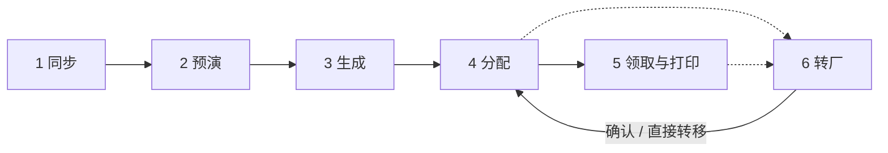
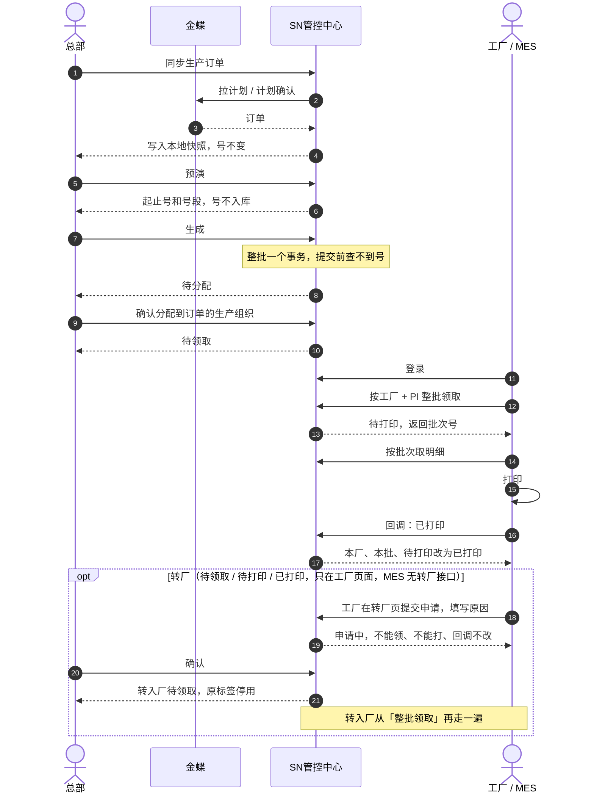

# 多工厂 SN 防重管控 · 关键节点说明

> **读者**：业务方、现场实施、新成员　**更新**：2026-10-08
> **相关**：[需求说明](多工厂SN防重管控-需求说明（修订版）.md)　接口与时序见 [技术文档](技术文档.md)　MES 见 [MES 对接接口文档](MES对接接口文档.md)　[文档导航](README.md)

总部统一生成并分配 SN，工厂按本厂、按 PI 整批领取和打印。同一张 PI 下的 SN 不得重复。本文只讲业务节点；接口、事务与落库见技术文档 §7，部署见运维手册。

每一节都是同一张表：**谁、在哪、进入、做完、下一步**。先看表，再看表下面的短条目。

## 目录

- [先看这张图](#先看这张图)
- [业务时序](#业务时序)
- [生成前的准备](#生成前的准备)
- [1. 订单同步](#1-订单同步)
- [2. 预演](#2-预演)
- [3. 生成](#3-生成)
- [4. 确认分配](#4-确认分配)
- [5. 领取与打印](#5-领取与打印)
- [6. 转厂](#6-转厂)
- [7. 查询与留痕](#7-查询与留痕)

## 先看这张图

主链状态：**待分配 → 待领取 → 待打印 → 已打印**。

转厂申请后临时变为 **申请中**。总部确认或直接转移后，号在转入厂回到 **待领取**。驳回或撤回后，恢复申请前的状态。

状态记在每一枚 SN 上。

| 节点 | 谁 | 做完 |
| --- | --- | --- |
| 1 订单同步 | 总部 | 号不变，本地有订单快照 |
| 2 预演 | 总部 | 算出起止号，号还没入库 |
| 3 生成 | 总部 | **待分配** |
| 4 确认分配 | 总部 | **待领取** |
| 5 领取与打印 | 工厂，或总部代厂；MES 走接口 | **待打印**，打印后 **已打印** |
| 6 转厂 | 工厂申请，总部处理 | **申请中** → 确认后转入厂 **待领取** |
| 7 查询与留痕 | 按角色 | 状态不变 |

## 业务时序

主链按这个顺序走。领取页点「领取 / 打印」时，号的状态变化与 MES 相同。

## 生成前的准备

全公司只部署一套 SN 管控中心，国内总部、国内工厂、越南工厂的浏览器和 MES 都访问这一套，号池在同一个 MySQL 库。

生成之前先备齐下面几件事。前两件缺一件，不能生成；起始号可以不指定。

| 准备 | 谁 | 缺了会怎样 |
| --- | --- | --- |
| 工厂建档 | 总部。金蝶同步组织，或手工建档 | 订单上的生产组织对不上工厂，不能生成 |
| 规则 | 总部。通用 / 按客户 / 按 PI | 没有生效规则，不能生成 |
| 起始号与历史导入 | 总部。每张 PI 在首次生成前指定一次 | 不指定就从当前最大号往后排；指定后这张 PI 不能再改起始号 |

- 规则优先级：**单张 PI ＞ 客户 ＞ 给这张 PI 指定的规则**。通用规则可以有多条；都没有绑定时，由总部从全部通用规则中选一条（默认编码最小的一条），可在生成页「指定给此 PI」，不指定时首次生成自动指定所选规则，之后生成默认用它。指定的规则可以解绑后重新选择（流水接续，之后的号换成新格式）；按客户 / 按 PI 的绑定在规则页修改，改回通用即解绑。改前缀、后缀、进制、位数或字符集，另出一版，只作用于之后的新号。这个版本还没生成过号时，可以就地改。只改名称，不另出版本。位数用尽就停止。
- 起始号必须大于已转入本 PI 的号、按本 PI 规则解析出的流水。可同时导入历史已发出的 SN，导入后状态直接是 **已打印**，参与查重。

---

## 1. 订单同步

把金蝶里「计划 / 计划确认」的生产订单拉到本地。生成前的额度和领取前的 PI 检查，读的是**当前这份**快照。已经写下的号不随同步改写。

| 谁 | 在哪 | 进入 | 做完 | 下一步 |
| --- | --- | --- | --- | --- |
| 总部 | 生产订单页 | 金蝶能登录、能查询 | 号的状态不变 | 下面五项都有 → 预演 |

**两种同步**

| | 全量 | 按单据 |
| --- | --- | --- |
| 范围 | 全部计划 / 计划确认 | 只替换这一个单据编号 |
| 失败时 | 旧快照保持不动 | 这张单的旧行保持不动 |

**快照里有什么**

- 每条物料一行，同一物料多行也不合并。
- 一张订单的可生成数量 = 各物料行数量之和。物料编码为空的行，也计入。
- 一张订单只属于一个厂。同一单据上的客户、PO、PI、生产组织相同。
- 客户编码为空的行留在快照里，订单列表不显示。没有明细的单据不进入快照。

**订单离开「计划 / 计划确认」**

这张单从快照消失。已经生成的号还在，仍按号上的来源单据编号查询。

**再同步一次，后面怎么走**

同步靠页面点击，或由总部开启定时全量同步（间隔 10 分钟到 7 天，与手动全量同步完全相同，操作人记为 system）。不管哪种方式、隔多久再同步，都只换快照，不改已经写下的号。

| 当时走到哪 | 再同步之后 |
| --- | --- |
| 还没预演 | 按新快照算额度。五项仍齐，才能预演 |
| 已预演，还没生成 | 预演默认 30 分钟内还在。点生成时用新快照对数量、物料、PI、工厂；有变就作废。这张单已不在快照里，生成不成立 |
| 已生成，待分配 | 号仍是待分配，物料和来源订单不变，可以分配。额度变大，差额可再生成；额度不够，不再生成，已有的号不删 |
| 已分配，待领取 | 号仍挂在原工厂。这张 PI 还在任意一张计划 / 计划确认的订单上，就可以领；整张 PI 都消失，不能领 |
| 已领取或已打印 | 打印、回调照常做 |

**五项都有，才能预演**

有客户 · 有 PI · 生产组织已建档 · 有生效规则 · 额度 > 0

额度 = 物料行数量之和 − 该单已生成数。少一项，页面提示原因。

---

## 2. 预演

按额度和当前规则，算出这一次的起止号，并按物料行切成连续号段。号此时还不入库。

| 谁 | 在哪 | 进入 | 做完 | 下一步 |
| --- | --- | --- | --- | --- |
| 总部 | 生成与分配页 | 上一节五项都满足 | 给出起止号和号段，记下当时的 PI 最大号 | 生成 |

**页面上填什么**

- 选生产订单，填本次数量。
- 单次上限默认 10000，可以改。后台不设上限。
- 这张 PI 还没锁定起始号时，才填起始号。

**起点怎么定**

取较大的一个，再 +1：

1. 这张 PI 自己的最大号
2. 已转入这张 PI 的号，按本 PI 当前规则解析出的最大流水

解析不出的转入号不参与。预演会注明起点是因为哪个转入号后移的。

同一厂、同一张 PI 出现在多张订单上时，各订单接着同一套流水往下排。

**预演作废，必须重来**

- 改了数量、起始号或所选订单
- 点生成时，这张 PI 的最大号已经变了（期间有人生成过，或又有号转入）

没有这次预演，不能生成。

---

## 3. 生成

按刚刚那次预演，把号写入号池。几十万也是一次生成，最后一起提交。

| 谁 | 在哪 | 进入 | 做完 | 下一步 |
| --- | --- | --- | --- | --- |
| 总部 | 生成与分配页 | 带着本次预演：本人、未用、未过期，数量 / 起始号 / 订单一致 | **待分配**。还没有工厂 | 确认分配 |

**写到哪里**

以 30 万枚为例：1 个任务，插入 300 次，每次 1000 枚，最后一次提交。

| | |
| --- | --- |
| 存在哪 | 每一千条已经发给 MySQL，放在还没提交的事务里。不在程序缓存里；内存只留当前这一千条 |
| 提交前 | 查询、领取、分配都看不到这些号。页面进度每 1000 条跳一次 |
| 提交后 | 整批同时变为待分配。PI 最大号、订单已生成数一起加上 |
| 失败 | 已插入的全部撤销，一枚不留。已生成数不加。碰到与本 PI 已有号相同的 SN，同样整批取消，不跳号 |

| 数字 | 含义 |
| --- | --- |
| 1000 | 每次插入的行数 |
| 5000 | 超过这个数就改到后台跑，页面先返回 |
| 10000 | 页面上的默认填写值，可以改大。后台不设上限 |

**断网、中断**

| 发生了什么 | 库里的号 | 怎么办 |
| --- | --- | --- |
| 浏览器断网、关掉页面 | 服务器继续写。提交成功后，整批待分配 | 重新打开生成页看进度。成功就去分配 |
| 服务停掉、重启，或写库时数据库断开 | 未提交的全部撤销，一枚都没有 | 服务起来后重新预演，再生成 |

服务停掉时，任务可能仍显示正在生成，这张 PI 暂时不能再生成。下次启动把这种任务收成失败，并放开这张 PI。这次预演已经用过，要重新预演。计数器没往前走，起点不变。

**同一张 PI，同时只跑一个**

别人正在生成这张 PI 时，本次提示稍后再试。其他 PI 不受影响。

**号上有什么**

按物料行顺序切段，每枚标上该行物料。物料为空，号上的物料也为空。状态是待分配，工厂先空着。分配之前不能领取。这批号以后转走，仍计入这张订单的已生成数。

---

## 4. 确认分配

把待分配的号，整张订单一次分给该单的生产组织。

| 谁 | 在哪 | 进入 | 做完 | 下一步 |
| --- | --- | --- | --- | --- |
| 总部 | 生成与分配页 | 号属于这张订单，当前是待分配 | **待领取**，挂到该生产组织 | 第 5 步领取。物料不该留在本厂时，先转厂 |

**默认值，不能改厂**

- 数量默认是这次生成的全部
- 工厂默认是订单上的生产组织。改到别的厂，本次不成立

**领取页怎么显示**

按每一枚号上的工厂、PI、物料、当前状态重新拼行。整单分给一个厂，页面仍按物料分行。物料为空时，整单合成一行。

同一厂、同一张 PI 不另发一套新号。这一步之后，号才可以领取，也可以转厂。

---

## 5. 领取与打印

两步：**待领取 → 待打印 → 已打印**。只领取、不打印，号停在待打印。一次领走该厂 + 该 PI 下全部待领取的号。页面和 MES 是同一批号。查询员只能看。

| 谁 | 进入 | 领取之后 | 打印之后 |
| --- | --- | --- | --- |
| 工厂做本厂；总部可代任一厂 | 待领取，且这张 PI 仍在计划 / 计划确认快照里 | **待打印**，带批次号 | **已打印** |

| | 页面 | MES |
| --- | --- | --- |
| 领取 | 领取页点这张 PI | `POST /api/open/acquire` |
| 取出号 | 页面上看号段 | `GET /api/open/batches/{batch_no}/items` |
| 打印 | 再点打印，下载文件 | 自己打印后 `POST /api/open/callback` |

**MES 怎么接**

MES 依次调用：登录 → `POST /api/open/acquire` 领取（待领取 → **待打印**，得到批次号）→ 按批次号翻页取明细 → 自己打印 → `POST /api/open/callback` 回调（本厂 + 本批 + 待打印 → **已打印**）。本系统不调用 MES。字段、幂等、错误码见 [MES 对接接口文档](MES对接接口文档.md)。

**能不能只做一部分**

领取不能。接口没有数量、号段参数，一次领走该厂、该 PI 下全部待领取的号。`page_size` 只决定返回明细每页多少条，不减少领取数量。

打印回写可以。`sns` 或 `ranges` 里有哪些号，就只把哪些改成已打印。没传的仍是待打印，可以再回调补上。

| 领不到 / 回调不动 | 原因 |
| --- | --- |
| 申请中 | 不参与领取；回调原因 `APPLYING` |
| 没有待领取 | 不产生批次 |
| 已在别的批次、待打印 | 不会被再次领走 |
| 不在这批里 | 回调原因 `NOT_IN_BATCH` |
| 已经已打印 | 计入 `already_printed`，不改第二次 |
| 已转走 | 回调原因 `TRANSFERRED` |

**页面与 MES 谁先打印**

页面打印和 MES 回调对等，谁先把待打印改成已打印谁生效，后到的一方不再改状态。MES 在领取时就已拿到整批 SN，页面先打印不影响 MES 取号。

| 先发生 | 后发生 | 结果 |
| --- | --- | --- |
| 页面打印 | MES 回调（部分或全部） | 页面已打的号计入 `already_printed`；仍待打印的号由回调改为已打印 |
| MES 部分回调 | 页面打印 | 只改剩下的待打印号，生成打印单，文件只含这一部分 |
| MES 全部回调 | 页面打印 | 返回 `PRINT_NOTHING`。页面只能在「SN 查询 → 领取批次」导出该批次文件，不改状态 |

批次导出 `GET /api/acquire/batches/{batch_no}/file?format=xlsx|csv`：当前仍属于该批次的号，列同打印文件。MES 回调写成已打印的号没有打印单，从这里取文件。

**断在哪，怎么续**

| 断在哪 | 号现在 | 怎么续 |
| --- | --- | --- |
| 领取没收到响应 | 可能已经是待打印 | 用同一个 `request_no` 再调，拿回原批次 |
| 明细取到一半 | 已是待打印 | 用 `batch_no` 接着翻页 |
| 打印完，回调没发出 | 仍是待打印 | 再发回调 |
| 回调只成功了一部分 | 成功的已是已打印 | 再发回调，已打印的不会改第二次 |

`GET /api/open/sn` 只读，不能代替领取。页面已经领走时，MES 再领没有待领取的号。打印后领取页不再显示这些号。已打印仍可转厂；确认后原标签停用，转入厂重新待领取，再走本节。

---

## 6. 转厂

旁路。只在转厂页，查询页不能转。可以从第 4 步之后进入；确认或直接转移后，回到第 5 步重新领取。

| 谁 | 在哪 | 进入 | 做完 | 下一步 |
| --- | --- | --- | --- | --- |
| 工厂提交本厂申请；总部确认、驳回或直接转移 | 转厂页 | 待领取 / 待打印 / 已打印。来源在同一张 PI 内 | 见下表 | 确认或直接转移后 → 转入厂从第 5 步再领 |

**五种结果**

| 动作 | 谁 | 号变成 |
| --- | --- | --- |
| 申请（必填原因） | 工厂 | **申请中**。不能领、不能打，回调也不改 |
| 确认 | 总部 | 转入厂 **待领取**。清掉原批次和打印单 |
| 驳回 | 总部 | 恢复申请前的状态 |
| 撤回（确认或驳回之前） | 申请厂 | 恢复申请前的状态 |
| 直接转移 | 总部 | 转入厂 **待领取**。不经过申请 |

**一次能转多少**

1. 这张 PI 下当前可转的全部
2. 这张 PI + 一个物料。其他物料不动
3. 这张 PI 下的某一枚

同一枚号同时只能有一张未完成的申请。待分配、申请中的号不能转。

**转到哪里**

生产组织、客户、PI、物料。可从订单快照选，也可手填。

| 项 | 要求 |
| --- | --- |
| 生产组织 | 必须是系统里已有的工厂 |
| PI | 必填 |
| 客户、物料 | 留空则沿用原值 |
| 手填 | 不与金蝶核对，记录里标为手工填写 |

**号本身**

- SN 字符串不变。流水仍归属原 PI，不占转入 PI 的流水。
- 转入 PI 里已有相同 SN：整次拒绝，并给出重复数量和示例。
- 会让转入 PI 的下一个号后移：只提示，不拒绝。
- 转出厂在转厂记录里仍能看到，标为已转出。
- 转走的号仍算在来源订单的已生成数里。

确认之后，查询、领取、打印都按新的工厂、客户、PI、物料。原标签由现场停用。

---

## 7. 查询与留痕

不改变号的状态。只读拉取也不能代替领取。

| 谁 | 在哪 | 进入 | 做完 | 下一步 |
| --- | --- | --- | --- | --- |
| 总部看全部；厂区默认看本厂；查询员按是否绑厂 | SN 查询页、操作痕迹页；MES 可只读拉取 | 已登录，且在自己的可见范围里 | 状态不变 | 无。要改状态走前面的节点 |

**能看见的范围**

| 角色 | 范围 |
| --- | --- |
| 总部 | 全部工厂 |
| 厂区操作员 | 默认本厂。可只读切换，看同一张 PI 下各厂已分配的号 |
| 查询员（绑厂） | 本厂 |
| 查询员（不绑厂） | 跨厂只读 |
| 尚未分配的号 | 只有总部和不绑厂的查询员能看到；厂区、绑厂查询员看不到（厂区切换「同 PI 各厂」只读时也不含） |

筛选：工厂、客户、PI、物料、状态、SN、来源订单、批次。可以导出。

MES 按工厂 + PI 只读拉取，物料可以不传。

**留痕里有什么**

账户、规则、生成、分配、领取、打印、回调、转厂，被拒绝的操作也记。

每条都有：操作人、时间、来源（页面或接口）、PI、工厂、号段或数量、前后状态。有批次号、请求号或原因时一并记下。

页面上的领取和打印，与接口领取、回调，记在同一类痕迹里。
