# 多工厂 SN 防重管控 · 技术文档

> **读者**：开发　**对应代码**：`app/`、`frontend/src/`、`tests/`　**更新**：2026-10-08
> **相关**：[需求说明](多工厂SN防重管控-需求说明（修订版）.md)　[数据库表设计](数据库表设计.md)　[MES 对接接口文档](MES对接接口文档.md)　[运维手册](运维手册.md)　[文档导航](README.md)

## 1. 概述

总部统一生成并分配 SN，具备全部操作权限，也可以代工厂领取、打印；工厂按本厂数量领取、打印；**同一张 PI 下的 SN 不得重复**。

本文从开发角度说明代码结构、权限、状态机、关键时序、接口清单和需求落地方式。总体设计与非功能设计见 [系统技术方案](系统技术方案.md)。

## 2. 技术栈与架构

| 层 | 选型 |
| --- | --- |
| 前端 | Vue 3 + TypeScript + Vite + Element Plus + Pinia + vue-router + vue-i18n（简中 / English / Tiếng Việt） |
| 后端 | Python 3.12、FastAPI + Uvicorn、PyMySQL（手写 SQL + 连接池，事务按 REQUIRED / REQUIRES_NEW 语义）、structlog |
| 数据库 | MySQL 8.0（InnoDB，utf8mb4），版本化建表脚本（Flyway 兼容的 `flyway_schema_history`） |
| 导出 | openpyxl 只写模式（xlsx）/ CSV（UTF-8 BOM，流式） |
| 外部系统 | 金蝶 K3 Cloud WebAPI（LoginByAppSecret、ExecuteBillQuery、View） |
| 接口文档 | FastAPI OpenAPI（`/docs`，对外接口在 `open` 分组；`/redoc` 只在单端口方式可用，nginx / Vite 未代理） |

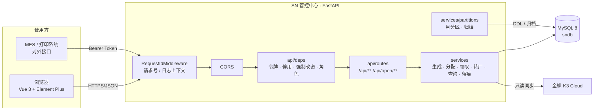

部署形态（单端口 / Docker Compose / 前后端分离开发）见 [运维手册](运维手册.md)。

## 3. 代码结构

```
app/
  main.py        应用装配：中间件、CORS、错误处理（含失败留痕）、单端口托管前端、启动任务
  api/           deps.py（鉴权依赖、分页、下载）、routes/（auth、users、factories、orders、rules、generate、
                 acquire、open、transfers、sn、audits、dashboard、health）
  core/          config（.env / 环境变量）、envfile、errors（ErrorCode + 中文模板）、exceptions（BizError）、
                 encoding（进制编码）、security（PBKDF2、HMAC 令牌、当前操作人）、logging、scheduler、utils
  db/            mysql.py（连接池与事务）、session.py、migrate.py（Flyway 兼容）、migration/V1__init.sql
  middleware/    request_id.py
  models/        表清单
  schemas/       请求体（pydantic）
  services/      users、factories、k3、orders、rules、sn_items（号段切分）、generate、pi_init、acquire、transfers、
                 query、audit、audit_query、dashboard、partitions、files（CSV / XLSX）、demo_seed
tests/           pytest：单元测试 + 集成测试（真实 MySQL + 假金蝶）
frontend/src/
  api/ stores/ router/ layouts/ components/ composables/ views/ locales/（由 scripts/gen_locales.py 生成）
```

## 4. 角色与权限

| 能力 | 系统管理员（总部，不绑厂） | 厂区操作员（必须绑厂） | 查询员（不绑厂） | 查询员（绑厂） |
| --- | --- | --- | --- | --- |
| 账户：创建 / 修改 / 停用 / 启用 / 重置密码 | ✔ | | | |
| 工厂：金蝶同步 / 手工建档 | ✔ | | | |
| 生产订单快照：查看（左表、物料行、客户列表） | ✔ 全部 | | ✔ 全部 | ✔ 本厂（他厂订单的物料行返回 `FACTORY_FORBIDDEN`） |
| 生产订单快照：同步 | ✔ | | | |
| 定时全量同步：查看设置 / 修改设置 | ✔ / ✔ | | ✔ / | ✔ / |
| 规则模板维护 | ✔ | | | |
| 起始号与历史导入 | ✔ | | | |
| 生成、分配 | ✔ | | | |
| 领取页：查看 | ✔ 任一厂 / 全部 | ✔ 本厂；可切换只读看同 PI 各厂 | ✔ 全部（只读） | ✔ 本厂（只读） |
| 领取、打印（页面） | ✔ 代任一厂 | ✔ 本厂 | | |
| 对外接口：领取 / 回调 | ✔ 领取需指定工厂，回调以批次为准 | ✔ 本厂 | | |
| 转厂：提交申请、撤回本厂申请 | | ✔ 本厂 | | |
| 转厂：确认、驳回、直接转移 | ✔ | | | |
| 转厂页、转厂记录：查看 | ✔ | ✔ 转出 / 转入本厂 | ✔（只读） | ✔ 本厂（只读） |
| SN 查询 / 导出 | ✔ 全部 | ✔ 本厂；只读看同 PI 各厂（未分配的号不在范围） | ✔ 全部 | ✔ 本厂 |
| 操作痕迹 | ✔ 全部 | ✔ 本厂 + 转入本厂的转厂 | ✔ 全部 | ✔ 本厂 + 转入本厂的转厂 |

工厂不能自己生成 SN、不能代其他厂领取或打印、不能在查询界面里把号转走（查询接口只读，转厂只在转厂页）。

## 5. SN 状态机

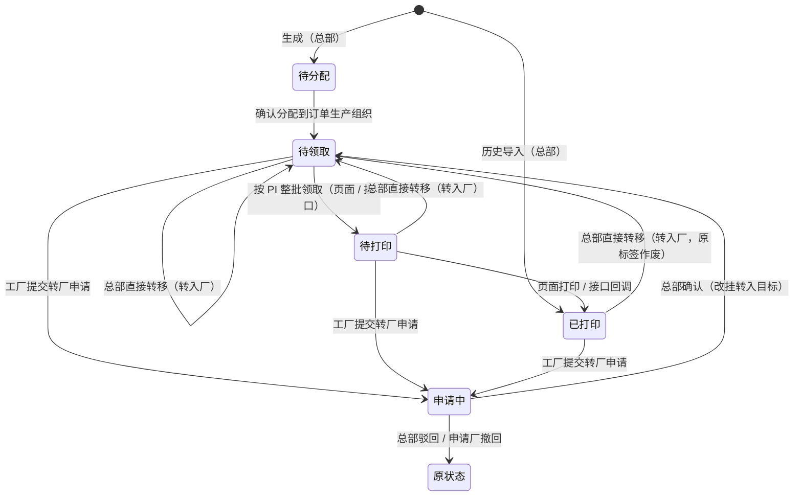

- 待分配、申请中的号不能转移；申请中的号不参与领取，回调也不改动它们；
- 同一枚号同时只能有一张未完成的转厂申请（申请中即不可再被选入）；
- 转出厂在转厂记录中仍能查到这些号，标「已转出」。

## 6. 业务总流程

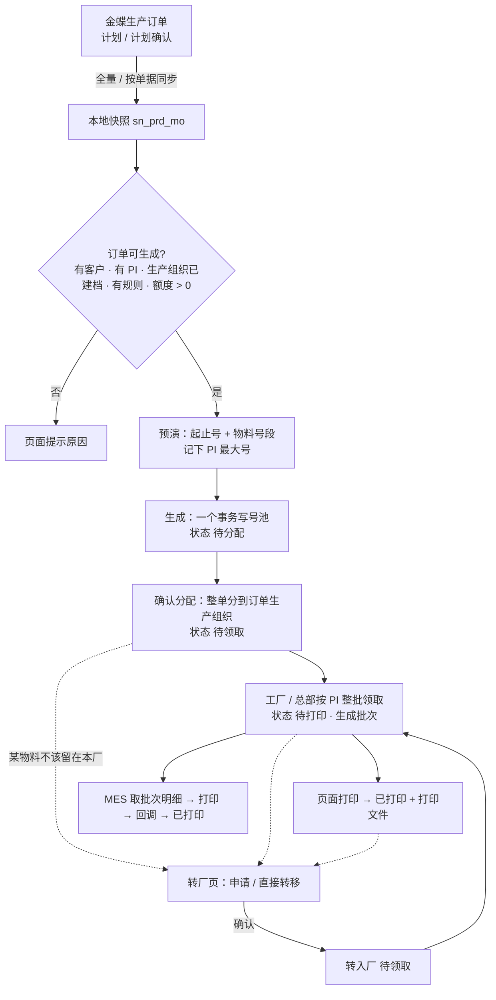

## 7. 关键时序

### 7.1 登录与首次改密

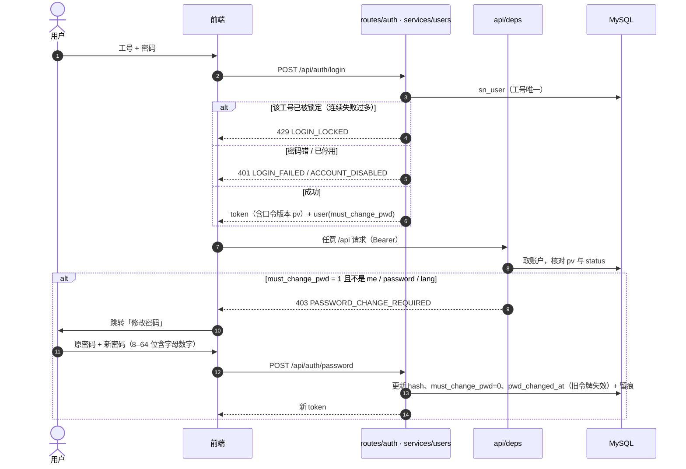

### 7.2 金蝶生产订单同步

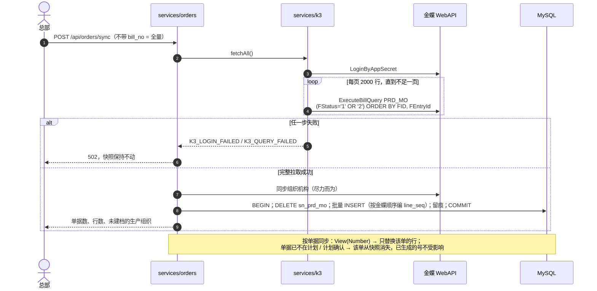

**定时全量同步**（`services/order_sync_schedule`）：设置存在 `sn_order_sync_schedule`（只有 id = 1 一行：开关、间隔分钟、下次执行、最近一次结果）。进程启动后有一个后台线程每 30 秒调一次 `run_due()`：

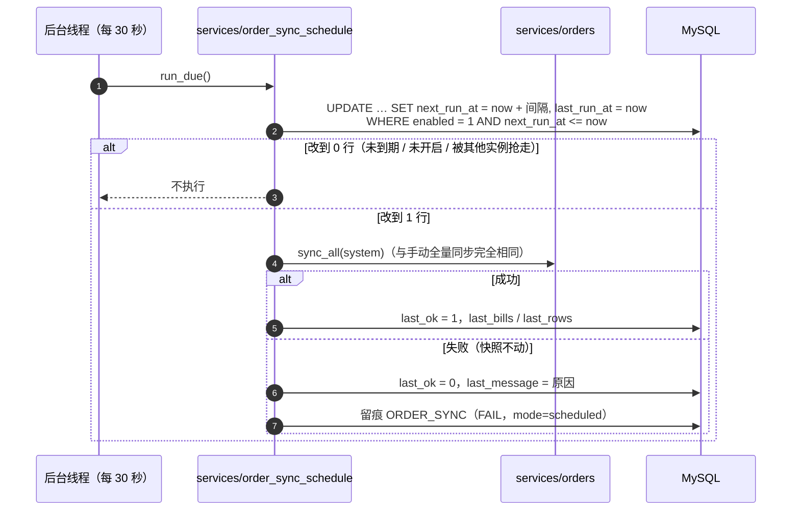

- 抢这一次靠条件 UPDATE：多实例部署时同一周期只有一个实例执行。
- 开启、或改了间隔时，下次执行 = 保存时刻 + 间隔；关闭时 `next_run_at` 置空。间隔 10 分钟–7 天，越界 `ORDER_SYNC_INTERVAL_INVALID`。
- 修改设置留痕 `ORDER_SYNC_SCHEDULE`（前后值写在 detail）。

**金蝶调用细节**（`app/services/k3.py`）：地址 `K3_SERVER_URL`，`httpx` 直连、不走系统代理。每次调用先 `LoginByAppSecret`（账套、用户名、AppId、AppSecret、LCID 默认 2052；`LoginResultType = 1` 才继续），把 `KDSVCSessionId` 写成 Cookie `kdservice-sessionid`。请求体是金蝶 WebAPI 信封：`format=1`、`parameters`、`timestamp`、`v=1.0`。

| 金蝶服务 | 本系统入口 | 说明 |
| --- | --- | --- |
| `ExecuteBillQuery`，表单 `PRD_MO` | `POST /api/orders/sync` 不带单据号、定时全量同步 | 过滤 `FStatus='1' OR FStatus='2'`，按 `FID, FTreeEntity_FEntryId` 排序，每页 2000 行直到不足一页；任一页失败整次失败 |
| `View`，表单 `PRD_MO` | `POST /api/orders/sync` 带 `bill_no` | 只替换这张单；`MsgCode = 10`（找不到）视为已离开计划 / 计划确认，从快照删除，已生成的号不删 |
| `ExecuteBillQuery`，表单 `ORG_Organizations` | `POST /api/factories/sync`；全量订单同步时顺带一次 | 未禁用组织（`FForbidStatus='A'`）写入 `sn_factory`（`source=K3`），只取一页 2000 行；全量订单同步里这一步失败只记警告 |

生产订单字段（`FieldKeys`）：`F_ora_kh.FNumber, FBillNo, F_HX_PO, F_HX_PI, FMaterialId.FNumber, FMaterialId.FName, FQty, FStatus, FSaleOrderNo, FPrdOrgId.FName`，落到 `sn_prd_mo` 的客户、单据、PO、PI、物料、数量、状态、需求单据号、生产组织名称，不存金蝶内码。超时：登录 30 秒、查询 120 秒、View 60 秒（`K3_LOGIN_TIMEOUT` / `K3_QUERY_TIMEOUT` / `K3_VIEW_TIMEOUT`）。错误：登录失败 502 `K3_LOGIN_FAILED`，查询失败 502 `K3_QUERY_FAILED`，缺配置 503 `K3_CONFIG_MISSING`；本地快照 / 工厂表均不动。

### 7.3 预演与生成

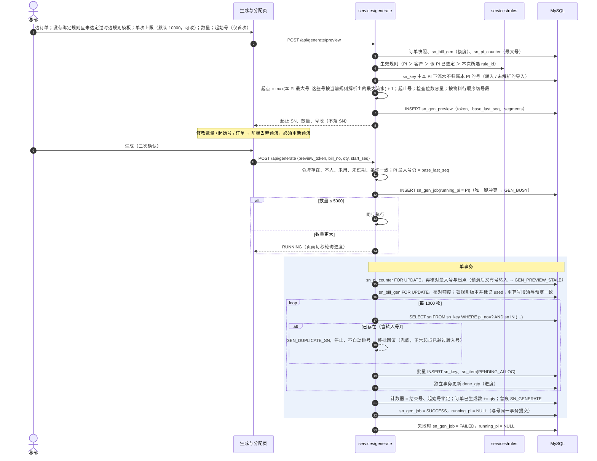

生成事务锁住计数器后会再读一次任务状态：任务已不是 `RUNNING`（被下文的启动回收标为失败）就放弃，不写任何号。

**中断任务回收**：后台任务运行中进程退出（容器重启、`stop.bat`、崩溃）时，未提交的生成事务随连接回滚，但任务行会停在 `RUNNING` 并占住 `running_pi`，这张 PI 之后一直报 `GEN_BUSY`。因此应用每次启动（建表之后）执行 `generate.recover_interrupted()`：对每个 `RUNNING` 任务，用 `FOR UPDATE NOWAIT` 依次锁任务行和该 PI 的计数器行。拿不到锁说明生成事务仍在进行（例如在另一实例上），跳过；拿到锁就把任务标为 `FAILED`（`error_code = INTERRUPTED`）并释放 `running_pi`，这些任务一枚号也没有写入。多实例部署时，一个实例重启可能把另一实例上还在排队、尚未开始的任务也标为失败，这些任务不会再执行，重新预演后生成即可，不会产生重号。

### 7.4 确认分配

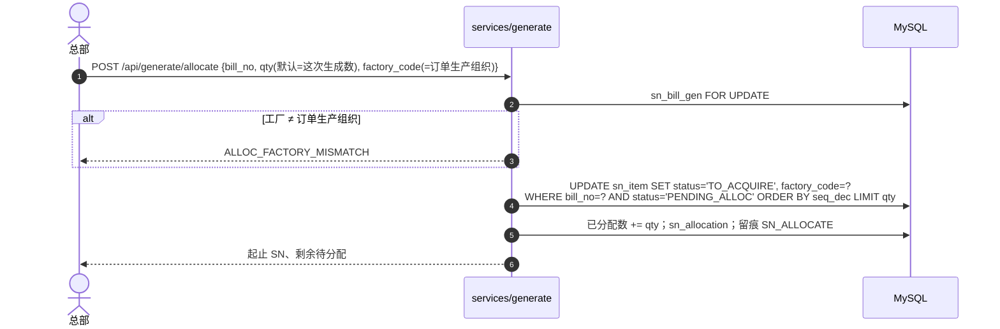

### 7.5 领取页：按 PI 领取与打印

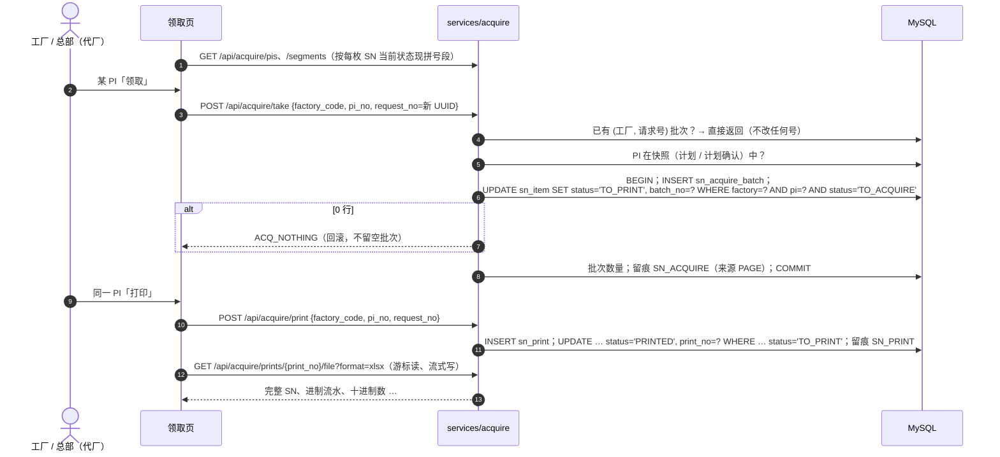

### 7.6 对外接口：领取（幂等）、批次明细、回调

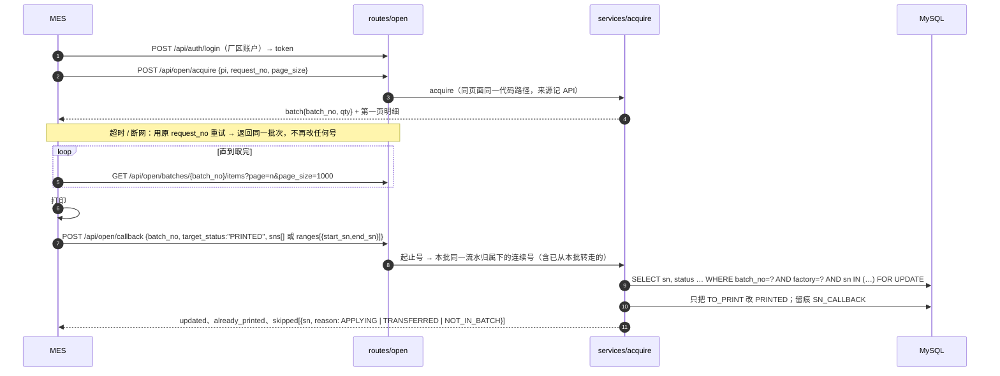

### 7.7 转厂：申请 → 确认 / 驳回 / 撤回；总部直接转移

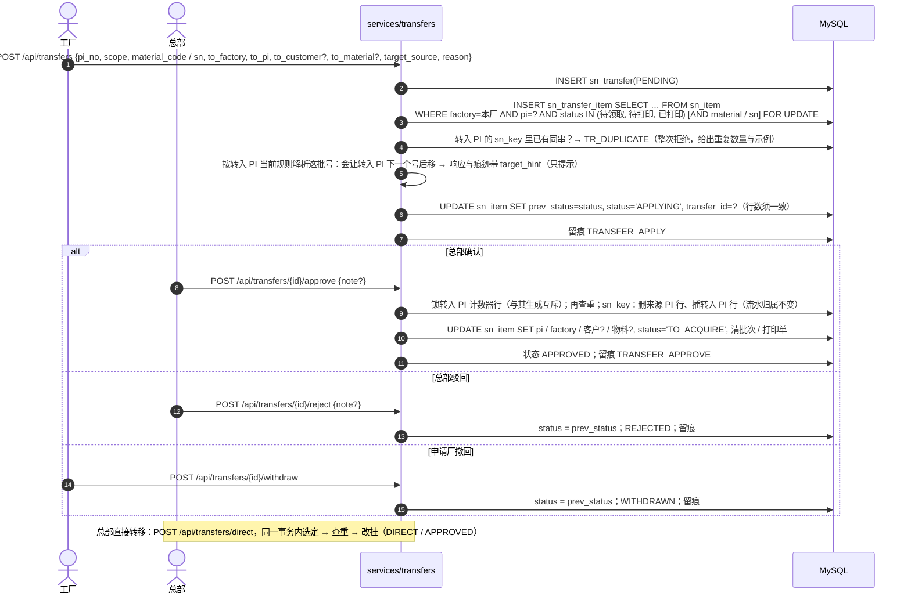

### 7.8 起始号与历史导入

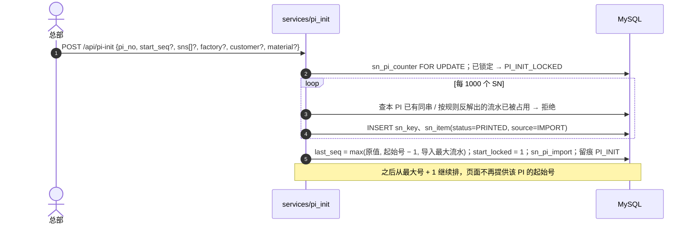

### 7.9 分区维护与痕迹归档

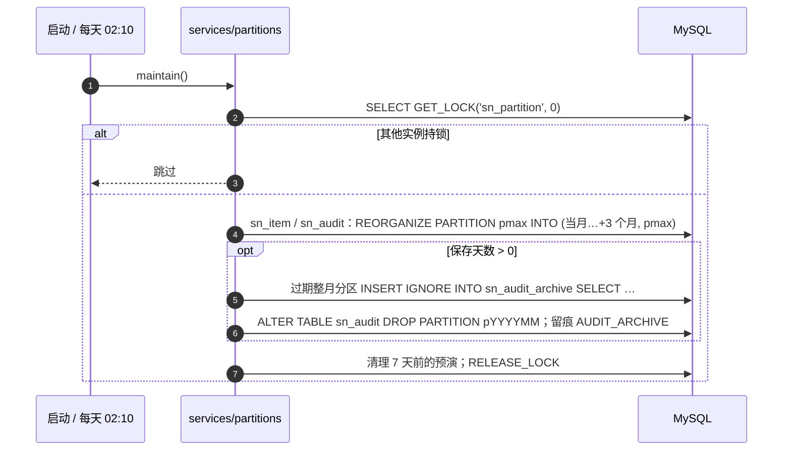

## 8. 接口清单

统一约定：JSON 与查询参数都用 **snake_case**；时间 `yyyy-MM-dd HH:mm:ss`；列表返回 `{items, total, page, page_size, total_capped}`；错误返回 `{code, message, params}`（`message` 为中文，前端按 `code` 显示当前语言）。除登录与健康检查外都需要 `Authorization: Bearer <token>`。

| 分组 | 方法 路径 | 说明 | 角色 |
| --- | --- | --- | --- |
| 认证 | POST `/api/auth/login` | 登录 | 公开 |
| | GET `/api/auth/me` · POST `/api/auth/password` · PUT `/api/auth/lang` | 当前账户 / 改密 / 语言 | 登录 |
| 账户 | GET/POST `/api/users`，PUT `/api/users/{id}`，POST `/{id}/disable|enable|reset-password` | 账户管理 | 管理员 |
| 工厂 | GET `/api/factories`；POST `/api/factories/sync`、POST `/api/factories` | 列表 / 金蝶同步 / 手工建档 | 查看：登录；写：管理员 |
| 订单 | GET `/api/orders`、`/api/orders/meta`、`/api/orders/{bill_no}/lines`、`/api/orders/customers` | 快照；`/api/orders` 的 `q` 匹配单据 / PI / PO / 物料 / 客户，`pending=1` 只要还有额度或待分配的单据 | 管理员、查询员 |
| | GET `/api/orders/pis?customer=&q=&pending=&limit=` | 生成页 PI 下拉：按 PI 汇总单据数、可生成、待分配，最近下单在前（默认 50，最多 200） | 管理员、查询员 |
| | POST `/api/orders/sync` `{bill_no?}` | 全量 / 按单据同步 | 管理员 |
| | GET `/api/orders/sync-schedule` · PUT `{enabled, interval_minutes?}` | 定时全量同步：查看 / 修改（间隔 10–10080 分钟） | 查看：管理员、查询员；修改：管理员 |
| 规则 | GET/POST `/api/rules`，PUT `/api/rules/{id}`，POST `/api/rules/preview` | 维护（返回 RENAMED / UPDATED / NEW_VERSION） | 管理员 |
| | GET `/api/rules/effective?pi=` | PI 当前生效规则 | 登录 |
| 生成 | GET `/api/generate/context?bill_no=` | 订单、额度、「工厂 + PI」汇总、规则、计数器、任务 | 管理员 |
| | POST `/api/generate/preview`、POST `/api/generate` | 预演 / 凭令牌生成 | 管理员 |
| | GET `/api/generate/jobs`、`/jobs/{id}` | 任务与进度 | 管理员 |
| | POST `/api/generate/allocate`、GET `/api/generate/allocations` | 分配 | 管理员 |
| | GET/POST `/api/pi-init` | 起始号与历史导入 | 管理员 |
| 领取页 | GET `/api/acquire/pis`、`/segments`、`/batches`、`/batches/{no}/items`、`/prints`、`/prints/{no}/file` | 查看 / 下载 | 登录（按范围） |
| | POST `/api/acquire/take`、`/api/acquire/print` | 按 PI 领取 / 打印 | 管理员、厂区操作员 |
| **对外** | POST `/api/open/acquire` | 按 PI 整批领取（请求号幂等） | 管理员（需指定工厂）、厂区操作员 |
| | GET `/api/open/batches/{batch_no}/items` | 批次明细（分页，可反复读） | 同上 + 查询员（只读） |
| | POST `/api/open/callback` | 打印回调 | 管理员、厂区操作员 |
| | GET `/api/open/sn?factory_code&customer_code&pi&material_code` | 只读拉取 | 登录（按范围） |
| 转厂 | GET `/api/transfers`、`/{id}`、`/{id}/items`、`/candidates`、`/targets` | 记录（待确认的附转入后起点提示）/ 明细 / 范围预览（传 `to_pi` 时附重复号与起点提示）/ 快照目标 | 登录（按范围） |
| | POST `/api/transfers` · POST `/{id}/withdraw` | 申请 / 撤回 | 厂区操作员 |
| | POST `/api/transfers/direct` · POST `/{id}/approve|reject` | 直接转移 / 确认 / 驳回 | 管理员 |
| 查询 | GET `/api/sn`、`/api/sn/export` | SN 查询（`pi_all=true` 厂区只读看同 PI 各厂）/ 导出 | 登录（按范围） |
| 留痕 | GET `/api/audits`、`/api/audits/export`、`/api/audits/meta` | 痕迹 | 登录（按范围） |
| 其他 | GET `/api/dashboard`；GET `/health/live`、`/health/ready`（别名 `/api/health`） | 首页 / 健康检查 | 登录 / 公开 |

对外接口示例：

```http
POST /api/open/acquire
{"pi": "ADT260730-0832-1711", "request_no": "MES-20260928-0001", "page_size": 1000}

→ {"batch": {"batch_no": "B202609281307042814", "qty": 200, "replayed": false, ...},
   "items": {"items": [{"sn": "81260908200001", "seq_text": "00001", "seq_dec": 1, ...}], "total": 200, ...}}

POST /api/open/callback
{"batch_no": "B202609281307042814", "target_status": "PRINTED",
 "ranges": [{"start_sn": "81260908200001", "end_sn": "81260908200120"}]}

→ {"updated": 120, "already_printed": 0, "skipped": [{"sn": "81260908200121", "reason": "APPLYING"}]}
```

## 9. 关键设计与需求落地说明

| 需求 / 附录待确认项 | 落地方式 |
| --- | --- |
| 同一 PI 完整 SN 不重复（含转入号）；自己生成的流水不重复 | `sn_key` 主键 + `(seq_pi_no, seq_dec)` 唯一键；生成、导入、转厂确认都在事务中写护栏 |
| 1. 每枚记来源生产订单，额度 = 订单数量 − 已生成 | `sn_item.bill_no`、`sn_bill_gen.generated_qty`；转走的号仍计入来源订单（7） |
| 2. 同一 PI 生成加锁串行；最大号变化预演失效 | `sn_gen_job.running_pi` 唯一键 + 计数器 `FOR UPDATE` + 预演 `base_last_seq` 核对 |
| 3. 物料行顺序切段，物料为空的行物料为空 | `sn_items.split`：订单已生成 G 枚时从第 G 个位置接着切；同物料多行多段 |
| 4. 领取请求号幂等；按批次号查明细；分页 | `sn_acquire_batch` 唯一键 `(factory_code, request_no)`；批次明细分页、页码不限 |
| 5. 可撤回；驳回 / 撤回恢复原状态；申请中回调不改 | `prev_status`；回调 `skipped: APPLYING` |
| 6. 已打印的号转厂后变为待领取、重新打印 | 确认 / 直接转移后统一 `TO_ACQUIRE`，清空批次与打印单 |
| 8. 起始号按 PI 指定一次；可导入历史清单参与查重 | `sn_pi_counter.start_locked`、`sn_pi_import`；导入号 `PRINTED`、`source=IMPORT` |
| 9. 只停用不删除；首次登录改密 | 无删除接口；`must_change_pwd`；改密 / 重置后旧令牌失效 |
| 预演条件改变 → 失效 | 前端监听数量 / 起始号 / 订单变化丢弃预演；后端核对数量、起始号、规则版本、首号串、号段 |
| 转入号不让转入 PI 卡住 | 起点 = max(本 PI 最大号, 转入号按本 PI 当前规则的最大流水) + 1（`generate.NextStart`），预演中注明；预演后又有号转入则预演失效；指定起始号须越过转入号（`GEN_START_TAKEN`） |
| 生成遇到相同完整 SN 停止，不自动跳号 | 每块先查 `sn_key`，护栏插入冲突同样转为 `GEN_DUPLICATE_SN`，整批回滚、任务 FAILED |
| 单次默认上限 10000，可改；后台不设上限 | 前端「单次上限」输入框；后端只受额度与规则容量约束 |
| PI 必须与 ERP 生产订单一致才允许生成、领取 | 生成：订单须在快照中；领取：PI 须在快照中（`SN_ACQUIRE_REQUIRE_SNAPSHOT`，默认开） |
| 转入目标：生产组织须已建档，PI 必填，客户 / 物料留空沿用 | 校验 `sn_factory`；`to_customer / to_material` 空串 = 沿用；快照中找不到则标「手工填写」 |
| 转入 PI 已有同串拒绝整次 | 申请时与确认时各查一次（确认时可能已有新号）；`/api/transfers/candidates?to_pi=` 提交前预查，错误给出重复数量与示例 |
| 转厂不改流水归属，不抬高转入 PI 计数器 | `seq_pi_no` 不变；`sn_pi_counter.last_seq_dec` 不动（确认时锁该行与生成互斥）；会让转入 PI 下一个号后移时，候选预查、提交 / 确认响应与痕迹给出前后下一个号与不再生成的号数 |
| 痕迹：来源、PI、工厂、号段 / 数量、前后状态、批次 / 请求号 / 原因 | `sn_audit` 冗余这些列；页面与接口同一类审计；被拒绝的写操作也记 FAIL |
| 痕迹至少 3 年可永久；按月分区、过期归档 | 见 [数据库表设计 §5](数据库表设计.md#5-分区维护) |
| 生成任务不因服务重启永久占住 PI | 任务状态与号同一事务提交；启动时回收中断的 `RUNNING` 任务（§7.3） |
| 导出文件不执行公式 | XLSX 文本单元格强制按字符串写出（内容原样）；CSV 对 `= + - @`、制表符、回车开头的文本加 `'` 前缀，且在加引号之前处理 |
| 登录令牌不可伪造 | `ENVIRONMENT=production` 时 `SN_SECRET` 为空、为示例值或不足 32 位拒绝启动；非生产只告警 |
| 防暴力破解、登录留痕 | 同一工号 `SN_LOGIN_LOCK_MINUTES` 内连续失败 `SN_LOGIN_MAX_FAILURES` 次即锁定同样时长（`429 LOGIN_LOCKED`，锁定期间密码正确也拒绝；计数在进程内存，重启清零）；工号不存在时同样做一次口令校验，响应时间不泄露工号是否存在；登录成功、失败、锁定都记 `LOGIN` 痕迹（含来源地址） |

需求未写明、按经验处理（上线前请业务确认）：

1. **规则绑定唯一**：同一客户 / 同一 PI / 通用各只允许一条规则（多版本在规则内部演进），避免「同一对象多条规则取哪条」的歧义。
2. **领取须 PI 在快照中**：严格按「只有仍处于计划、计划确认的订单可以领取」。若现场存在「订单已下达但号还没领」或「手工转入不在金蝶的 PI」，可把 `SN_ACQUIRE_REQUIRE_SNAPSHOT=false`。
3. **物料行数量有小数**：按整数部分计 SN 枚数。
4. **总部代厂转厂**：总部在转厂页用「直接转移」；不走申请。
5. **账户可重新启用**：只停用不删除，额外提供「启用」，同样留痕。
6. **历史导入的号**：能按当前规则反解的记十进制流水并抬高计数器；反解不了的只参与完整 SN 查重。
7. **页面打印同样幂等**：页面每次点击生成新的请求号；网络重试不会重复改号。

## 10. 错误码与多语言

- 后端所有业务拒绝都抛 `biz(ErrorCode.X, **params)`（`BizError`）；`ErrorCode` 枚举（`app/core/errors.py`）集中定义 HTTP 状态与中文模板。
- 前端 `locales/errors.{zh-CN,en,vi}.json` 按错误码渲染；UI 词条来自 `frontend/scripts/ui_messages.py`，错误码英 / 越译文来自 `error_messages.py`，由 `python3 frontend/scripts/gen_locales.py` 生成三种语言文件（缺译或占位符不一致会直接报错）。
- 契约测试：`tests/test_unit.py::test_every_error_code_translated`（后端每个错误码三语齐全、占位符一致）、`frontend/src/locales.test.js`（三语键一致，源码里的静态 `t('…')` 键都存在）。

- 数据库异常的统一映射（`app/main.py`）：死锁 / 锁等待超时 / 约束冲突 / 连接池耗尽（等 30 秒仍无空闲连接，日志单独记 `db_pool_exhausted`，说明 `DB_POOL_SIZE` 不够）→ 409 `CONFLICT_RETRY`（可重试）；字段超长、格式不符（`DataError`）→ 422 `VALIDATION`（请求本身有误，重试无效）。编码类字段上限 64 位，起始号导入会预先校验 PI 长度。

新增错误码：在 `ErrorCode` 加一行 → `error_messages.py` 加英 / 越 → 运行 `gen_locales.py` → `uv run pytest`。

## 11. 配置项

全部来自环境变量或仓库根目录 `.env`（模板 `.env.example`，每项都有注释）。完整清单与默认值只在 [系统技术方案 附录 A](系统技术方案.md#附录-a-配置项) 维护；需要部署时填写的项见 [运维手册 §2](运维手册.md#2-配置-env)。代码读取入口为 `app/core/config.py`。

## 12. 测试

```bash
uv run pytest -q                    # 单元测试 + 集成测试（仓库根目录）
node --test frontend/src/*.test.js  # 前端辅助函数与多语言键
```

- 集成测试（`tests/test_*.py`）启动完整应用 + 真实 MySQL（默认 `127.0.0.1:3306/sndb_test_py`，用 `SN_TEST_DB_HOST / _NAME / _USER / _PASSWORD` 覆盖）+ 本地假金蝶 HTTP 服务；连不上 MySQL 时自动跳过。测试库每次整体重建。
- 覆盖：账户（首次改密、令牌失效、停用、最后一名管理员）、快照（多行不合并、状态过滤、单据替换 / 消失、金蝶失败不动快照、范围）、生成（预演不落库、令牌校验、最大号变化失效、额度、同 PI 并发、位数用尽、起始号一次、遇重复整批回滚、后台任务进度）、分配、领取幂等与冲突、回调、转厂（申请 / 撤回 / 驳回 / 确认 / 直接、查重、流水归属、来源订单计数）、查询范围、失败留痕、规则版本、起始号与导入、分区与归档；中断任务回收（重启后可再生成、仍在生成的不回收、回收后不再写号）、导出防公式注入、生产环境弱密钥拒绝启动、超长字段返回 422、绑厂查询员订单明细范围。
