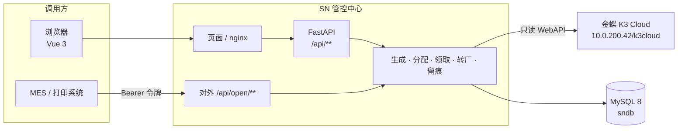
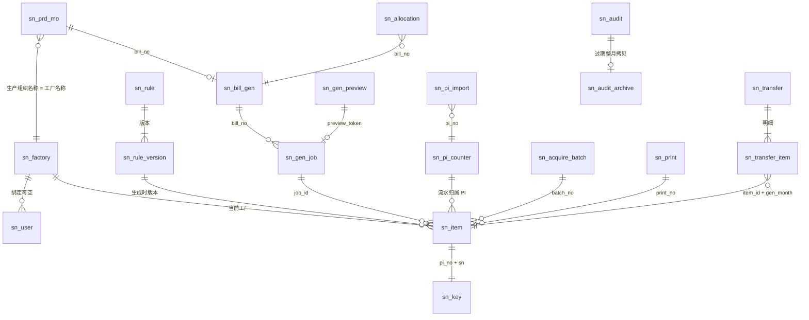
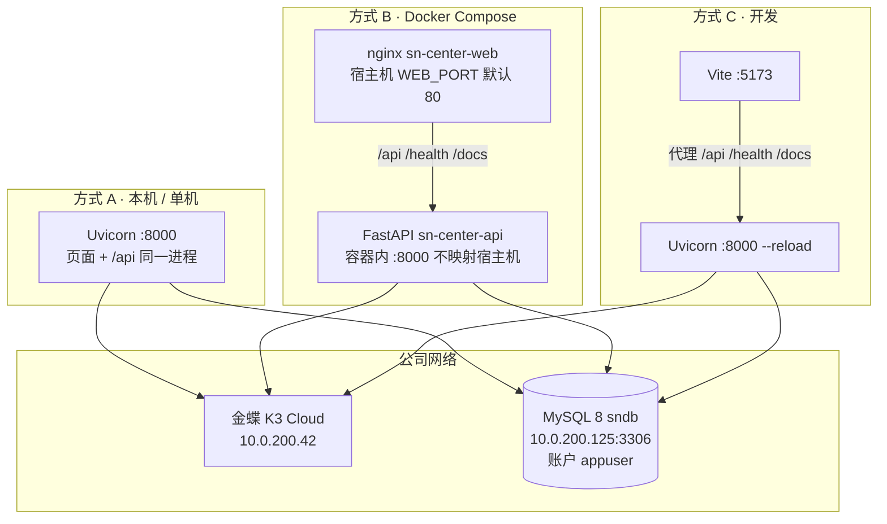
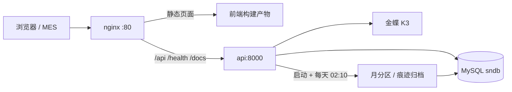

# 多工厂 SN 防重管控 · 接口、数据与架构

> 对照当前代码：出站只有金蝶 K3 Cloud；入站给 MES / 打印系统的是 `/api/open/**`。
> 字段级表结构见 [数据库表设计](数据库表设计.md)（含 [§6.1 POC 如何落到本表](数据库表设计.md#61-mysql-poc-如何落到本表)）。
> 启动与端口见 [部署说明书](部署启动关闭方式说明书.md)。

## 1. 系统间关系

本系统不调用 MES。MES / 打印系统主动调本系统。本系统只读调用金蝶，把生产订单和组织机构落到本地快照，之后生成、领取、转厂都只读写 MySQL。



| 方向 | 对端 | 做什么 | 不做什么 |
| --- | --- | --- | --- |
| 出站 | 金蝶 K3 Cloud | 登录、拉生产订单、拉组织机构 | 不回写金蝶，不改单据状态 |
| 入站 | MES / 打印系统 | 登录、按 PI 整批领取、拉批次明细、打印回调、只读查号 | 不提供生成、分配、转厂 |
| 入站 | 浏览器 | 总部 / 工厂页面的全部操作 | 与对外接口分开路径，领取逻辑共用同一段服务代码 |

## 2. 出站接口（本系统调用金蝶）

实现：`app/services/k3.py`。地址 `K3_SERVER_URL`（默认 `http://10.0.200.42/k3cloud/`），`httpx` 直连、不走系统代理。每次调用先 `LoginByAppSecret`，成功后把 `KDSVCSessionId` 写成 Cookie `kdservice-sessionid`。请求体是金蝶 WebAPI 信封：`format=1`、`parameters`、`timestamp`、`v=1.0`。

登录失败 → `502 K3_LOGIN_FAILED`；查询失败 → `502 K3_QUERY_FAILED`；缺配置 → `503 K3_CONFIG_MISSING`。金蝶失败时本地快照 / 工厂表保持不动。

| # | 金蝶服务 | 本系统入口 | 作用 |
| --- | --- | --- | --- |
| 1 | `AuthService.LoginByAppSecret` | 下面每一次查询之前 | 账套、用户名、AppId、AppSecret、LCID（默认 2052）。`LoginResultType = 1` 才继续 |
| 2 | `DynamicFormService.ExecuteBillQuery`，表单 `PRD_MO` | `POST /api/orders/sync` 不带单据号 | 全量。过滤 `FStatus='1' OR FStatus='2'`（计划、计划确认），按 `FID, FTreeEntity_FEntryId` 排序，每页 2000 行直到不足一页。任一页失败则整次失败，不写快照。成功后在一个事务里 `DELETE sn_prd_mo` 再批量插入 |
| 3 | `DynamicFormService.View`，表单 `PRD_MO` | `POST /api/orders/sync` 带 `bill_no` | 只替换这一张单的快照行。金蝶 `MsgCode = 10`（找不到）视为该单已离开计划 / 计划确认，从快照删除；已生成的号不删 |
| 4 | `DynamicFormService.ExecuteBillQuery`，表单 `ORG_Organizations` | `POST /api/factories/sync`；全量订单同步时也会顺带调一次 | 未禁用组织（`FForbidStatus='A'`），按组织编码、名称写入 `sn_factory`（`source=K3`）。只取一页 2000 行。全量订单同步里这一步失败只记警告，不回滚订单快照 |

生产订单字段（`FieldKeys`）：

`F_ora_kh.FNumber, FBillNo, F_HX_PO, F_HX_PI, FMaterialId.FNumber, FMaterialId.FName, FQty, FStatus, FSaleOrderNo, FPrdOrgId.FName`

落到 `sn_prd_mo` 的是客户编码、单据编号、PO、PI、物料编码 / 名称、数量、状态、需求单据号、生产组织名称。不存金蝶内码。生产组织按**名称**对应 `sn_factory.factory_name`。

超时：登录 30 秒、单据查询 120 秒、View 60 秒（`K3_LOGIN_TIMEOUT` / `K3_QUERY_TIMEOUT` / `K3_VIEW_TIMEOUT`）。

## 3. 入站接口（供其他系统调用）

给 MES / 打印系统的契约在 OpenAPI 分组 `open`（`/docs`）。除登录外都要 `Authorization: Bearer <token>`。厂区账户只能操作本厂；总部账户领取和回调时必须带 `factory_code`。痕迹来源记为 `API`。没有转厂、生成、分配的对外接口。

约定与页面接口相同：JSON 用 snake_case；时间 `yyyy-MM-dd HH:mm:ss`；列表 `{items, total, page, page_size, total_capped}`；错误 `{code, message, params}`。409 `CONFLICT_RETRY`（锁冲突）可以用同一请求号重试；422 `VALIDATION`（参数不合法、编码类字段超过 64 位）须修正请求，重试无效。

### 3.1 登录（页面与 MES 共用）

`POST /api/auth/login`

```json
{ "emp_no": "op100", "password": "..." }
```

成功返回令牌和账户（含 `must_change_pwd`）。令牌默认 12 小时（`ACCESS_TOKEN_TTL_SECONDS`）。改密或重置后旧令牌失效。MES 使用厂区操作员账户；首次登录若被要求改密，先调 `POST /api/auth/password`。

### 3.2 按 PI 整批领取

`POST /api/open/acquire`　角色：总部（须指定工厂）、厂区操作员。

```json
{
  "factory_code": "100",
  "pi": "ADT260730-0832-1711",
  "request_no": "MES-20260928-0001",
  "page_size": 1000
}
```

把该厂、该 PI 下全部「待领取」改为「待打印」，生成批次号。`request_no` 必填。同一工厂 + 同一请求号再次调用返回原批次（`replayed: true`），不再改任何号。没有待领取的号则 `ACQ_NOTHING`，不留空批次。PI 须仍在生产订单快照中（`SN_ACQUIRE_REQUIRE_SNAPSHOT`，默认 true）。

返回 `batch`（`batch_no`、`qty`、`replayed` 等）和第一页明细。

### 3.3 批次明细

`GET /api/open/batches/{batch_no}/items?page=&page_size=`

默认页大小 1000。可反复读，不改变状态。查询员也可以读。明细含完整 SN、进制流水、十进制数。

### 3.4 打印回调

`POST /api/open/callback`　角色：总部、厂区操作员。

```json
{
  "batch_no": "B202609281307042814",
  "target_status": "PRINTED",
  "ranges": [{ "start_sn": "81260908200001", "end_sn": "81260908200120" }]
}
```

`sns`（清单）与 `ranges`（起止号）二选一。只把「本厂 + 本批次 + 待打印」改为已打印。已打印的计入 `already_printed`，不重复改。已转走、申请中、不在本批的号放进 `skipped`，原因 `TRANSFERRED` / `APPLYING` / `NOT_IN_BATCH`。单次最多 `SN_CALLBACK_MAX`（默认 20 万）枚。

### 3.5 只读拉取

`GET /api/open/sn?factory_code=&pi=&customer_code=&material_code=&page=&page_size=`

`factory_code`、`pi` 必填，物料可空。不改变领取或打印状态。范围与页面查询相同：厂区只能看本厂。

### 3.6 页面接口（不给外部系统）

浏览器走 `/api/**`，与对外路径分开。外部系统不要调这些接口。

| 分组 | 路径 | 谁用 |
| --- | --- | --- |
| 账户 | `/api/users` | 总部 |
| 工厂 | `/api/factories`、`POST /api/factories/sync` | 查看：登录；同步 / 手工建档：总部 |
| 订单快照 | `/api/orders`、`POST /api/orders/sync` | 查看：总部、查询员（绑厂查询员的列表、物料行、客户列表都只含本厂订单）；同步：总部 |
| 规则 | `/api/rules` | 总部 |
| 生成与分配 | `/api/generate/**`、`/api/pi-init` | 总部 |
| 领取页 | `/api/acquire/**` | 登录；领取 / 打印：总部、厂区操作员 |
| 转厂 | `/api/transfers/**` | 申请 / 撤回：厂区；确认 / 驳回 / 直接转移：总部 |
| 查询与痕迹 | `/api/sn`、`/api/audits`、`/api/dashboard` | 登录，按工厂范围过滤 |
| 健康检查 | `GET /health/live`、`GET /health/ready` | 公开；ready 含数据库连通 |

## 4. 数据库设计

MySQL 8.0，InnoDB，`utf8mb4`。编码类列（SN、PI、物料、工厂）用 `utf8mb4_bin`。建表脚本 `app/db/migration/V1__init.sql`，启动时执行，版本记在 `flyway_schema_history`。不建外键：`sn_item`、`sn_audit` 是分区表，分区表不能有外键；引用由服务层在事务里保证。

### 4.1 ER



`sn_prd_mo` 与 `sn_factory` 是名称对应，不是外键。`sn_item` 与 `sn_key` 一行对一行：号的状态在 `sn_item`，查重在 `sn_key`。

### 4.2 表与分区

| 表 | 职责 | 量级 | 分区 |
| --- | --- | --- | --- |
| `sn_factory` | 工厂 = 金蝶生产组织 | 几十 | 否 |
| `sn_user` | 账户，只停用不删除 | 几百 | 否 |
| `sn_rule` / `sn_rule_version` | 规则与版本；用过的版本不能就地改编码 | 几百 | 否 |
| `sn_prd_mo` | 金蝶生产订单快照，一物料一行 | 数万 | 否 |
| `sn_pi_counter` | PI 最大流水、起始号是否已锁定 | 与 PI 数相同 | 否 |
| `sn_bill_gen` | 订单已生成 / 已分配（额度不扫号池） | 与订单数相同 | 否 |
| `sn_gen_preview` | 预演令牌 | 短期 | 否，7 天删除 |
| `sn_gen_job` | 生成任务；`running_pi` 唯一，同一 PI 同时只跑一个 | 每次生成一行 | 否 |
| `sn_item` | 号池，一枚一行 | 约 400 万 / 月 | **按月** |
| `sn_key` | 查重护栏：`(pi_no, sn)`、`(seq_pi_no, seq_dec)` | 与号池相同 | **否** |
| `sn_allocation` | 分配记录 | 每次分配一行 | 否 |
| `sn_acquire_batch` | 领取批次；`(factory_code, request_no)` 幂等 | 每次领取一行 | 否 |
| `sn_print` | 页面打印单 | 每次打印一行 | 否 |
| `sn_transfer` / `sn_transfer_item` | 转厂单与明细 | 按需 | 否 |
| `sn_pi_import` | 起始号与历史导入记录 | 每张 PI 至多一行 | 否 |
| `sn_audit` | 操作痕迹 | 每次操作一行 | **按月** |
| `sn_audit_archive` | 过期痕迹 | 累积 | 否，压缩行 |

号的状态只在 `sn_item.status`：`PENDING_ALLOC` 待分配 → `TO_ACQUIRE` 待领取 → `TO_PRINT` 待打印 → `PRINTED` 已打印；转厂申请中为 `APPLYING`。

## 5. 性能设计

业务容量按每月约 400 万枚、3 年约 1.5 亿枚准备（需求说明）。POC 与分区、历史表的对应关系写在 [数据库表设计 §6.1](数据库表设计.md#61-mysql-poc-如何落到本表)，这里只保留决定。

### 5.1 POC 测到什么

在 MySQL 8.0.46 上，用当时的窄表方案插入 100 万枚（单事务、批量、含全部索引）：约 34 秒，数据 117 MB + 索引 199 MB，约 330 字节/枚。据此推算旧表 3 年约 48 GB，「单表可以支撑」。同时验证了：同 PI 重复 SN / 重复流水会被拒绝；审计按月 `DROP PARTITION` 可用；深分页和 `COUNT(*)` 扫号池不能当额度算法。

修订版把 3 年口径放到约 1.5 亿枚，而且现在的 `sn_item` 列和二级索引比 POC 那张窄表多，单行按 600–800 字节估，3 年约 90–120 GB。POC 的「单表能撑」不再直接套用，改成下面三条。

### 5.2 分区：两张表分，护栏不分

| 对象 | 分区 | 原因 |
| --- | --- | --- |
| `sn_item` | `PARTITION BY RANGE (gen_month)`，分区名 `pYYYYMM` | 3 年约 36 个分区，每个约 3 GB。备份、统计、以后冷热分离都按月做。初始脚本只有兜底分区 `pmax` |
| `sn_audit` | `PARTITION BY RANGE COLUMNS (created_at)` | POC 已验证整月 `DROP PARTITION`。在线表只留保存期内的月 |
| `sn_key` 及其他表 | 不分区 | MySQL 要求分区表的每个唯一键都包含分区列。查重是「整个 PI」而不是「某个月」，唯一键不能带 `gen_month`，所以护栏表保持不分区。其余表量级小，分区没有收益 |

维护在 `app/services/partitions.py`：进程启动时，以及每天 02:10（`SN_PARTITION_CRON`）。`GET_LOCK('sn_partition', 0)`，多实例只有一个做 DDL。每次把 `pmax` 拆成「当月 + 未来 `SN_PARTITION_AHEAD_MONTHS`（默认 3）个月」再加回空的 `pmax`。

账户需要 `ALTER`、`DROP`（加分区、丢弃过期痕迹分区）。

### 5.3 存量转历史：只归档痕迹，号不进历史表

| 数据 | 策略 |
| --- | --- |
| 操作痕迹 `sn_audit` | **转历史表。** 分区上界早于「今天 − `SN_AUDIT_RETENTION_DAYS`」的整月：`INSERT IGNORE INTO sn_audit_archive`，再 `DROP PARTITION`。默认 1095 天；设为 0 则永久留在线表。归档表同结构，加 `archived_at`，`ROW_FORMAT=COMPRESSED`，不分区 |
| 号池 `sn_item`、护栏 `sn_key` | **不转历史表，不删除。** 已打印的号仍要查重、转厂、回调和按 SN 追溯。历史导入也是写入 `sn_item`，不是另一张历史号表。分区只为了按月维护；更久以后若要把冷月挪到归档库，用 `EXCHANGE PARTITION`，那是运维动作，当前没有 `sn_item_hist` |
| 预演 `sn_gen_preview` | 不是历史数据。分区任务里删除 7 天前的行 |
| 订单快照 `sn_prd_mo` | 每次全量同步整表替换；按单据同步只替换该单。快照消失不影响已生成的号 |

POC 里「超过 3 年的已打印号要不要进历史表」这一条，当前的决定是：**不要。** 号是主数据，痕迹才是可归档的流水。

### 5.4 写入与查询上的其它约束

这些直接承接 POC：大表不能靠 `COUNT(*)` 算额度，不能深 `OFFSET`。

- 额度与最大号：`sn_bill_gen`、`sn_pi_counter` 行锁后增减，生成不扫号池。
- 生成：1000 枚一块查 `sn_key` 再批量插入；`DB_URL` 带 `rewriteBatchedStatements=true`。不超过 5000 枚同步返回，超过则 `sn_gen_job` 后台跑，进度单独提交。
- 同一 PI 并发生成：`sn_gen_job.running_pi` 唯一键，冲突即 `GEN_BUSY`。任务成功状态与号同一事务提交；启动时回收进程中断留下的 `RUNNING` 任务（`FOR UPDATE NOWAIT` 探测，仍在生成的跳过）。
- 列表：`total` 计数封顶 10 万（`total_capped`）。导出按主键游标，每块 5000 行，上限 `SN_EXPORT_LIMIT`（默认 100 万）。导出防公式注入：XLSX 文本强制按字符串写出，CSV 对 `= + - @`、制表符、回车开头的文本加 `'` 前缀。
- 连接池 `DB_POOL_SIZE` 默认 20。

## 6. 部署架构

三种运行方式连的是同一套库和同一套金蝶，差别只在进程怎么摆。



| | 方式 A | 方式 B | 方式 C |
| --- | --- | --- | --- |
| 命令 | `python start.py` | `docker compose up -d --build` | `uv run uvicorn` + `npm run dev` |
| 用户入口 | `http://<IP>:8000` | `http://<IP>:` `WEB_PORT` | 浏览器打开 5173 |
| 前端 | 构建后由 Uvicorn 托管 | nginx 静态文件 | Vite |
| API | 同一进程 | 容器 `api`，只给 nginx 访问 | 本机 8000 |
| MySQL | `.env` 的 `DB_URL`，默认公司库 | 同左。测试可 `--profile mysql` 起一个 `mysql:8.0`，并把 `DB_URL` 指到 `mysql:3306` | 同左，集成测试默认 `sndb_test_py` |
| 金蝶 | `K3_SERVER_URL` | 同左 | 同左；没有金蝶时可 `SN_DEMO_SEED=true`，连公司库必须为 false |

方式 B 的 nginx（`frontend/nginx.conf`）：`/api/`、`/health/` 反代到 `http://api:8000`，读超时 600 秒（全量同步、大导出），上传 50 MB（历史 SN 清单），`/docs` 与 `/openapi.json` 同样反代。`/health/ready` 作为 api 容器健康检查，web 等 api 健康后才启动。



公司库若已有别的表、还没有 `flyway_schema_history`：`.env` 设 `DB_BASELINE_ON_MIGRATE=true`、`DB_BASELINE_VERSION=0`，启动仍会执行 `V1__init.sql` 创建 `sn_*` 表。空库不用这两项。
