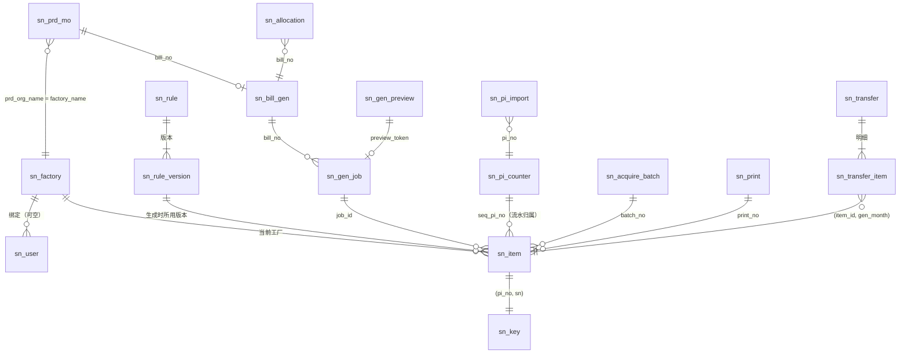

# 多工厂 SN 防重管控 · 数据库表设计

> **读者**：开发、DBA　**对应代码**：`app/db/migration/V1__init.sql`、`app/services/partitions.py`　**更新**：2026-10-08
> **相关**：[技术文档](技术文档.md)　[运维手册](运维手册.md)　[文档导航](README.md)
>
> 数据库：**MySQL 8.0**（InnoDB，`utf8mb4`）。建表脚本：`app/db/migration/V1__init.sql`，由应用启动时执行并按 Flyway 格式记录在 `flyway_schema_history`。
> 演示阶段所有表结构合并在 `V1__init.sql` 一个脚本里，改表直接改它（已有的演示库按《运维手册》8.1 清本系统的表或 8.2 清空整个库后重建）。正式上线后改为只新增 `V2__xxx.sql`、`V3__xxx.sql`，不再修改已执行过的脚本。

## 1. 设计要点

| 要点 | 做法 |
| --- | --- |
| 同一 PI 下完整 SN 不重复 | 护栏表 `sn_key` 主键 `(pi_no, sn)`；转入号也写入转入 PI 名下 |
| PI 自己生成的十进制流水不重复 | `sn_key` 唯一键 `(seq_pi_no, seq_dec)`；流水归属 PI 转厂不变 |
| 不同 PI 可以出现相同 SN | 唯一性只在 `pi_no` 维度，不设全局唯一 |
| 号的状态记在每一枚 SN 上 | `sn_item.status`，不在 PI / 批次上记状态 |
| 容量（约 400 万枚 / 月，3 年约 1.5 亿） | `sn_item`、`sn_audit` 按月 RANGE 分区；查询 / 导出 / 批次明细全部分页或游标读取 |
| 痕迹至少 3 年、可永久 | `SN_AUDIT_RETENTION_DAYS`（默认 1095，0 = 永久）；过期整月分区拷入 `sn_audit_archive` 后 `DROP PARTITION` |
| 编码类字段精确比较 | SN、PI、物料、工厂等所在表统一 `utf8mb4_bin`（区分大小写，自定义字符表里大小写不同的字符不会被判重） |
| 不用外键 | 分区表不支持外键；引用完整性由服务层在事务中保证 |

### 为什么多一张 `sn_key`

MySQL 要求**分区表上的每个唯一键都必须包含分区列**。`sn_item` 按生成月份（`gen_month`）分区后，无法在它上面建 `UNIQUE(pi_no, sn)`。因此把两条查重约束放到一张不分区的窄表 `sn_key`：

- 生成、历史导入：先写 `sn_key` 再写 `sn_item`，冲突即整批回滚；
- 转厂确认：在同一事务里把这批号的 `sn_key.pi_no` 从来源 PI 换成转入 PI（先删后插），转入 PI 已有同串时整次拒绝；
- `sn_key` 每行约 100 字节，1.5 亿行约 15～25 GB（含索引），单表可承受。

## 2. ER 图



## 3. 表清单

| 表 | 说明 | 量级 | 分区 |
| --- | --- | --- | --- |
| `sn_factory` | 工厂（金蝶生产组织） | 几十 | — |
| `sn_user` | 账户 | 几百 | — |
| `sn_rule` / `sn_rule_version` | 规则 / 规则版本 | 几百 | — |
| `sn_prd_mo` | 金蝶生产订单快照（每条物料一行） | 数万 | — |
| `sn_order_sync_schedule` | 定时全量同步设置（一行） | 1 | — |
| `sn_pi_counter` | PI 流水计数器 | 与 PI 数相同 | — |
| `sn_bill_gen` | 订单已生成 / 已分配数 | 与订单数相同 | — |
| `sn_gen_preview` | 生成预演 | 7 天后清理 | — |
| `sn_gen_job` | 生成任务 | 每次生成一行 | — |
| **`sn_item`** | **SN 明细（号池）** | **约 400 万 / 月** | **按月** |
| **`sn_key`** | **查重护栏** | 与 `sn_item` 相同 | — |
| `sn_allocation` | 分配记录 | 每次分配一行 | — |
| `sn_acquire_batch` | 领取批次 | 每次领取一行 | — |
| `sn_print` | 页面打印单 | 每次打印一行 | — |
| `sn_transfer` / `sn_transfer_item` | 转厂申请 / 明细 | 按需 | — |
| `sn_pi_import` | 起始号与历史导入记录 | 每张 PI 至多一行 | — |
| **`sn_audit`** | **操作痕迹** | 每次操作一行 | **按月** |
| `sn_audit_archive` | 过期痕迹归档 | 累积 | —（压缩行格式） |

## 4. 表结构

以下「PK」= 主键，「UK」= 唯一键，「IX」= 普通索引。时间字段均为业务时区（`TZ`，默认 Asia/Shanghai）。

### 4.1 `sn_factory` 工厂

| 字段 | 类型 | 说明 |
| --- | --- | --- |
| factory_code | VARCHAR(64) PK | 工厂编码 = 金蝶组织 `FNumber`；手工建档时自定 |
| factory_name | VARCHAR(128) UK | 工厂名称 = 快照中的 `生产组织`（`FPrdOrgId.FName`），按名称对应 |
| enabled | TINYINT(1) | 启用 |
| source | VARCHAR(16) | `K3` 金蝶同步 / `MANUAL` 手工 |
| created_at / updated_at | DATETIME | |

### 4.2 `sn_user` 账户

| 字段 | 类型 | 说明 |
| --- | --- | --- |
| id | BIGINT PK AI | |
| emp_no | VARCHAR(32) UK | 公司工号，唯一 |
| name | VARCHAR(64) | 姓名 |
| role | VARCHAR(32) | `admin` 系统管理员（总部）/ `factory_operator` 厂区操作员 / `query` 查询员 |
| factory_code | VARCHAR(64) IX | 厂区操作员必填；查询员可空（空 = 跨厂只读）；管理员必须为空 |
| status | VARCHAR(16) | `ACTIVE` / `DISABLED`。只停用、不删除 |
| password_hash | VARCHAR(128) | PBKDF2-SHA256（12 万轮）：salt(32 hex) + dk(64 hex) |
| must_change_pwd | TINYINT(1) | 1 = 首次登录 / 被重置后必须改密；期间只能访问 `/api/auth/me|password|lang` |
| lang | VARCHAR(8) | 界面语言偏好 |
| last_login_at, pwd_changed_at | DATETIME | `pwd_changed_at` 同时是令牌版本：改密 / 重置后旧令牌失效 |
| created_by, created_at, updated_at, disabled_by, disabled_at | | 留痕字段 |

### 4.3 `sn_rule` 规则 / `sn_rule_version` 规则版本

`sn_rule`：

| 字段 | 类型 | 说明 |
| --- | --- | --- |
| id | BIGINT PK AI | |
| rule_code | VARCHAR(64) UK | 规则编码 |
| rule_name | VARCHAR(128) | 名称；只改名称不另出一版 |
| bind_scope | VARCHAR(16) | `GENERAL` 通用 / `CUSTOMER` 按客户 / `PI` 按单张 PI |
| bind_value | VARCHAR(64) | 客户编码或 PI；通用为空串 |
| bind_key | VARCHAR(64) | 虚拟列：通用为 NULL，其余同 `bind_value`。UK `(bind_scope, bind_key)`：一个客户 / 一张 PI 只有一条规则，通用规则可以有多条 |
| current_version | INT | 当前版本号 |
| created_by, created_at, updated_by, updated_at | | |

`sn_rule_version`：

| 字段 | 类型 | 说明 |
| --- | --- | --- |
| id | BIGINT PK AI | `sn_item.rule_version_id` 引用它 |
| rule_id, version | BIGINT, INT | UK `(rule_id, version)` |
| prefix / suffix | VARCHAR(64) | 前缀 / 后缀 |
| base | INT | 进制：10 / 16 / 32 / 36 |
| seq_len | INT | 流水位数 1–12；最大流水 = base^seq_len − 1，用尽即停止并提示 |
| charset | VARCHAR(64) | 完整字符表，长度 = 进制、不重复（留空时存系统默认表） |
| used | TINYINT(1) | 1 = 已生成过号。此后改编码参数必须另出一版；0 时可就地修改 |

生效顺序：按 PI ＞ 按客户 ＞ 给该 PI 指定的规则（`sn_pi_counter.rule_id`），取该规则的当前版本。都没有时，生成前由用户从全部通用规则中选一条（默认编码最小的一条）；可手动指定给 PI，或首次生成成功后自动记入 `sn_pi_counter.rule_id`，之后生成默认用它。解绑（清空 `rule_id`）后须重新选择，流水接续、之后的号换成新格式。

### 4.4 `sn_prd_mo` 生产订单快照

一张生产订单的每条物料一行；不存单据头，不存金蝶单据内码 / 分录内码。

| 字段 | 类型 | 说明 |
| --- | --- | --- |
| id | BIGINT PK AI | |
| bill_no | VARCHAR(64) | 单据编号 |
| line_seq | INT | 单内物料行顺序（金蝶 `FID, FTreeEntity_FEntryId` 顺序）。UK `(bill_no, line_seq)`；号段按此顺序切分 |
| customer_number | VARCHAR(64) IX | 客户编码（表头，写在每一行）；为空的行留在快照，订单列表不显示、不能生成 |
| po / pi | VARCHAR | 表头，写在每一行；IX `(pi)` |
| material_number / material_name | VARCHAR | 物料；编码可为空 |
| qty | DECIMAL(18,4) | 该物料行数量；SN 枚数取整数部分 |
| status | VARCHAR(8) | 只保留 `1` 计划、`2` 计划确认 |
| demand_bill_no | VARCHAR(64) | 需求单据号（销售订单号），可空 |
| prd_org_name | VARCHAR(128) | 生产组织 = 工厂名称。IX `(prd_org_name, pi)` |
| synced_at | DATETIME | 本次同步时间 |

同步：全量 = 完整拉取后在**一个事务**里 `DELETE` + 批量 `INSERT`（失败整体回滚，不出现空快照）；按单据 = 只替换该单的行；金蝶失败时快照不动。

### 4.4.1 `sn_order_sync_schedule` 定时全量同步设置

只有一行（`id = 1`，迁移时插入，默认关闭、间隔 1440 分钟）。后台线程每 30 秒检查一次，到期时用条件更新抢这一次（`WHERE enabled = 1 AND next_run_at <= now`，同时把 `next_run_at` 推后一个间隔），多实例只有一个执行。

| 字段 | 类型 | 说明 |
| --- | --- | --- |
| id | TINYINT PK | 固定 1 |
| enabled | TINYINT(1) | 是否开启 |
| interval_minutes | INT | 间隔分钟，10–10080（7 天） |
| next_run_at | DATETIME | 下次执行；开启或改间隔时 = 保存时刻 + 间隔，关闭时为空 |
| last_run_at | DATETIME | 最近一次定时执行开始时间 |
| last_ok | TINYINT(1) | 最近一次是否成功；从未执行为空 |
| last_bills / last_rows | INT | 最近一次**成功**同步的单据数 / 物料行数（失败时保留上次成功的值） |
| last_message | VARCHAR(500) | 最近一次失败原因；成功为空 |
| updated_by / updated_at | | 最近修改设置的工号与时间 |

### 4.5 `sn_pi_counter` PI 流水计数器

| 字段 | 类型 | 说明 |
| --- | --- | --- |
| pi_no | VARCHAR(64) PK | |
| last_seq_dec | BIGINT | 本 PI 已占用的最大十进制流水。生成时 `SELECT … FOR UPDATE` |
| generated_qty | BIGINT | 本 PI 自己生成的枚数（不设 99999 上限） |
| imported_qty | BIGINT | 历史导入枚数 |
| start_seq_dec | BIGINT | 指定过的起始号 |
| rule_id | BIGINT | 给该 PI 指定的通用规则（手动指定，或首次生成时所选）；为空表示未指定（解绑后也为空），生成前须重新选择 |
| start_locked | TINYINT(1) | 1 = 已指定起始号或已生成过，页面不再提供起始号 |
| locked_by, locked_at, updated_at | | |

转入号不抬高转入 PI 的计数器；原 PI 之后从自己的最大号 + 1 接着排。转入 PI 生成的起点另取「`last_seq_dec` 与本 PI 下流水不归属本 PI 的 `sn_key` 行按当前规则解析出的最大流水」两者较大者 + 1，所以不会与转入号重复（不改表结构）。

### 4.6 `sn_bill_gen` 订单生成统计

| 字段 | 类型 | 说明 |
| --- | --- | --- |
| bill_no | VARCHAR(64) PK | 生产订单单据编号 |
| pi_no, factory_code, customer_code | VARCHAR | 生成时的 PI、目标工厂（订单生产组织）、客户。IX `(pi_no, factory_code)` |
| generated_qty | BIGINT | 已生成数（转走的号仍计入） |
| allocated_qty | BIGINT | 已分配数 |

可生成额度 = 快照中该单各物料行数量之和 − `generated_qty`。订单离开快照后此表仍在，用于「工厂 + PI」汇总与分配。

### 4.7 `sn_gen_preview` 生成预演

| 字段 | 类型 | 说明 |
| --- | --- | --- |
| token | CHAR(32) PK | 预演令牌（随机 128 位） |
| bill_no, pi_no, factory_code | | 预演条件 |
| qty, start_override | BIGINT | 数量、指定的起始号（可空） |
| start_seq_dec, end_seq_dec, start_sn, end_sn | | 起止号 |
| rule_version_id | BIGINT | 预演时的规则版本 |
| base_last_seq | BIGINT | **预演时这张 PI 的最大号**；生成时不等即失效 |
| segments_json | TEXT | 按物料行切出的号段；生成时重算比对，不一致即失效 |
| created_by, created_at, expires_at, used_at | | 仅本人、未过期、未使用的预演可用于生成 |

### 4.8 `sn_gen_job` 生成任务

| 字段 | 类型 | 说明 |
| --- | --- | --- |
| id | BIGINT PK AI | |
| bill_no, pi_no, factory_code, customer_code, rule_version_id | | |
| qty, start_seq_dec, end_seq_dec, start_sn, end_sn | | |
| status | VARCHAR(16) | `RUNNING` / `SUCCESS` / `FAILED` |
| done_qty | BIGINT | 进度（独立事务按块更新，页面轮询） |
| error_code, error_msg | | 失败原因（整批已回滚）；`INTERRUPTED` = 服务重启时未完成，启动回收时标记 |
| running_pi | VARCHAR(64) **UK** | 运行中 = `pi_no`，结束置 NULL → **同一 PI 同一时刻只允许一个生成**，并发提交得到 `GEN_BUSY`；成功时与号同一事务置空，进程中断留下的由启动回收置空 |
| preview_token | CHAR(32) **UK** | 一个预演只能生成一次 |
| segments_json, created_by, created_at, finished_at | | |

### 4.9 `sn_item` SN 明细（按月分区）

| 字段 | 类型 | 说明 |
| --- | --- | --- |
| id | BIGINT AI | PK `(id, gen_month)` |
| gen_month | INT | **分区键**，生成 / 导入时的 yyyymm |
| sn | VARCHAR(64) | 完整 SN，写出后不再修改。IX `(sn)` |
| pi_no | VARCHAR(64) | 当前挂靠 PI（转厂后为转入 PI） |
| customer_code, material_code | VARCHAR(64) | 当前客户、物料（物料可为空串） |
| factory_code | VARCHAR(64) | 当前工厂；待分配时为 NULL |
| bill_no | VARCHAR(64) | 来源生产订单单据编号（转厂不变；订单离开快照后仍可按它查） |
| rule_version_id | BIGINT | 生成时的规则版本（新版本不影响已发出的号） |
| seq_pi_no | VARCHAR(64) | **流水归属 PI**（转厂不变） |
| seq_dec | BIGINT | 十进制流水；历史导入无法按规则反解时为 NULL |
| status | VARCHAR(16) | `PENDING_ALLOC` 待分配 → `TO_ACQUIRE` 待领取 → `TO_PRINT` 待打印 → `PRINTED` 已打印；`APPLYING` 申请中 |
| prev_status | VARCHAR(16) | 申请前状态，驳回 / 撤回时恢复 |
| source | VARCHAR(8) | `GEN` 生成 / `IMPORT` 历史导入 |
| job_id, batch_no, print_no, transfer_id | | 生成任务 / 领取批次 / 打印单 / 未完成的转厂申请 |
| created_at, allocated_at, acquired_at, printed_at, updated_at | DATETIME | |

索引（均为分区内本地索引）：

| 索引 | 列 | 用途 |
| --- | --- | --- |
| ix_item_fac | factory_code, status, pi_no, material_code, seq_pi_no, seq_dec | 领取页、按 PI 整批领取 / 打印（`factory+pi+status`）、号段拼接 |
| ix_item_status | status, factory_code | 首页在途统计、总部看全部工厂 |
| ix_item_pi | pi_no, status, factory_code | 按 PI 查询、转厂范围 |
| ix_item_bill | bill_no, status, seq_dec | 分配（按订单取待分配号、按流水排序）、按来源订单查 |
| ix_item_batch / ix_item_print / ix_item_transfer | batch_no / print_no / transfer_id | 批次明细、回调、打印文件、转厂 |
| ix_item_sn | sn | 按 SN 查询 |

领取页的号段由窗口函数现拼（不另存状态）：

```sql
seq_dec - ROW_NUMBER() OVER (PARTITION BY factory_code, pi_no, material_code, status, seq_pi_no ORDER BY seq_dec)
```

相同差值即同一连续号段。

### 4.10 `sn_key` 查重护栏（不分区）

| 字段 | 类型 | 说明 |
| --- | --- | --- |
| pi_no | VARCHAR(64) | 当前挂靠 PI。PK `(pi_no, sn)` |
| sn | VARCHAR(64) | |
| seq_pi_no, seq_dec | VARCHAR(64), BIGINT | UK `(seq_pi_no, seq_dec)`；无法反解流水的导入号两列为 NULL（MySQL 唯一键允许多个 NULL） |

### 4.11 `sn_allocation` 分配记录

bill_no、pi_no、factory_code、qty、start_sn、end_sn、created_by、created_at。

### 4.12 `sn_acquire_batch` 领取批次

| 字段 | 类型 | 说明 |
| --- | --- | --- |
| batch_no | VARCHAR(40) PK | `B` + 时间 + 随机数 |
| factory_code, pi_no | | 领取只按「工厂 + PI」整批 |
| request_no | VARCHAR(64) | 调用方请求号。**UK `(factory_code, request_no)`**：同一请求号重复调用返回同一批次、不再改动任何号 |
| source | VARCHAR(8) | `PAGE` / `API` |
| qty | BIGINT | 本批数量 |
| created_by, created_at | | |

### 4.13 `sn_print` 页面打印单

print_no（PK）、factory_code、pi_no、request_no（UK 与工厂组合，页面打印同样幂等）、qty、created_by、created_at。打印文件可按打印单号反复下载。

### 4.14 `sn_transfer` 转厂 / `sn_transfer_item` 转厂明细

`sn_transfer`：

| 字段 | 类型 | 说明 |
| --- | --- | --- |
| id | BIGINT PK AI | |
| transfer_no | VARCHAR(40) UK | `T` + 时间 + 随机数 |
| mode | VARCHAR(8) | `APPLY` 工厂申请 / `DIRECT` 总部直接转移 |
| status | VARCHAR(16) | `PENDING` / `APPROVED` / `REJECTED` / `WITHDRAWN` |
| scope | VARCHAR(16) | `PI` 整张 PI / `MATERIAL` PI + 物料 / `SINGLE` 单枚 SN |
| from_factory, from_customer, from_pi, from_material, from_sn | | 来源（限同一张 PI） |
| qty | BIGINT | |
| to_factory, to_pi | | 转入目标；工厂必须已建档，PI 必填 |
| to_customer, to_material | | 空串 = 沿用原值 |
| target_source | VARCHAR(16) | `SNAPSHOT` 快照选择 / `MANUAL` 手工填写（不与金蝶核对） |
| reason | VARCHAR(500) | 原因（必填） |
| applied_by/at, decided_by/at, decide_note | | |

`sn_transfer_item`（PK `(transfer_id, item_id)`）：item_id、gen_month、sn、seq_pi_no、seq_dec、from_status（申请前状态）、from_customer、from_material、**from_batch_no**（原领取批次：回调时据此识别「已转走」的号）。转出厂通过它查到已转出的号。

### 4.15 `sn_pi_import` 起始号与历史导入

pi_no、start_seq_dec、import_qty、max_seq_dec（导入清单按规则反解出的最大流水）、factory_code、file_name、created_by、created_at。

### 4.16 `sn_audit` 操作痕迹（按月分区）/ `sn_audit_archive` 归档

| 字段 | 类型 | 说明 |
| --- | --- | --- |
| id | BIGINT AI | PK `(id, created_at)` |
| created_at | DATETIME(3) | **分区键**（RANGE COLUMNS） |
| operator, operator_name, role | | 操作人 |
| source | VARCHAR(8) | `PAGE` 页面 / `API` 对外接口 / `SYSTEM` 定时任务 |
| action | VARCHAR(32) | 见下表 |
| result | VARCHAR(8) | `OK` / `FAIL`（被业务拒绝的写操作也记，独立事务，不随业务回滚） |
| factory_code, pi_no, customer_code, material_code, bill_no | | |
| start_sn, end_sn, qty | | 号段或数量 |
| before_status, after_status | | 操作前后状态 |
| batch_no, request_no, transfer_no, reason | | 有则记 |
| error_msg, trace_id, detail | | 失败原因、请求 ID、补充信息 |

索引：`(created_at)`、`(action, created_at)`、`(factory_code, created_at)`、`(pi_no, created_at)`、`(operator, created_at)`、`(batch_no)`。

`action` 取值：

| 类别 | 动作 |
| --- | --- |
| 账户 | LOGIN（成功、失败、锁定都记，含来源地址）、USER_CREATE、USER_DISABLE、USER_ENABLE、USER_UPDATE、USER_RESET_PWD、PASSWORD_CHANGE |
| 规则 | RULE_CREATE、RULE_UPDATE（就地修改）、RULE_VERSION（另出一版）、RULE_RENAME |
| SN | SN_GENERATE、SN_ALLOCATE、SN_ACQUIRE、SN_PRINT、SN_CALLBACK、PI_INIT |
| 转厂 | TRANSFER_APPLY、TRANSFER_WITHDRAW、TRANSFER_APPROVE、TRANSFER_REJECT、TRANSFER_DIRECT |
| 其他 | ORDER_SYNC（定时执行的操作人为 system，失败 detail 为 `mode=scheduled`）、ORDER_SYNC_SCHEDULE（修改定时同步设置）、FACTORY_SYNC、FACTORY_CREATE、AUDIT_ARCHIVE |

`sn_audit_archive`：同结构 + `archived_at`，不分区，`ROW_FORMAT=COMPRESSED`。

## 5. 分区维护

由 `app/services/partitions.py` 在**应用启动时**与**每天 02:10**（`SN_PARTITION_CRON`）执行，用 `GET_LOCK('sn_partition')` 保证多实例只有一个在做 DDL：

1. 为 `sn_item`、`sn_audit` 建好「当月 + 未来 `SN_PARTITION_AHEAD_MONTHS`（默认 3）个月」的分区：`REORGANIZE PARTITION pmax INTO (pYYYYMM …, pmax)`。兜底分区 `pmax` 始终为空，拆分几乎零成本。
2. 痕迹归档：上界早于「今天 − 保存天数」的整月分区，`INSERT IGNORE INTO sn_audit_archive SELECT … FROM sn_audit PARTITION (pYYYYMM)` 后 `ALTER TABLE sn_audit DROP PARTITION pYYYYMM`，并记一条 `AUDIT_ARCHIVE` 痕迹。保存天数为 0 时不归档。
3. 清理 7 天前的预演记录。

`sn_item` 不做删除 / 归档（号是业务主数据）；按月分区便于按月维护、备份与冷热分层（如把早期分区迁到归档库时用 `EXCHANGE PARTITION`）。

## 6. 容量估算（约 400 万枚 / 月，3 年约 1.5 亿枚）

| 对象 | 单行（含索引）估算 | 3 年 |
| --- | --- | --- |
| `sn_item` | ≈ 600–800 B | ≈ 90–120 GB，36 个分区，每分区 ≈ 3 GB |
| `sn_key` | ≈ 120–160 B | ≈ 18–24 GB |
| `sn_audit` | 每次操作一行（不是每枚 SN 一行） | 很小 |

性能约束：

- 生成：1000 枚一块，PyMySQL `executemany` 合并成多值 INSERT 批量写 `sn_key` + `sn_item`（不需要也不读取 JDBC 的 `rewriteBatchedStatements` 等参数）；超过 `SN_GEN_SYNC_THRESHOLD`（默认 5000）转后台任务。
- 查询列表：计数封顶 10 万（`total_capped`），避免大表全量 COUNT；导出按 `id` 游标 5000 行一块流式写 CSV / XLSX（xlsx 用 openpyxl 只写模式）。
- 批次明细、转厂明细、打印文件：均分页 / 游标读取，不在 100 条处截断。

## 7. 事务与并发

| 场景 | 保证 |
| --- | --- |
| 生成 | 一个事务：锁 `sn_pi_counter` 行 → 核对预演时最大号 → 锁 `sn_bill_gen` 行核对额度 → 锁规则版本并标记已使用 → 逐块查重 + 写入 → 推进计数器 → 任务置 `SUCCESS`；任一失败整批回滚。另有 `sn_gen_job.running_pi` 唯一键拦截同 PI 并发；计数器、订单统计行用 `INSERT … ON DUPLICATE KEY UPDATE` 预建（不用 `INSERT IGNORE`，避免超长值被静默截断） |
| 中断任务回收 | 启动时对 `RUNNING` 任务用 `FOR UPDATE NOWAIT` 锁任务行与计数器行，拿到才标记 `FAILED / INTERRUPTED`；拿不到说明仍在生成，跳过 |
| 分配 | 锁 `sn_bill_gen` 行；`UPDATE … WHERE bill_no=? AND status='PENDING_ALLOC' ORDER BY seq_dec LIMIT n`，影响行数不等即回滚 |
| 领取 / 页面打印 | 先插批次（请求号唯一键），再整批 `UPDATE … WHERE factory_code=? AND pi_no=? AND status='TO_ACQUIRE'`；0 行即回滚（不留空批次）；同请求号并发时后到者读已有批次返回 |
| 回调 | `SELECT … FOR UPDATE` 锁住该批这些号，再只把 `TO_PRINT` 改为 `PRINTED` |
| 转厂 | `INSERT INTO sn_transfer_item SELECT … FOR UPDATE` 锁定范围；状态更新影响行数必须等于锁定行数，否则 `TR_CONCURRENT` 回滚 |
| 死锁 / 锁超时 / 连接池耗尽 | 统一转为 409 `CONFLICT_RETRY`，由调用方重试。死锁、锁等待超时、`NOWAIT` 冲突后连接回滚即回池复用；只有断线、读写超时（客户端错误号 2000–2999）才丢弃连接 |
| 字段超长 / 格式不符 | `DataError` 转为 422 `VALIDATION`，不重试 |

## 8. 性能测试与设计决定

### 8.1 号池写入 POC

在 MySQL 8.0.46 上，用当时的窄表方案插入 100 万枚（单事务、批量、含全部索引）：约 34 秒，数据 117 MB + 索引 199 MB，约 330 字节 / 枚。同时验证了：同 PI 重复 SN / 重复流水会被拒绝；痕迹按月 `DROP PARTITION` 可用；深分页和 `COUNT(*)` 扫号池不能当额度算法。

修订版把 3 年口径放到约 1.5 亿枚，且现在的 `sn_item` 列和二级索引比 POC 窄表多（单行按 600–800 字节估，见 §6），POC 的「单表可以支撑」不再直接套用，由此得出三条决定：

1. **两张表分区，护栏不分**：`sn_item`、`sn_audit` 按月分区；`sn_key` 查重范围是整张 PI，唯一键不能带分区列，保持不分区（§1）。
2. **只归档痕迹，号不进历史表**：已打印的号仍要查重、转厂、回调和按 SN 追溯，号是主数据；痕迹才是可归档的流水（§5）。当前没有 `sn_item_hist`，以后冷月迁出用 `EXCHANGE PARTITION`，属运维动作。
3. **额度和最大号不扫号池**：记在 `sn_bill_gen`、`sn_pi_counter`，行锁后增减；列表计数封顶、导出按主键游标，不用深 `OFFSET`（§6）。

### 8.2 查询性能测试（订单表）

测的是库 `sndb` 里 `poc_*` 订单表的点查、列表和聚合（2026-09-23、09-24），不是号池的生成、领取、打印。

| | 缓冲池 128MB | 缓冲池 8GB |
| --- | --- | --- |
| 测到哪 | 1 万、10 万通过；30 万停止 | 50 万到 500 万五档都跑完 |
| 停止原因 | 30 万档数据加索引约 242MB，大于缓冲池；两条聚合 p95 为 25 秒、38 秒 | 未触发停止，读测试缓冲池读盘为 0 |
| 点查 | 30 万档 p95 仍小于 2 毫秒 | 500 万档 p95 约 1 毫秒 |

500 万订单、热缓存、单连接的 p95：点查主键 / 订单号约 1 毫秒；先按时间限制再关联（返回 50 行）6 毫秒；键集分页 43 毫秒；全量按类目、省份、月份聚合 184 秒。同样返回 50 行，先关联全量再聚合要 103 秒。深分页 `OFFSET` 在 500 万档的数字异常，不作结论。

结论：缓冲池能装下数据时，点查和「先限制再关联」到 500 万行仍很快；全表聚合随行数变慢，不能做页面接口。因此列表先按条件限制再取行，按 SN、批次查询走索引。

未覆盖：多厂同时领取（只测了单连接）、冷缓存、`sn_item` 的生成 / 领取 / 打印。这份结果不能用来判断号池能否上线，上线前应在生产同规格环境复测。
