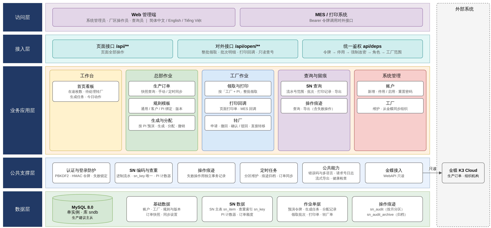
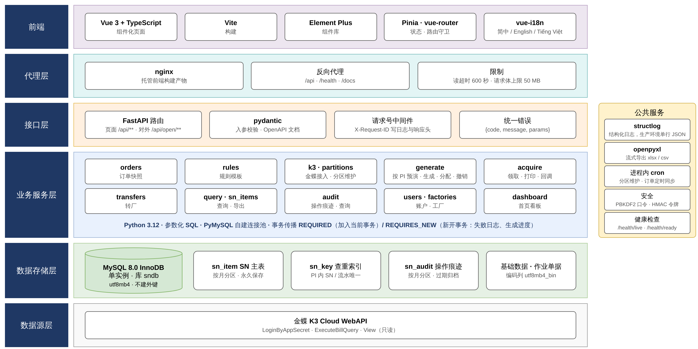
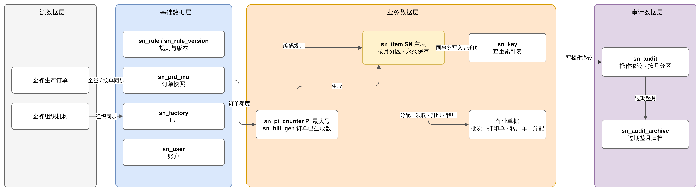
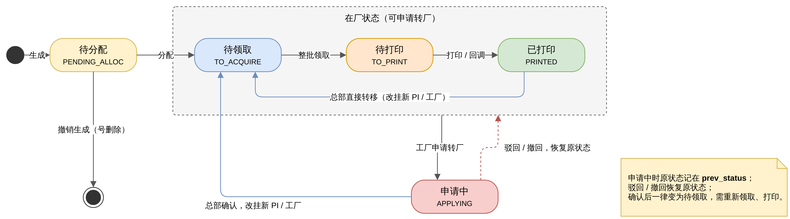
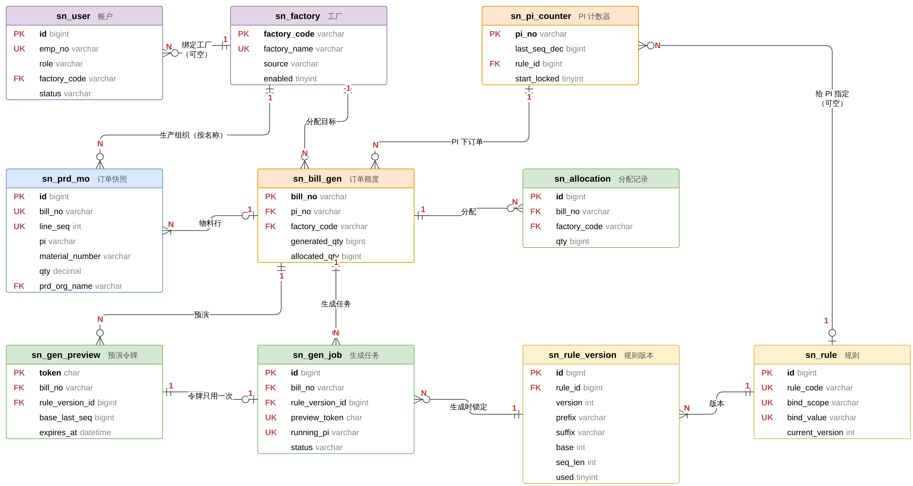
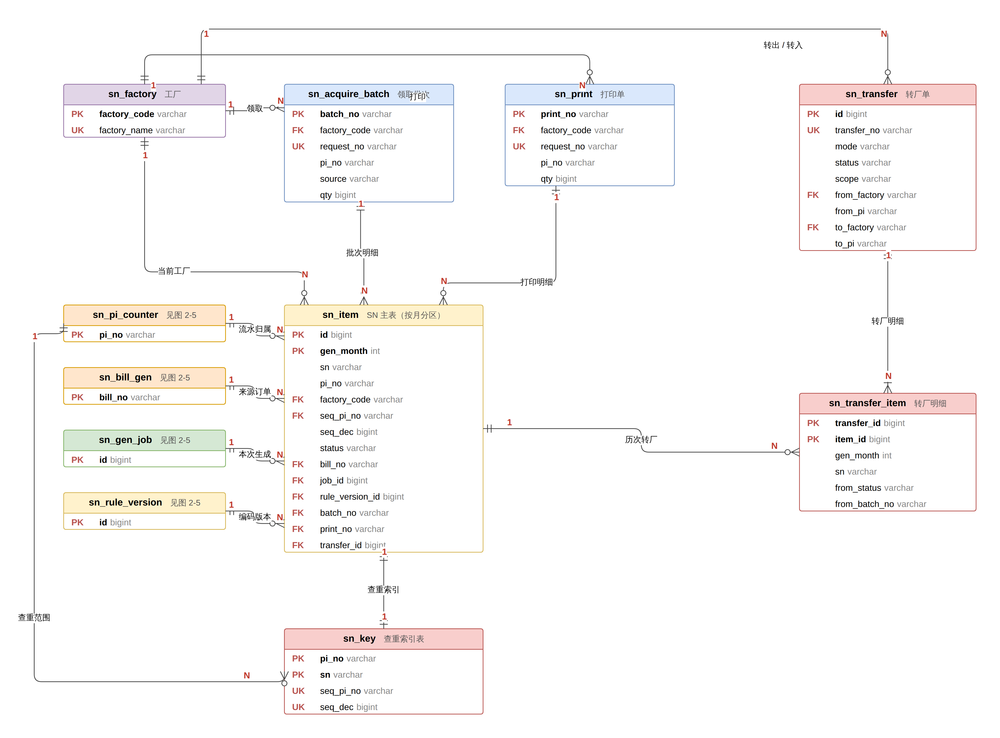
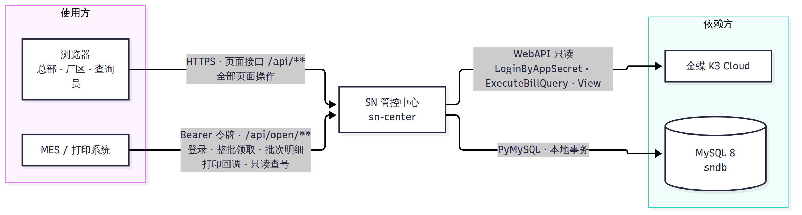
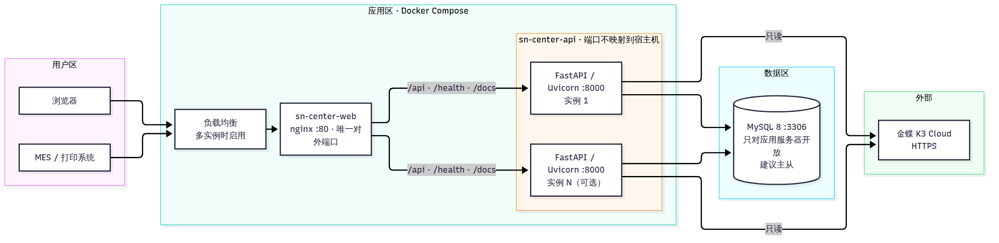
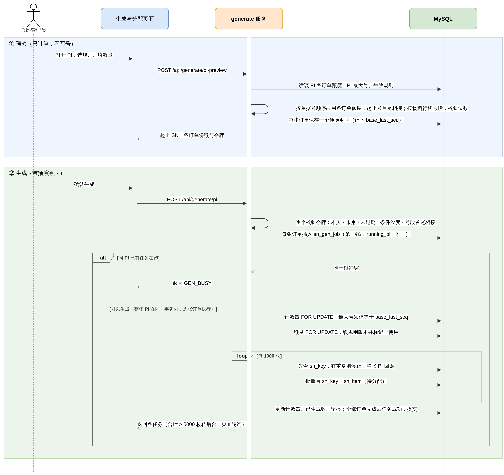

# 多工厂 SN 防重管控系统 · 技术方案

| 项目 | 内容 |
| --- | --- |
| 文档名称 | 多工厂 SN 防重管控系统技术方案 |
| 版本 | V1.5 |
| 状态 | 评审稿 |
| 日期 | 2026-10-10 |
| 编写 / 审核 / 批准 | （待填） |

**修订记录**

| 版本 | 日期 | 修订内容 |
| --- | --- | --- |
| V1.0 | 2026-09-30 | 初稿 |
| V1.1 | 2026-09-30 | 重绘全部架构图；数据层改为单实例内的数据域划分；系统间关系图不再包含本系统内部组件；补充范围、约束与假设、安全设计、可用性与备份恢复、风险与应对；统一术语并逐项对照代码核实 |
| V1.2 | 2026-10-08 | 数据库连接改为逐项配置（`DB_HOST` 等）；补充连接池耗尽与锁冲突后的连接复用；附录 A 补齐应急与部署配置项 |
| V1.3 | 2026-10-08 | 术语统一：「操作日志」改称「操作痕迹」，与页面菜单一致；附录 A 定为配置项的唯一完整清单 |
| V1.4 | 2026-10-10 | 增加撤销生成：生成点错时撤销 PI 流水排在最后、号全部仍待分配的一次生成，退回最大号与额度 |
| V1.5 | 2026-10-10 | 按当前代码校对：生成与分配以 PI 为单位（按 PI 预演、整张 PI 一个事务生成、整张 PI 分配）；账户可重新启用、新建账户不强制改密；SN 查询支持流水号范围；附录 B 补充撤销生成、规则选择、范围查询等错误码 |

> Word 版见 [系统技术方案.docx](系统技术方案.docx)，由本文执行 `python docs/build_tech_docx.py` 生成。各图的源文件（`.drawio`，可用 draw.io / diagrams.net 编辑）及导出的 PNG、SVG 位于 `docs/images/系统技术方案/`。

## 目录

- [第一章 概述](#第一章-概述)
  - [1.1 编写目的](#11-编写目的)
  - [1.2 适用范围与读者](#12-适用范围与读者)
  - [1.3 术语与缩略语](#13-术语与缩略语)
  - [1.4 建设背景](#14-建设背景)
  - [1.5 建设目标](#15-建设目标)
  - [1.6 建设范围](#16-建设范围)
  - [1.7 约束与假设](#17-约束与假设)
  - [1.8 设计原则](#18-设计原则)
- [第二章 总体设计](#第二章-总体设计)
  - [2.1 功能架构](#21-功能架构)
  - [2.2 技术架构](#22-技术架构)
  - [2.3 数据架构](#23-数据架构)
  - [2.4 系统间关系](#24-系统间关系)
  - [2.5 部署与网络架构](#25-部署与网络架构)
  - [2.6 软硬件配置](#26-软硬件配置)
- [第三章 功能设计](#第三章-功能设计)
  - [3.1 角色与权限](#31-角色与权限)
  - [3.2 生产订单快照同步](#32-生产订单快照同步)
  - [3.3 SN 规则与编码](#33-sn-规则与编码)
  - [3.4 SN 生成与分配](#34-sn-生成与分配)
  - [3.5 领取、打印与打印回调](#35-领取打印与打印回调)
  - [3.6 转厂](#36-转厂)
  - [3.7 账户与认证](#37-账户与认证)
  - [3.8 查询、导出与操作痕迹](#38-查询导出与操作痕迹)
- [第四章 非功能设计](#第四章-非功能设计)
  - [4.1 安全设计](#41-安全设计)
  - [4.2 性能与容量](#42-性能与容量)
  - [4.3 并发与事务](#43-并发与事务)
  - [4.4 可靠性与异常处理](#44-可靠性与异常处理)
  - [4.5 可用性与备份恢复](#45-可用性与备份恢复)
  - [4.6 外部集成](#46-外部集成)
  - [4.7 可维护性](#47-可维护性)
  - [4.8 监控与日志](#48-监控与日志)
- [第五章 风险与应对](#第五章-风险与应对)
- [附录 A 配置项](#附录-a-配置项)
- [附录 B 主要错误码](#附录-b-主要错误码)

## 第一章 概述

### 1.1 编写目的

本文描述多工厂 SN 防重管控系统（下称「本系统」或「SN 管控中心」）的总体架构、数据设计、功能设计和非功能设计，作为开发、测试、部署、运维及后续变更评审的依据。文中的表结构、状态、参数和错误码均以当前代码为准。

### 1.2 适用范围与读者

| 读者 | 关注内容 |
| --- | --- |
| 项目负责人、业务方 | 第一章、2.1、第三章 |
| 开发人员 | 第二章、第三章、4.3、4.4 |
| 测试人员 | 第三章、第四章、附录 B |
| 运维人员 | 2.5、2.6、4.5、4.7、4.8、附录 A |
| MES / 打印系统对接方 | 2.4、3.5、4.6 |

### 1.3 术语与缩略语

| 术语 | 说明 |
| --- | --- |
| SN | 产品序列号。完整 SN = 前缀 + 定长流水号 + 后缀 |
| PI | 形式发票（Proforma Invoice）号。SN 挂靠在 PI 上，查重以 PI 为范围 |
| 生产订单 | 金蝶 K3 Cloud 的生产订单（单据类型 `PRD_MO`）。一张生产订单对应一个 PI、一个生产组织，含多条物料行 |
| 生产组织 | 生产订单上的生产组织，按**名称**与本系统的工厂对应 |
| 订单快照 | 从金蝶同步到本地的生产订单数据（`sn_prd_mo`），只包含「计划」「计划确认」两种业务状态 |
| SN 规则 / 规则版本 | 定义前缀、后缀、进制（10 / 16 / 32 / 36）、流水位数和字符表；规则可有多个版本，生成时锁定所用版本 |
| 流水号 / 十进制流水 | 进制流水号按规则解码得到的十进制值（`seq_dec`），用于排序、计算号段和查重 |
| 挂靠 PI | SN 当前所属的 PI（`pi_no`）。转厂后变为转入 PI |
| 流水归属 PI | 生成该 SN 时所在的 PI（`seq_pi_no`）。转厂不改变流水归属 |
| PI 计数器 | 记录每张 PI 自身已占用的最大十进制流水（`sn_pi_counter.last_seq_dec`） |
| SN 主表 | `sn_item`，每枚 SN 一行，记录状态、工厂、批次等 |
| 查重索引表 | `sn_key`，不分区的窄表，承载「同一 PI 内完整 SN 唯一」和「同一流水归属 PI 内流水唯一」两个唯一约束 |
| 预演 | 生成前的试算：计算起止号和号段并生成一次性令牌，不写入 SN |
| 领取批次 | 按「工厂 + PI」一次领取的全部 SN，批次号唯一 |
| 打印回调 | MES / 打印系统打印完成后通知本系统，把 SN 状态置为已打印 |
| 转厂 | 把已分配的 SN 转移到其他工厂和（或）其他 PI |
| 请求号 | 调用方为领取、打印生成的幂等键，同一工厂内唯一 |
| 操作痕迹 | `sn_audit`，记录每次写操作（含被拒绝的操作），页面菜单同名 |
| K3 | 金蝶 K3 Cloud |
| MES | 制造执行系统 |

### 1.4 建设背景

此前各工厂各自发放 SN，存在以下问题：

1. 同一张 PI 的产品在不同工厂生产时，可能出现重复 SN；
2. SN 的发放、转移没有统一记录，出现问题时无法追溯；
3. SN 数量与生产订单没有关联，存在超发风险。

### 1.5 建设目标

| 编号 | 目标 | 衡量标准 |
| --- | --- | --- |
| G1 | 统一发号 | 仅总部可生成 SN；生成数量不超过生产订单数量 |
| G2 | 防止重复 | 同一 PI 内完整 SN 不重复；同一流水归属 PI 内流水不重复；在并发请求和多实例部署下同样成立 |
| G3 | 全程可追溯 | 生成、分配、领取、打印、转厂、账户、规则等写操作均记录操作痕迹，被拒绝的操作也记录 |
| G4 | 系统对接 | 为 MES / 打印系统提供幂等的领取接口和打印回调接口 |
| G5 | 容量 | 支撑约 400 万枚 / 月、3 年约 1.5 亿枚；操作痕迹在线保存不少于 3 年 |

### 1.6 建设范围

**范围内**

- 生产订单快照同步（只读金蝶）、工厂与账户管理、SN 规则管理；
- SN 预演、生成、分配、领取、打印、打印回调、转厂；
- SN 查询与导出、操作痕迹查询与导出、首页看板；
- 面向 MES / 打印系统的对外接口。

**范围外**

- 向金蝶回写任何数据；
- 主动调用 MES；
- 标签模板设计与打印机驱动（由 MES / 打印系统负责）；
- 单点登录（SSO）与统一身份认证对接；
- 服务器、数据库和网络的基础设施监控（由现有运维平台负责）。

### 1.7 约束与假设

| 类型 | 内容 |
| --- | --- |
| 约束 | 数据库为 MySQL 8.0（InnoDB）；后端为 Python 3.12；部署方式为 Docker Compose 或单机进程 |
| 约束 | 金蝶只通过 WebAPI 只读访问；本系统的可用性不依赖金蝶实时在线（生成、领取只读本地快照） |
| 约束 | 生产订单的生产组织名称必须与本系统工厂名称一致，否则该订单不能生成和分配 |
| 假设 | 业务量约 400 万枚 / 月；单次生成通常为数千到数万枚 |
| 假设 | MES / 打印系统能够保存请求号，并在超时后用原请求号重试 |
| 假设 | 生产环境在负载均衡或 nginx 上配置 HTTPS 证书（当前 nginx 配置只监听 80 端口） |

### 1.8 设计原则

| 原则 | 本系统的做法 |
| --- | --- |
| 分层 | 路由（`api/routes`）→ 鉴权依赖（`api/deps`）→ 业务服务（`services`）→ 数据访问（`db`）；前后端分离 |
| 复用 | 页面接口与对外接口调用同一套业务服务，领取、查询等逻辑只有一份实现 |
| 配置化 | SN 规则由页面维护（编码参数、绑定对象、版本）；运行参数全部来自环境变量或 `.env` |
| 一致性 | 单体应用 + 单库，写操作使用本地事务；以唯一约束和幂等键兜底，不引入分布式事务 |
| 可追溯 | 每个请求带请求 ID（`X-Request-ID`），写入日志和响应头；写操作记录操作痕迹 |
| 最小依赖 | 不引入消息队列、缓存、注册中心；多实例协调依靠数据库行锁、唯一约束和 `GET_LOCK` |

## 第二章 总体设计

### 2.1 功能架构

系统自上而下分为访问层、接入层、业务应用层、公共支撑层和数据层。业务应用层按页面菜单的五个分组划分；数据层为一个 MySQL 实例，按数据域组织。

**图 2-1 功能架构图**

| 分组 | 模块 | 职责 | 使用角色 |
| --- | --- | --- | --- |
| 工作台 | 首页看板 | 展示在途 SN 数量（待分配、待领取、待打印、申请中）、待处理转厂申请、最近生成任务、当日各类操作数量 | 全部角色（按工厂范围） |
| 总部作业 | 生产订单 | 同步并展示金蝶「计划」「计划确认」状态的生产订单；支持手动全量同步、按单据同步、定时全量同步 | 系统管理员；查询员只读 |
| | 规则模板 | 维护 SN 规则（通用 / 按客户 / 按 PI 绑定）及版本，提供编码预览 | 系统管理员 |
| | 生成与分配 | 按 PI 操作：预演（按单据号顺序占用各订单额度）、整张 PI 一个事务生成、失败全部回滚（大批量转后台任务）、整张 PI 分配（各订单分到各自生产组织）或只分配一张订单；点错时撤销最后一次生成（号仍全部待分配时） | 系统管理员 |
| 工厂作业 | 领取与打印 | 每张 PI 一行，显示「待领取 → 待打印」进度，行上按钮执行下一步（领取或打印并下载打印文件）；可勾选多张 PI 批量操作；点 PI 查看号段，可按物料带入转厂 | 系统管理员（可代任一工厂）、厂区操作员 |
| | 打印回调 | 接收 MES / 打印系统的打印完成通知 | MES / 打印系统（以厂区或管理员账户调用） |
| | 转厂 | 转厂单列表（总部默认看待处理）；新建时按「转哪些号 → 转到哪里 → 原因」填写，提交前实时校验可转数量、重复 SN 与下一号后移；工厂申请、撤回；总部确认、驳回或直接转移 | 厂区操作员申请，系统管理员审批 |
| 查询与留痕 | SN 查询 | SN 明细：按工厂、客户、PI、物料、状态、订单、批次、SN、流水号范围查询，导出 xlsx / csv；领取批次 / 打印记录：按 PI、批次号、打印单号、请求号、来源（页面 / 接口）查找，查看批次明细、重新下载打印文件 | 全部角色（按工厂范围） |
| | 操作痕迹 | 查询、导出操作痕迹，含被拒绝的操作 | 全部角色（按工厂范围） |
| 系统管理 | 账户 | 新增、修改、停用 / 启用、重置密码 | 系统管理员 |
| | 工厂 | 维护工厂，从金蝶同步组织机构 | 系统管理员 |

公共支撑层不直接面向用户，由各业务模块调用：

| 支撑能力 | 说明 |
| --- | --- |
| 认证与登录防护 | 密码哈希、令牌签发与校验、连续失败锁定（见 3.7） |
| SN 编码与查重 | 进制编解码、PI 计数器、基于 `sn_key` 的唯一性校验；生成、转厂共用 |
| 操作痕迹 | 成功的写操作与业务在同一事务内记录；被拒绝的写操作在独立事务中记录 |
| 定时任务 | 进程内调度：分区维护、操作痕迹归档、过期预演清理、订单定时同步 |
| 金蝶接入 | 登录、分页查询生产订单、按单据查看、查询组织机构；只读 |
| 公共能力 | 统一错误码与三语文案、请求 ID 与结构化日志、流式导出、健康检查 |

### 2.2 技术架构

**图 2-2 技术架构图**

| 层 | 选型 | 说明 |
| --- | --- | --- |
| 前端 | Vue 3、TypeScript、Vite、Element Plus、Pinia、vue-router、vue-i18n | 简体中文 / English / Tiếng Việt；按错误码显示当前语言的提示 |
| 代理层 | nginx | 托管前端静态文件，反向代理 `/api`、`/health`、`/docs`；读超时 600 秒，请求体上限 50 MB |
| 接口层 | FastAPI、pydantic | JSON（字段 snake_case）；Bearer 令牌；错误响应统一为 `{code, message, params}`；OpenAPI 文档 |
| 业务服务层 | Python 3.12、PyMySQL | 参数化 SQL；自建连接池；事务传播分 REQUIRED（加入当前事务）和 REQUIRES_NEW（新开事务，用于失败日志和生成进度） |
| 数据存储层 | MySQL 8.0 InnoDB，单实例，库名 `sndb` | 字符集 utf8mb4，编码类列使用 `utf8mb4_bin`；`sn_item`、`sn_audit` 按月分区；不建外键 |
| 数据源层 | 金蝶 K3 Cloud WebAPI | `LoginByAppSecret`、`ExecuteBillQuery`、`View`；只读 |
| 公共服务 | structlog、openpyxl、进程内定时器 | 生产环境输出单行 JSON 日志；流式导出；cron 表达式调度 |

**架构选型说明**：按当前业务量和团队规模，采用单体应用 + 单库，不拆分微服务，不引入网关、注册中心、消息队列和缓存。应用无会话状态，可水平扩容；多实例间的并发控制由数据库行锁、唯一约束和 MySQL 命名锁（`GET_LOCK`）完成。

### 2.3 数据架构

#### 2.3.1 数据分层

**图 2-3 数据分层图**

| 数据层 | 内容 | 保存策略 |
| --- | --- | --- |
| 基础数据 | 订单快照、工厂、SN 规则、账户 | 订单快照在每次全量同步时整表替换；其余长期保存；账户只停用、不删除 |
| 业务数据 | PI 计数器、订单额度、SN 主表、查重索引表、领取批次、打印单、转厂单 | 永久保存。已打印的 SN 仍需参与查重、转厂和追溯；按月分区仅用于维护 |
| 审计数据 | 操作痕迹 | 在线保存默认 1095 天（`SN_AUDIT_RETENTION_DAYS`，0 表示永久）；到期的整月转入归档表 |
| 临时数据 | 预演令牌 | 有效期 30 分钟（`SN_PREVIEW_TTL_MINUTES`）；7 天前的记录由分区维护任务删除 |

**SN 的数据流转**：金蝶生产订单 → 订单快照 → 预演（只计算，不写入 SN）→ 生成（写入 `sn_item` 和 `sn_key`，更新 PI 计数器和订单已生成数量）→ 分配 → 领取（生成领取批次）→ 打印或打印回调 → 必要时转厂（变更挂靠 PI 和工厂，同步迁移 `sn_key`）。每一步都记录操作痕迹。

#### 2.3.2 SN 状态模型

**图 2-4 SN 状态流转图**

| 状态 | 编码 | 进入条件 | 可执行的后续操作 |
| --- | --- | --- | --- |
| 待分配 | `PENDING_ALLOC` | 生成 | 分配（整张 PI 或单张订单）；撤销生成（SN 删除） |
| 待领取 | `TO_ACQUIRE` | 分配；转厂确认；总部直接转移 | 领取；转厂 |
| 待打印 | `TO_PRINT` | 按「工厂 + PI」整批领取 | 页面打印；打印回调；转厂 |
| 已打印 | `PRINTED` | 页面打印；打印回调 | 转厂 |
| 申请中 | `APPLYING` | 工厂提交转厂申请（原状态记入 `prev_status`） | 确认后变为待领取；驳回或撤回后恢复原状态 |

说明：待分配和申请中的 SN 不能发起转厂；转厂确认后一律变为待领取，需重新领取和打印。

#### 2.3.3 ER 图

连线两端用 ER 符号表示基数：两道竖线表示「恰好一个」，竖线加圆圈表示「零或一个」，鸦脚加圆圈表示「零或多个」，鸦脚加竖线表示「一或多个」；两端另以红色 **1** / **N** 标注。为便于阅读分为两张图，图 2-6 左侧的简表在图 2-5 中已列出主要字段。

**图 2-5 ER 图（一）：基础数据与生成**

**图 2-6 ER 图（二）：SN 数据与作业单据**

**主要关联关系**

| 一方 | 多方 | 关联字段 | 基数 | 说明 |
| --- | --- | --- | --- | --- |
| `sn_factory` | `sn_user` | `factory_code` | 1 : 0..N | 厂区操作员必须绑定工厂；查询员可不绑定；系统管理员不绑定 |
| `sn_factory` | `sn_prd_mo` | `factory_name` = `prd_org_name` | 1 : 0..N | 按名称对应 |
| `sn_factory` | `sn_bill_gen`、`sn_allocation` | `factory_code` | 1 : 0..N | 订单的分配目标工厂 |
| `sn_factory` | `sn_item` | `factory_code` | 1 : 0..N | SN 的当前工厂，分配后才有值 |
| `sn_factory` | `sn_acquire_batch`、`sn_print` | `factory_code` | 1 : 0..N | 领取批次、打印单 |
| `sn_factory` | `sn_transfer` | `from_factory`、`to_factory` | 1 : 0..N | 转出工厂、转入工厂各为一条关联 |
| `sn_rule` | `sn_rule_version` | `rule_id` | 1 : 1..N | 每条规则至少一个版本 |
| `sn_rule_version` | `sn_gen_job`、`sn_item` | `rule_version_id` | 1 : 0..N | 生成时锁定版本 |
| `sn_bill_gen` | `sn_prd_mo` | `bill_no` | 0..1 : 1..N | 一张生产订单有多条物料行；首次生成时创建 `sn_bill_gen` |
| `sn_bill_gen` | `sn_gen_preview`、`sn_gen_job`、`sn_allocation` | `bill_no` | 1 : 0..N | 一张订单可多次预演、生成、分配 |
| `sn_bill_gen` | `sn_item` | `bill_no` | 1 : 0..N | SN 的来源订单 |
| `sn_gen_preview` | `sn_gen_job` | `preview_token` | 1 : 0..1 | 预演令牌只能使用一次 |
| `sn_gen_job` | `sn_item` | `job_id` | 1 : 0..N | 一次生成写入多枚 SN |
| `sn_pi_counter` | `sn_bill_gen` | `pi_no` | 1 : 0..N | 一张 PI 下可有多张生产订单 |
| `sn_pi_counter` | `sn_item` | `seq_pi_no` | 1 : 0..N | 流水归属 PI，转厂不变 |
| `sn_pi_counter` | `sn_key` | `pi_no` | 1 : 0..N | 查重范围为挂靠 PI |
| `sn_item` | `sn_key` | `pi_no` + `sn` | 1 : 1 | 同一事务内写入和迁移 |
| `sn_acquire_batch` | `sn_item` | `batch_no` | 1 : 0..N | 批次明细 |
| `sn_print` | `sn_item` | `print_no` | 1 : 0..N | 打印单明细 |
| `sn_transfer` | `sn_transfer_item` | `transfer_id` | 1 : 1..N | 转厂单明细 |
| `sn_item` | `sn_transfer_item` | `item_id` + `gen_month` | 1 : 0..N | 一枚 SN 可多次转厂 |

`sn_audit`、`sn_audit_archive`、`sn_order_sync_schedule` 与其他表没有引用关系，图中未画出；操作痕迹通过 `pi_no`、`batch_no`、`transfer_no` 等字段冗余记录业务对象。

表之间不建立外键（MySQL 分区表不支持外键），以上关联由业务服务在事务内保证。

#### 2.3.4 存储设计

**存储约定**：MySQL 8.0 InnoDB，字符集 utf8mb4；SN、PI、物料、工厂等编码列使用 `utf8mb4_bin` 排序规则（区分大小写，避免字符表中大小写不同的字符被视为相同）；时间按业务时区（默认 Asia/Shanghai，`TZ` 可配）存储。

| 表 | 职责 | 数据量级 | 分区 | 关键约束 |
| --- | --- | --- | --- | --- |
| `sn_factory` / `sn_user` | 工厂 / 账户 | 数十 / 数百 | — | 工厂名称唯一；工号唯一 |
| `sn_rule` / `sn_rule_version` | 规则 / 版本 | 数百 | — | `(bind_scope, bind_value)` 唯一；`(rule_id, version)` 唯一 |
| `sn_prd_mo` | 订单快照，每条物料行一行 | 数万 | — | `(bill_no, line_seq)` 唯一 |
| `sn_order_sync_schedule` | 定时同步设置 | 1 行 | — | — |
| `sn_pi_counter` / `sn_bill_gen` | PI 计数器 / 订单已生成与已分配数量 | 与 PI 数、订单数相同 | — | 生成时对两行加锁 |
| `sn_gen_preview` / `sn_gen_job` | 预演令牌 / 生成任务 | 临时 / 每次生成一行 | — | `running_pi` 唯一；`preview_token` 唯一 |
| `sn_item` | SN 主表，每枚 SN 一行 | 约 400 万行 / 月 | 按月 | 主键 `(id, gen_month)` |
| `sn_key` | 查重索引表 | 与 `sn_item` 相同 | 否 | 主键 `(pi_no, sn)`；唯一键 `(seq_pi_no, seq_dec)` |
| `sn_allocation` | 分配记录 | 每次分配一行 | — | — |
| `sn_acquire_batch` / `sn_print` | 领取批次 / 打印单 | 每次操作一行 | — | `(factory_code, request_no)` 唯一 |
| `sn_transfer` / `sn_transfer_item` | 转厂单 / 明细 | 按需 | — | 明细记录原批次号，用于回调识别「已转走」 |
| `sn_audit` | 操作痕迹 | 每次操作一行 | 按月 | 主键 `(id, created_at)` |
| `sn_audit_archive` | 操作痕迹归档 | 累积 | 否 | 压缩行格式 |

**设立 `sn_key` 的原因**：MySQL 要求分区表的每个唯一键都包含分区列。`sn_item` 按生成月份分区后，无法直接建立「同一 PI 内 SN 唯一」这类跨月份的唯一键。因此把两个唯一约束放到不分区的窄表 `sn_key`：生成时先写 `sn_key`，再写 `sn_item`，任一冲突即回滚整批；转厂确认时把相应记录的 `pi_no` 由来源 PI 改为转入 PI。

**`sn_item` 主要索引**（均为分区本地索引）：

| 索引 | 列 | 支撑的操作 |
| --- | --- | --- |
| `ix_item_fac` | factory_code, status, pi_no, material_code, seq_pi_no, seq_dec | 按「工厂 + PI」领取、打印；领取页号段统计 |
| `ix_item_bill` | bill_no, status, seq_dec | 分配（按订单取待分配 SN 并按流水排序） |
| `ix_item_pi` | pi_no, status, factory_code | 按 PI 查询；确定转厂范围 |
| `ix_item_status` | status, factory_code | 首页在途数量统计 |
| `ix_item_batch`、`ix_item_print`、`ix_item_transfer`、`ix_item_sn` | 单列 | 批次明细与回调、打印文件、转厂、按 SN 查询 |

**容量估算**（按 400 万枚 / 月，3 年约 1.44 亿枚）：

| 对象 | 单行（含索引） | 3 年 |
| --- | --- | --- |
| `sn_item` | 约 600–800 B | 约 90–120 GB，36 个分区，每个分区约 3 GB |
| `sn_key` | 约 120–160 B | 约 18–24 GB |
| `sn_audit` | 每次操作一行（非每枚 SN 一行） | 数 GB 以内 |

以上为按行宽估算的数量级，实际占用以上线后的监控数据为准。

#### 2.3.5 分区与归档

| 数据 | 策略 |
| --- | --- |
| `sn_item` | 按生成月份 `gen_month` 做 RANGE 分区（`pYYYYMM`，另设兜底分区 `pmax`）。不归档、不删除：已打印的 SN 仍需参与查重、转厂、回调和追溯。分区用于按月备份、统计和冷热分离 |
| `sn_key` | 不分区、不归档：查重范围是整张 PI，与月份无关 |
| `sn_audit` | 按 `created_at` 分区。分区上界早于「当天 − 保存天数」的整月，先执行 `INSERT IGNORE INTO sn_audit_archive SELECT … PARTITION (pYYYYMM)`，再 `DROP PARTITION`，并记录一条 `AUDIT_ARCHIVE` 操作痕迹 |
| `sn_audit_archive` | 与 `sn_audit` 结构相同，另加 `archived_at`；不分区，`ROW_FORMAT=COMPRESSED`；页面只查询在线表 |
| `sn_gen_preview` | 删除 7 天前的记录 |

分区维护（`services/partitions`）在应用启动时和每天 02:10（`SN_PARTITION_CRON`）执行，通过 `GET_LOCK('sn_partition', 0)` 保证多实例下只有一个实例执行：

1. 将 `pmax` 拆分出当月至未来 3 个月（`SN_PARTITION_AHEAD_MONTHS`）的分区。`pmax` 始终为空，拆分几乎没有开销；
2. 保存天数大于 0 时，归档并删除到期的操作痕迹分区；
3. 清理过期预演记录。

数据库账户需具备 `ALTER`、`DROP` 权限。

#### 2.3.6 数据迁移

**表结构迁移**（`db/migrate.py`，与 Flyway 的版本表兼容）：

| 要点 | 做法 |
| --- | --- |
| 脚本 | `app/db/migration/V{版本}__{说明}.sql`，应用启动时按版本顺序执行，结果记入 `flyway_schema_history` |
| 多实例 | `GET_LOCK('sn_center_migrate', 120)`，同一时刻只有一个实例执行迁移 |
| 校验 | 已执行脚本的校验和变化时记录告警；存在失败记录时拒绝启动，需人工处理 |
| 接入已有库 | 库中已有其他表而没有迁移记录时默认拒绝启动；设置 `DB_BASELINE_ON_MIGRATE=true`（配合 `DB_BASELINE_VERSION`）写入基线后执行 |
| 版本约定 | 当前全部表结构位于 `V1__init.sql`；正式上线后只新增 `V2__…`、`V3__…`，不修改已执行的脚本 |

**冷数据迁移**（运维操作，按需执行）：早期月份的 `sn_item` 分区可通过 `EXCHANGE PARTITION` 整月迁出到归档库，不影响在线分区。迁出前须评估这些 SN 是否仍可能被查询、转厂或回调。

### 2.4 系统间关系

本系统与外部的交互如图 2-7 所示。数据库属于本系统内部组件，见 2.5。

**图 2-7 系统间关系图**

| 方向 | 对端 | 协议 | 交互内容 | 约束 |
| --- | --- | --- | --- | --- |
| 出站 | 金蝶 K3 Cloud | HTTPS WebAPI | 登录；查询生产订单（全量分页 / 按单据）；查询组织机构 | 只读；金蝶调用失败时本地快照保持不变 |
| 入站 | MES / 打印系统 | HTTPS + Bearer 令牌 | 登录（`/api/auth/login`）；按 PI 整批领取、按批次取明细、打印回调、只读查询（`/api/open/**`） | 不提供生成、分配、转厂接口；厂区账户只能操作本厂数据 |
| 入站 | 浏览器 | HTTPS | 全部页面功能（`/api/**`） | 与对外接口路径分离，领取逻辑共用同一实现 |

本系统不主动调用 MES，不向金蝶写入数据。

### 2.5 部署与网络架构

**图 2-8 部署与网络架构图**

- **网络分区**：nginx 是唯一对外端口；API 容器端口不映射到宿主机，仅供 nginx 访问；数据库只对应用服务器开放。
- **传输安全**：生产环境须在负载均衡或 nginx 上配置 HTTPS 证书。
- **多实例**：应用无会话状态（令牌自包含），可水平扩容；定时任务通过条件更新或 `GET_LOCK` 保证同一时刻只有一个实例执行。登录失败计数保存在进程内存中，多实例部署时按实例分别计数（见第五章）。

运行方式：

| 方式 | 命令 | 适用场景 |
| --- | --- | --- |
| 单机 | `python start.py` / `start.bat` | 演示、小规模使用；Uvicorn 在 8000 端口同时提供页面和 API |
| Docker | `docker compose up -d --build` | 服务器部署；连接 `.env` 中 `DB_*` 指向的 MySQL |
| 开发 | `uv run uvicorn --reload` + `npm run dev` | 前端 5173 端口将 `/api` 代理到 8000 |

### 2.6 软硬件配置

**软件**

| 软件 | 版本 | 说明 |
| --- | --- | --- |
| 操作系统 | Linux（CentOS / Ubuntu）或 Windows | Windows 仅用于单机方式 |
| Python | 3.12 及以上 | 后端运行时，依赖版本由 `uv.lock` 锁定 |
| FastAPI / Uvicorn | 以 `uv.lock` 为准 | Web 框架 / ASGI 服务器 |
| PyMySQL、httpx、structlog、openpyxl | 以 `uv.lock` 为准 | 数据库驱动、金蝶调用、日志、导出 |
| Node.js | 20 及以上 | 仅用于构建前端 |
| nginx | alpine 镜像 | 前端托管与反向代理 |
| MySQL | 8.0 | InnoDB，时区 +08:00 |
| Docker / Docker Compose | Compose v2 | 服务器部署 |

**硬件**（建议值，按 3 年容量估算，可按实际业务量调整）

| 服务器 | 数量 | CPU | 内存 | 磁盘 | 说明 |
| --- | --- | --- | --- | --- | --- |
| 应用服务器（nginx + API） | 1–2 | 4 核 | 8 GB | 100 GB | 两台时前置负载均衡 |
| 数据库服务器 | 1（建议一主一从） | 8 核 | 16–32 GB | SSD 500 GB | 3 年数据约 110–150 GB，另需预留索引增长、操作痕迹和备份空间 |

## 第三章 功能设计

### 3.1 角色与权限

| 功能 | 系统管理员（总部） | 厂区操作员（绑定工厂） | 查询员（可绑定工厂） |
| --- | --- | --- | --- |
| 账户、工厂、规则管理；订单同步 | 可操作 | — | 订单只读 |
| 生成、分配 | 可操作 | — | — |
| 领取、打印 | 可代任一工厂操作 | 本厂 | 只读 |
| 转厂申请、撤回 | — | 本厂 | 只读 |
| 转厂确认、驳回、直接转移 | 可操作 | — | — |
| SN 查询、操作痕迹查询 | 全部 | 本厂；可只读查看同一 PI 在各厂的 SN | 未绑定工厂可查看全部；绑定工厂仅查看本厂 |

权限在 `api/deps` 中统一校验，顺序为：令牌有效 → 账户未停用 → 无需强制改密 → 角色满足 → 工厂范围满足（`write_factory` / `read_factory`）。校验失败分别返回 401、403（`FORBIDDEN`、`FACTORY_FORBIDDEN`、`PASSWORD_CHANGE_REQUIRED`）。

### 3.2 生产订单快照同步

| 方式 | 处理规则 |
| --- | --- |
| 手动全量同步 | 按每页 2000 行分页查询金蝶「计划」「计划确认」状态的生产订单，全部页读取成功后，在同一事务内清空并写入快照。任一页失败则放弃本次同步，原快照保持不变 |
| 按单据同步 | 调用 `View` 查询指定单据并替换该单的快照；金蝶查无此单时从快照中删除，已生成的 SN 不受影响 |
| 定时全量同步 | 设置保存在 `sn_order_sync_schedule`（单行）；后台线程每 30 秒执行 `UPDATE … WHERE enabled=1 AND next_run_at<=now`，更新成功的实例执行本次同步，保证多实例下每个周期只执行一次；间隔范围 10 分钟至 7 天 |

生产组织按名称匹配 `sn_factory`；未匹配到工厂的订单不能生成和分配（`FACTORY_UNMAPPED`）。组织机构同步失败只记录告警，不影响订单快照。

### 3.3 SN 规则与编码

- **编码格式**：完整 SN = 前缀 + 定长进制流水号（不足位数时左侧用字符表首字符补齐）+ 后缀，总长不超过 64 个字符；流水位数 1–12 位；进制为 10、16、32 或 36，字符表长度等于进制。
- **规则绑定与优先级**：按 PI 绑定 > 按客户绑定 > 给该 PI 指定的通用规则。通用规则可以有多条，未绑定的 PI 从全部通用规则中选；可手动指定给 PI（首次生成也会自动指定），后续生成默认用它；可解绑后重新选择。按客户 / 按 PI 的绑定可在规则页修改或解绑。
- **版本管理**：仅修改规则名称不产生新版本；未使用过的版本可直接修改；已使用过的版本修改编码参数时生成新版本。生成时锁定所用版本并将其标记为已使用。

### 3.4 SN 生成与分配

**额度与起点**

- 生成前置条件：订单有客户和 PI，且生产组织已匹配到工厂；否则返回 `ORDER_NO_CUSTOMER`、`ORDER_NO_PI` 或 `FACTORY_UNMAPPED`。
- 订单可生成额度 = 快照中该订单各物料行数量之和 − `sn_bill_gen.generated_qty`。额度直接读计数字段，不对 SN 主表做计数。
- 生成起点 = max（本 PI 已占用的最大流水，已转入本 PI 的 SN 按当前规则解析出的最大流水）+ 1，避免与转入的 SN 冲突。

**预演与生成**

**图 3-1 预演与生成时序图**

| 步骤 | 处理规则 |
| --- | --- |
| 预演 | 以 PI 为单位（`POST /api/generate/pi-preview`）：读取该 PI 各订单额度、PI 最大流水和生效规则，本次数量按单据号顺序依次占用各订单额度（生产组织未匹配的订单跳过），号段在 PI 的一套流水上首尾相接；每张订单按物料行顺序切分号段，校验流水位数是否足够，各保存一份一次性预演令牌并记录生成前应有的 PI 最大流水（`base_last_seq`），不写入 SN。页面在数量、规则变化后自动重新预演 |
| 令牌校验 | 生成时（`POST /api/generate/pi`）逐个校验令牌属于当前用户、未使用、未过期（30 分钟）、订单与数量未变化，且各令牌属于同一 PI、同一规则版本、号段首尾相接，否则返回 `GEN_PREVIEW_*` |
| 互斥 | 每张订单插入一个 `sn_gen_job`，第一张占用 `running_pi`，唯一约束保证同一 PI 同时只有一次生成，冲突返回 `GEN_BUSY` |
| 写入 | 整张 PI 单事务，各订单依次执行，任何一张失败全部回滚、各任务标为失败。每张订单：对 PI 计数器加锁并核对最大流水仍等于 `base_last_seq`（否则 `GEN_PREVIEW_STALE`）；对订单额度加锁并复核；锁定规则版本；每 1000 枚为一块，先查 `sn_key`，再批量写入 `sn_key` 和 `sn_item`（状态待分配）；最后更新计数器（首次生成时记下所选规则）、已生成数量、任务状态并记录操作痕迹 |
| 后台执行 | 数量超过 5000 枚（`SN_GEN_SYNC_THRESHOLD`）时转为后台任务，页面每秒查询进度；进度在独立事务中提交 |
| 重复处理 | 发现重复 SN 时立即停止并回滚整批（`GEN_DUPLICATE_SN`），不自动跳号 |

**分配**：页面默认整张 PI 分配（`POST /api/generate/pi-allocate`）：在一个事务里，把该 PI 每张订单的全部待分配 SN 按十进制流水顺序分配到各自订单的生产组织，状态变为待领取；也可只分配其中一张订单（`POST /api/generate/allocate`）。分配到其他工厂时返回 `ALLOC_FACTORY_MISMATCH`。

**撤销生成**：生成点错时，总部可撤销一次生成后重新预演、生成（`POST /api/generate/jobs/{id}/revoke`，原因必填）。只允许撤销该 PI 流水排在最后的一次成功生成（任务终点等于 PI 计数器最大流水，否则 `GEN_REVOKE_NOT_LAST`），且这次的 SN 必须全部仍为待分配（否则 `GEN_REVOKE_ALLOCATED`）。单事务内按与生成相同的顺序锁 PI 计数器和订单已生成数，删除这次的 `sn_item` 与 `sn_key`，把 PI 最大流水退回其余成功任务的最大终点、已生成数量相应扣减，任务置为 `REVOKED` 并记录 `SN_REVOKE` 痕迹。由于只撤最后一次，重新生成的 SN 与撤销前相同，号段不留空洞；待分配的 SN 不能领取和转厂，撤销不涉及批次、打印单和转厂记录。

### 3.5 领取、打印与打印回调

| 功能 | 处理规则 |
| --- | --- |
| 领取 | 按「工厂 + PI」将全部待领取 SN 置为待打印，并生成领取批次。`(factory_code, request_no)` 唯一：相同请求号重复调用返回原批次，不再变更任何 SN；请求号已用于其他 PI 时返回 `ACQ_REQUEST_CONFLICT`。无可领取 SN 时返回 `ACQ_NOTHING`，不生成空批次。PI 须仍在订单快照中（`SN_ACQUIRE_REQUIRE_SNAPSHOT`，否则 `ACQ_PI_NOT_IN_ERP`） |
| 页面打印 | 按「工厂 + PI」生成打印单，将全部待打印 SN 置为已打印；与领取一样按 `(factory_code, request_no)` 幂等；打印文件（xlsx / csv）按游标流式写出 |
| 批次明细 | 按批次号分页读取，默认每页 1000 条，可重复读取；也可导出为文件（格式同打印文件，只读不改状态） |
| 打印回调 | 入参为 SN 清单或起止号、批次号、目标状态 `PRINTED`；单次最多 20 万枚（`SN_CALLBACK_MAX`）。仅将属于本厂、本批次且为待打印的 SN 置为已打印；已是已打印的计入 `already_printed`；申请中、已转走或不属于本批次的列入 `skipped` 并注明原因 |

页面批量操作：勾选多张 PI 时逐张提交，每张 PI 使用独立的请求号；某张失败不影响其他 PI，页面汇总列出未完成的 PI。批量栏的领取、打印按钮与行按钮一致：每张 PI 只算进它行按钮那一步（有待领取先领取，领取完才进打印），避免同一张 PI 先打出旧号、领取后再打一次。

MES 对接流程：登录（`POST /api/auth/login`）→ 领取（`POST /api/open/acquire`）→ 分页读取批次明细（`GET /api/open/batches/{batch_no}/items`）→ 打印 → 回调（`POST /api/open/callback`）。

### 3.6 转厂

| 操作 | 执行角色 | 处理规则 |
| --- | --- | --- |
| 申请 | 厂区操作员 | 选择范围（整张 PI、PI + 物料、单枚 SN）和转入工厂、PI；在转入 PI 下查重，存在重复即拒绝整次申请（`TR_DUPLICATE`）；SN 置为申请中，原状态记入 `prev_status` |
| 撤回 | 厂区操作员（仅本厂提交的申请） | SN 恢复原状态 |
| 驳回 | 系统管理员 | SN 恢复原状态 |
| 确认 | 系统管理员 | 锁定转入 PI 的计数器（与该 PI 的生成互斥），再次查重，迁移 `sn_key`；SN 改挂转入 PI 和工厂，状态置为待领取，清空批次号和打印单号 |
| 直接转移 | 系统管理员 | 选择 SN、查重、改挂在同一事务内完成 |

- 流水归属 PI 不变，也不提高转入 PI 的计数器；如转入的 SN 会使转入 PI 后续生成的起点后移，仅给出提示（`target_hint`）。
- 转出工厂仍可查询到已转出的 SN，页面标注「已转出」。
- 已处理的申请不能重复操作（`TR_NOT_PENDING`）；并发导致部分 SN 状态变化时返回 `TR_CONCURRENT`，需刷新后重试。

### 3.7 账户与认证

- **密码存储**：PBKDF2-HMAC-SHA256，12 万次迭代，每个账户随机盐。
- **令牌**：HMAC-SHA256 签名，默认有效期 12 小时（`ACCESS_TOKEN_TTL_SECONDS`）；令牌中包含密码版本号，修改或重置密码后原令牌立即失效。
- **密码策略**：8–64 位，须同时包含字母和数字；管理员创建账户时设定的密码直接可用，管理员重置密码后下次登录必须修改；新密码不得与原密码相同。
- **账户管理**：账户只停用、不删除，停用后可重新启用；可修改姓名、角色和绑定工厂；不能停用自己的账户；系统须保留至少一名启用中的系统管理员（最后一名不能停用或改成其他角色）。
- **登录防护**：同一工号连续失败 5 次（`SN_LOGIN_MAX_FAILURES`）锁定 15 分钟（`SN_LOGIN_LOCK_MINUTES`），返回 429 `LOGIN_LOCKED`；工号不存在时同样执行一次密码计算，避免通过响应时间判断工号是否存在。
- **内置管理员**：空库首次启动时按 `.env` 的 `SN_INIT_ADMIN_EMP_NO` / `SN_INIT_ADMIN_PASSWORD` 创建，直接可用；生产环境密码仍为默认值时拒绝启动。

### 3.8 查询、导出与操作痕迹

- **查询范围**：按角色自动附加工厂范围（见 3.1）。列表总数最多统计到 10 万（超出时返回 `total_capped`），避免大表全量计数。
- **流水号范围查询**：须指定 PI；起止可填流水号（左侧补位可省略）或完整 SN，按该 PI 用过的规则版本解析为十进制流水，只查流水归属本 PI 的 SN（`seq_pi_no = PI`）；返回范围内各状态枚数，两端都填时给出应有枚数，便于发现缺号。
- **导出**：按主键游标每次读取 5000 行并流式写出；SN 导出上限 100 万行（`SN_EXPORT_LIMIT`），操作痕迹导出上限 20 万行（`AUDIT_EXPORT_LIMIT`）。
- **防公式注入**：XLSX 中文本一律按字符串写入；CSV 中以 `=`、`+`、`-`、`@`、制表符、回车开头的内容前加单引号。
- **操作痕迹内容**：操作人、角色、来源（页面 / 接口 / 系统）、动作、结果（成功 / 失败）、工厂、PI、客户、物料、订单、起止 SN、数量、变更前后状态、批次号、请求号、转厂单号、原因、错误信息、请求 ID。被拒绝的写操作记为 `FAIL`，在独立事务中写入，业务回滚后痕迹仍保留。

## 第四章 非功能设计

### 4.1 安全设计

| 方面 | 措施 |
| --- | --- |
| 身份认证 | Bearer 令牌（HMAC-SHA256 签名）；密码 PBKDF2 哈希存储；登录失败锁定；管理员重置密码后强制改密（见 3.7） |
| 访问控制 | 角色 + 工厂范围两级控制，在 `api/deps` 统一校验；对外接口不开放生成、分配、转厂 |
| 密钥管理 | 令牌签名密钥 `SN_SECRET` 由环境变量提供；生产环境下为空、为公开示例值或长度不足 32 位时拒绝启动 |
| 注入防护 | 数据库访问全部使用参数化 SQL；导出文件防公式注入（见 3.8） |
| 传输安全 | 生产环境通过负载均衡或 nginx 提供 HTTPS；API 端口不对外暴露 |
| 跨域 | 允许的来源由 `CORS_ORIGINS` 配置，默认仅本机开发地址 |
| 接口文档 | OpenAPI 文档由 `DOCS_ENABLED` 控制，生产环境建议关闭或仅内网访问 |
| 容器 | 应用镜像以非 root 用户运行；配置文件 `.env` 不纳入版本库 |
| 审计 | 所有写操作（含失败）记录操作痕迹，保存不少于 3 年 |

### 4.2 性能与容量

| 项目 | 设计 |
| --- | --- |
| 容量 | 约 400 万枚 / 月，3 年约 1.44 亿枚；存储估算见 2.3.4 |
| 写入能力 | 开发阶段 POC（MySQL 8.0，单事务批量插入并维护全部索引）测得 100 万枚约 34 秒；据此估算日常单次生成（数千到数万枚）为秒级。上线前应在生产同规格环境复测 |
| 批量处理 | 生成按 1000 枚分块，`executemany` 合并为多值 INSERT；分配、领取、打印各用一条条件 UPDATE 完成整批变更 |
| 计数 | 额度、最大流水直接读取 `sn_bill_gen`、`sn_pi_counter`，不对 SN 主表计数 |
| 查询 | 条件查询走索引并分页（每页最多 5000 条）；总数统计封顶 10 万 |
| 导出 | 按主键游标分段读取、流式写出，不一次性加载到内存 |
| 号段展示 | 领取页用窗口函数 `seq_dec − ROW_NUMBER() OVER (…)` 实时计算连续号段，不另存号段表 |
| 连接池 | 默认 20（`DB_POOL_SIZE`），按实例数和数据库最大连接数调整 |
| 长请求 | nginx 读超时 600 秒（全量同步、大批量导出）；请求体上限 50 MB（打印回调的 SN 清单） |

### 4.3 并发与事务

| 场景 | 控制手段 |
| --- | --- |
| 同一 PI 并发生成 | `sn_gen_job.running_pi` 唯一约束；PI 计数器 `SELECT … FOR UPDATE`；核对预演时的最大流水 |
| 防止重复 | `sn_key` 主键 `(pi_no, sn)` 与唯一键 `(seq_pi_no, seq_dec)`；生成、转厂确认均在事务内写入 |
| 防止超发 | `sn_bill_gen` 行锁后校验并累加已生成数量 |
| 转厂与生成互斥 | 转厂确认时锁定转入 PI 的计数器行 |
| 领取、打印幂等 | `(factory_code, request_no)` 唯一约束 |
| 回调与状态变更 | 按状态条件更新并核对影响行数 |
| 定时任务、分区维护、表结构迁移 | 条件更新抢占执行权；`GET_LOCK('sn_partition')`；`GET_LOCK('sn_center_migrate')` |
| 事务传播 | 连接保存在 contextvar 中；`tx()` 加入当前事务，`new_tx()` 新开事务（失败日志、生成进度） |

**并发粒度**：

- 生成只锁定本 PI 的计数器行和本订单的额度行，不同 PI、不同订单可并行生成；同一 PI 的第二个生成请求直接返回 `GEN_BUSY`，不排队等待。
- 生成写入的是待分配 SN，领取只变更待领取 SN，两者不会更新同一批行。
- 死锁、锁等待超时、连接池耗尽（等待 30 秒仍无空闲连接）统一返回 409 `CONFLICT_RETRY`；调用方使用原请求号重试即可。锁冲突回滚后连接仍可用，直接回池复用；只有断线、读写超时的连接才丢弃重建。

### 4.4 可靠性与异常处理

| 方面 | 处理 |
| --- | --- |
| 统一错误码 | `ErrorCode` 枚举集中定义约 100 个错误码及其 HTTP 状态和中文模板；业务代码只抛出 `BizError`；前端按 `code` 显示三种语言（主要错误码见附录 B） |
| 异常映射 | 参数校验失败 → 422 `VALIDATION`；死锁 / 锁等待超时 / 约束冲突 / 连接池耗尽 → 409 `CONFLICT_RETRY`（连接池耗尽另记 `db_pool_exhausted` 日志）；字段超长 → 422；未知异常 → 500，日志记录请求 ID |
| 失败留痕 | 写请求失败时读取已缓存的请求体（≤ 64 KB），在独立事务中记录一条 `FAIL` 操作痕迹 |
| 生成任务中断 | 任务状态与 SN 在同一事务提交；启动时用 `FOR UPDATE NOWAIT` 探测遗留的 `RUNNING` 任务，确认已中断的标记为失败并释放 PI，仍在执行的跳过 |
| 金蝶不可用 | 同步失败时快照保持不变，定时任务下一周期重试；生成、领取使用本地快照，不受影响 |
| 调用方重试 | 领取、打印按请求号幂等；回调按状态条件更新，重复回调不产生副作用 |

### 4.5 可用性与备份恢复

| 方面 | 设计 |
| --- | --- |
| 应用层 | 无状态，可部署多个实例并由负载均衡分发；容器异常退出时自动重启（`restart: unless-stopped`）；健康检查结果供负载均衡摘除异常实例 |
| 数据库 | 单实例为单点，生产环境建议配置一主一从并定期演练切换 |
| 备份 | 每日 `mysqldump --single-transaction` 或物理备份；`sn_item` 可按月分区单独备份历史分区 |
| 恢复 | 恢复后应用启动时自动校验表结构版本；未完成的生成任务按 4.4 处理 |
| 外部依赖 | 金蝶不可用时仅影响订单同步；MES 不可用不影响本系统运行 |

### 4.6 外部集成

| 对象 | 方式 | 超时与容错 |
| --- | --- | --- |
| 金蝶 K3 Cloud | 每次调用先 `LoginByAppSecret` 登录，会话保存在 Cookie 中；httpx 直连，不使用系统代理 | 超时：登录 30 秒、查询 120 秒、`View` 60 秒（`K3_*_TIMEOUT` 可配）；失败返回 502（`K3_LOGIN_FAILED`、`K3_QUERY_FAILED` 等），配置缺失返回 503 `K3_CONFIG_MISSING`；本地数据不变 |
| MES / 打印系统 | REST + Bearer 令牌；接口契约见 OpenAPI 文档的 `open` 分组 | 领取按请求号幂等，超时后用原请求号重试；回调重复调用无副作用 |

### 4.7 可维护性

- **部署**：API 镜像基于 `python:3.12-slim` 多阶段构建，以非 root 用户运行；web 镜像为 nginx，待 API 健康检查通过后启动。
- **启动流程**：校验密钥 → 执行表结构迁移 → 回收中断的生成任务 → 创建初始管理员（或按 `SN_RESET_ADMIN` 重置）→ 分区维护 →（演示环境）写入演示数据 → 启动定时任务。
- **配置**：全部来自环境变量或 `.env`，模板为 `.env.example`（见附录 A）。
- **自动化测试**：`uv run pytest` 启动完整应用，连接真实 MySQL 和模拟金蝶服务，覆盖账户、快照、生成（并发、重复、容量、中断回收）、分配、领取幂等、回调、转厂、权限范围、分区归档和安全项；无法连接 MySQL 时自动跳过。前端用 `node --test` 检查工具函数和三种语言词条的完整性。
- **代码检查**：`ruff`。

### 4.8 监控与日志

| 类型 | 内容 |
| --- | --- |
| 健康检查 | `/health/live`（进程存活）、`/health/ready`（含数据库连通性），供容器和负载均衡使用 |
| 应用日志 | structlog，每行带 `request_id`；生产环境输出单行 JSON，可接入 ELK、Loki 等日志平台 |
| 业务监控 | 首页展示在途数量、待处理转厂、当日操作量、最近生成任务；订单页展示定时同步的最近结果 |
| 基础设施 | 服务器 CPU、内存、磁盘及 MySQL 状态由现有运维监控平台采集，本系统不内置 |

## 第五章 风险与应对

| 编号 | 风险 | 影响 | 应对措施 |
| --- | --- | --- | --- |
| R1 | 数据库单实例故障 | 系统不可用 | 生产环境配置主从复制与每日备份，定期演练恢复 |
| R2 | 登录失败计数保存在进程内存 | 多实例部署时，锁定阈值按实例分别计算，实际允许的尝试次数为阈值 × 实例数；实例重启后计数清零 | 实例数较少时影响有限；如需严格控制，可将计数改存数据库 |
| R3 | 金蝶生产组织名称与工厂名称不一致 | 订单无法生成、分配 | 工厂从金蝶组织机构同步；页面对未匹配的订单给出提示 |
| R4 | 金蝶接口不可用或变更 | 订单快照无法更新 | 快照保持上次成功结果；接口字段集中在 `services/k3` 中解析，便于调整 |
| R5 | 数据量超出估算 | 存储和查询性能下降 | 按月分区可冷热分离；上线后按月监控表空间与慢查询，提前扩容 |
| R6 | 生产环境未配置 HTTPS 或未关闭接口文档 | 令牌和数据在传输中泄露；接口信息暴露 | 部署检查清单中列入 HTTPS 与 `DOCS_ENABLED=false` |
| R7 | 调用方不按请求号重试 | 重复领取请求被视为新请求 | 对接文档明确要求保存并复用请求号；同一 PI 的待领取 SN 已被领走时，新请求返回 `ACQ_NOTHING`，不会重复分发 |

## 附录 A 配置项

| 变量 | 默认值 | 说明 |
| --- | --- | --- |
| `ENVIRONMENT` | `local` | 设为 `production` 时启用生产校验（如密钥强度） |
| `DB_HOST` / `DB_PORT` / `DB_NAME` | `127.0.0.1` / 3306 / `sndb` | 数据库地址与库名 |
| `DB_USER` / `DB_PASSWORD` | `appuser` / — | 数据库账户 |
| `DB_URL` | — | 可选，兼容 JDBC 一行写法；单独配置的项优先 |
| `DB_POOL_SIZE` | 20 | 每个实例的连接池大小；日志出现 `db_pool_exhausted` 时调大 |
| `DB_BASELINE_ON_MIGRATE` / `DB_BASELINE_VERSION` | `false` / `1` | 已有库接入时写入迁移基线 |
| `TZ` | `Asia/Shanghai` | 业务时区 |
| `SN_HOST` / `SN_PORT` | `0.0.0.0` / 8000 | 监听地址与端口 |
| `SN_SECRET` | — | 令牌签名密钥，生产环境至少 32 位 |
| `ACCESS_TOKEN_TTL_SECONDS` | 43200 | 令牌有效期（秒） |
| `SN_LOGIN_MAX_FAILURES` / `SN_LOGIN_LOCK_MINUTES` | 5 / 15 | 登录失败锁定阈值与时长；阈值为 0 表示不锁定 |
| `SN_INIT_ADMIN_EMP_NO` | `admin` | 内置管理员工号 |
| `SN_INIT_ADMIN_PASSWORD` | `Admin@123` | 内置管理员密码，直接可用；生产环境不允许默认值 |
| `SN_RESET_ADMIN` | `false` | 应急：设为 `true` 启动一次，把内置管理员重置为 `.env` 里的密码、启用并改回管理员（不存在则新建，留痕）；用完立即删除 |
| `CORS_ORIGINS` / `CORS_ALLOW_ANY_ORIGIN` | 本机开发地址 / `false` | 跨域来源 |
| `DOCS_ENABLED` | `true` | 是否开放 OpenAPI 文档；生产环境建议 `false` |
| `SN_GEN_SYNC_THRESHOLD` | 5000 | 超过该数量的生成转为后台任务 |
| `SN_PREVIEW_TTL_MINUTES` | 30 | 预演令牌有效期（分钟） |
| `SN_ACQUIRE_REQUIRE_SNAPSHOT` | `true` | 领取时要求 PI 仍在订单快照中 |
| `SN_CALLBACK_MAX` | 200000 | 单次回调上限 |
| `SN_EXPORT_LIMIT` / `AUDIT_EXPORT_LIMIT` | 1000000 / 200000 | SN 导出 / 操作痕迹导出上限 |
| `SN_AUDIT_RETENTION_DAYS` | 1095 | 操作痕迹在线保存天数；0 表示永久 |
| `SN_PARTITION_AHEAD_MONTHS` / `SN_PARTITION_CRON` | 3 / `0 10 2 * * *` | 预建分区月数 / 分区维护时间（秒 分 时 日 月 周） |
| `SN_DEMO_SEED` / `SN_DEMO_PASSWORD` | `false` / `Demo@1234` | 是否写入演示数据 / 演示账户密码；连接正式库时必须为 `false` |
| `WEB_PORT` | 80 | Docker 方式 nginx 映射到宿主机的端口 |
| `K3_SERVER_URL`、`K3_ACCT_ID`、`K3_APP_ID`、`K3_APP_SECRET`、`K3_USERNAME` | — | 金蝶连接参数（必填） |
| `K3_LCID` | 2052 | 金蝶语言 |
| `K3_LOGIN_TIMEOUT` / `K3_QUERY_TIMEOUT` / `K3_VIEW_TIMEOUT` | 30 / 120 / 60 | 金蝶调用超时（秒） |

## 附录 B 主要错误码

下表列出文中引用的主要错误码，完整列表见 `app/core/errors.py`。

| 错误码 | HTTP | 含义 |
| --- | --- | --- |
| `UNAUTHENTICATED` / `TOKEN_INVALID` | 401 | 未登录 / 令牌失效 |
| `PASSWORD_CHANGE_REQUIRED` | 403 | 密码已被管理员重置，须先修改密码 |
| `FORBIDDEN` / `FACTORY_FORBIDDEN` | 403 | 角色无权限 / 超出工厂范围 |
| `LOGIN_LOCKED` | 429 | 登录失败次数过多，暂时锁定 |
| `VALIDATION` | 422 | 参数不合法 |
| `CONFLICT_RETRY` | 409 | 数据正被其他操作占用，可重试 |
| `GEN_QUOTA_EXCEEDED` | 400 | 生成数量超出可生成额度 |
| `GEN_PREVIEW_REQUIRED` / `GEN_PREVIEW_EXPIRED` / `GEN_PREVIEW_CHANGED` / `GEN_PREVIEW_STALE` | 400 / 400 / 409 / 409 | 未预演 / 预演过期 / 条件改变 / 最大流水已变化 |
| `GEN_BUSY` | 409 | 该 PI 正在生成 |
| `GEN_DUPLICATE_SN` | 409 | 生成的 SN 与该 PI 已有 SN 重复，已停止 |
| `GEN_REVOKE_NOT_LAST` / `GEN_REVOKE_ALLOCATED` | 409 | 只能撤销 PI 流水排在最后的一次生成 / 这次的 SN 已有分配出去的 |
| `RULE_CHOICE_REQUIRED` / `RULE_NOT_GENERAL` | 400 | PI 没有绑定规则，须先选一条通用规则 / 只能给 PI 指定通用规则 |
| `ALLOC_FACTORY_MISMATCH` | 400 | 只能分配到订单的生产组织 |
| `ACQ_NOTHING` | 400 | 无待领取 SN |
| `ACQ_REQUEST_CONFLICT` | 409 | 请求号已用于其他 PI |
| `ACQ_PI_NOT_IN_ERP` | 400 | PI 不在订单快照中 |
| `CALLBACK_TOO_MANY` / `CALLBACK_RANGE_INVALID` | 400 | 回调数量超限 / 起止号不属于该批次 |
| `TR_SAME_TARGET` | 400 | 转入目标与来源完全相同 |
| `TR_DUPLICATE` | 409 | 转入 PI 下已存在相同 SN，拒绝整次转移 |
| `TR_NOT_PENDING` / `TR_CONCURRENT` | 409 | 申请已处理 / SN 状态已变化 |
| `QUERY_RANGE_PI_REQUIRED` / `QUERY_RANGE_INVALID` / `QUERY_RANGE_REVERSED` | 400 | 流水号范围查询未指定 PI / 起止不是该 PI 的流水号或 SN / 起大于止 |
| `K3_CONFIG_MISSING` / `K3_LOGIN_FAILED` / `K3_QUERY_FAILED` | 503 / 502 / 502 | 金蝶配置缺失 / 登录失败 / 查询失败 |
