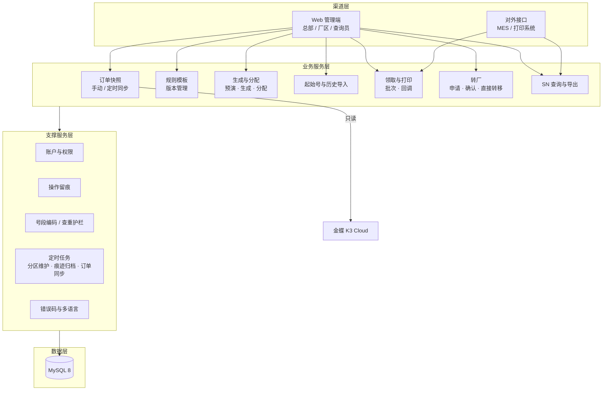
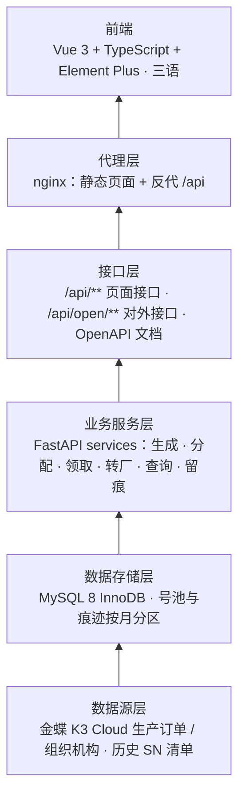
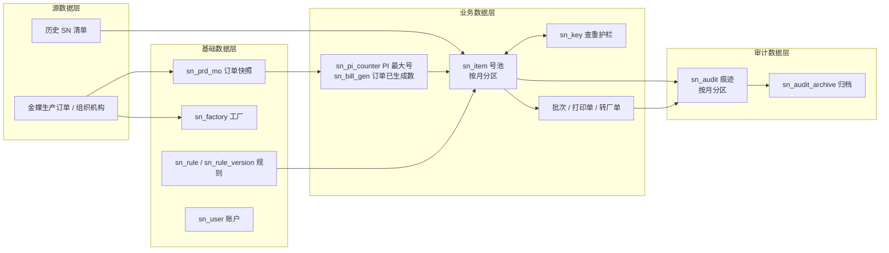
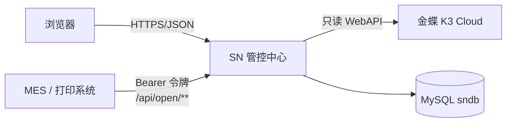
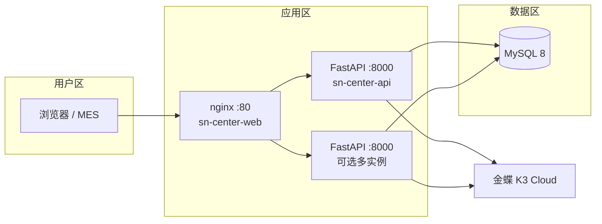
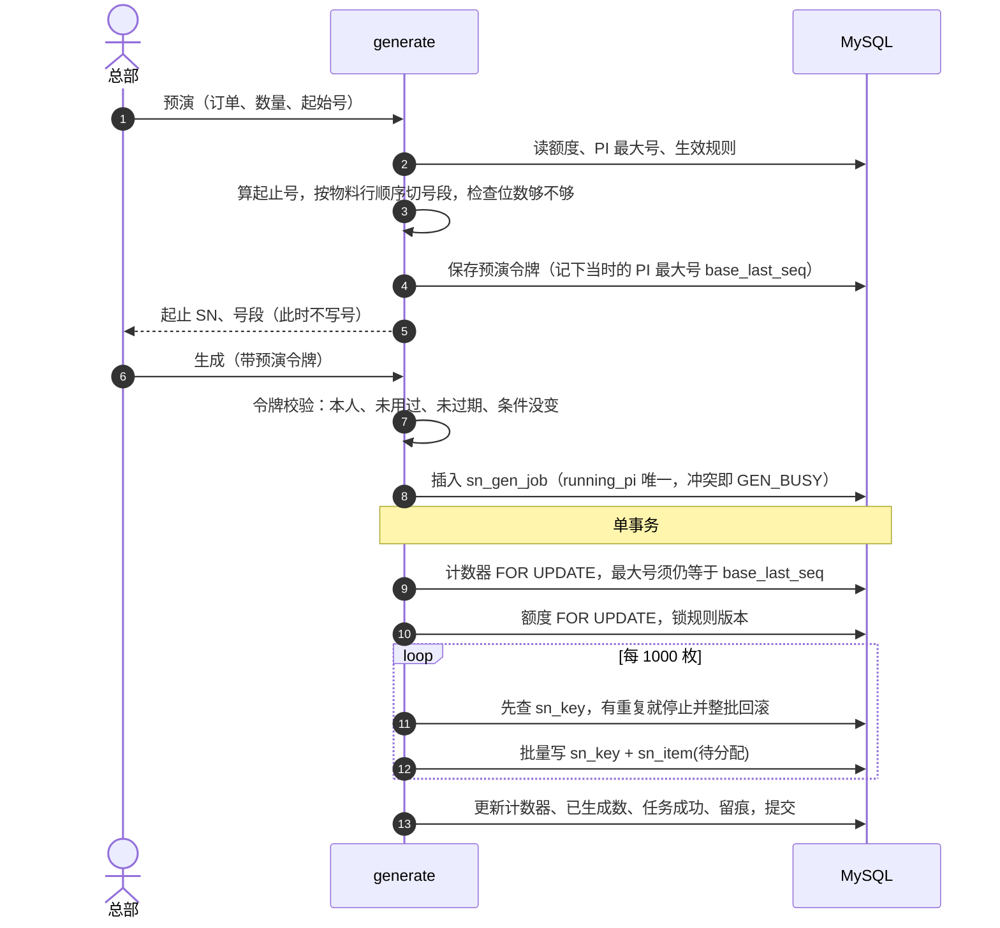

# 多工厂 SN 防重管控系统 · 技术方案

> 版本 V1.0

## 第一章 概述

### 1.1 定义

多工厂 SN 防重管控系统（下称「SN 管控中心」）：总部按金蝶生产订单统一生成 SN 并分配给工厂，工厂按 PI 整批领取、打印，号可以在工厂之间转移。系统保证**同一张 PI 下的 SN 不重复**，每一步操作都留痕。

| 术语 | 含义 |
| --- | --- |
| PI | 形式发票号，SN 挂在 PI 上，查重以 PI 为范围 |
| 生产订单 | 金蝶 `PRD_MO`，一张单一个 PI、一个生产组织（工厂）、多条物料行 |
| 规则 | 前缀 + 定长进制流水（10/16/32/36 进制）+ 后缀；有版本 |
| 流水归属 PI | 号是在哪张 PI 上生成的。转厂后号挂到新 PI，流水仍算原 PI 的 |
| 号池 / 护栏 | `sn_item` 存每枚号的状态；`sn_key` 存唯一键，负责查重 |

### 1.2 背景及目标

以前各工厂各自发号，同一张 PI 在不同厂可能出现重复 SN，而且发号、转厂都查不到记录。目标是：

1. **统一发号**：只有总部能生成，额度来自金蝶生产订单，不超发。
2. **防重**：同一 PI 完整 SN 不重复，PI 自己生成的流水不重复，并发生成与多实例部署下同样成立。
3. **全程可追溯**：生成、分配、领取、打印、转厂、账户、规则的操作（包括被拒绝的）都记痕迹。
4. **对接 MES / 打印系统**：提供幂等的领取接口和打印回调接口。
5. **容量**：约 400 万枚/月，3 年约 1.5 亿枚，痕迹至少保存 3 年。

### 1.3 设计原则

| 原则 | 本系统的做法 |
| --- | --- |
| 分层 | 路由（`api/routes`）→ 鉴权依赖（`api/deps`）→ 业务服务（`services`）→ 数据访问（`db`）；前后端分离 |
| 模块化 | 按业务拆服务模块：订单、规则、生成、领取、转厂、查询、留痕、分区；页面接口与对外接口复用同一段服务代码 |
| 配置化 | SN 规则由页面配置（编码参数、绑定对象、版本）；运行参数全部来自 `.env` / 环境变量 |
| 链路跟踪 | 每个请求带请求号 `X-Request-ID`（没有就生成），写进日志上下文和响应头 |
| 事务一致性 | 单体 + 单库，所有写操作走本地事务；幂等键 + 唯一键兜底，不引入分布式事务 |
| 监控 | 健康检查（存活 / 就绪）、结构化日志、操作痕迹，首页展示在途量与作业量 |

## 第二章 总体设计

### 2.1 功能架构

| 模块 | 职责 |
| --- | --- |
| 订单快照 | 把金蝶「计划 / 计划确认」的生产订单拉到本地，生成和领取只读本地快照 |
| 规则模板 | 通用 / 按客户 / 按 PI 三种绑定；用过的版本不改，改了就出新版本 |
| 生成与分配 | 按生产订单额度生成 SN，写入号池（待分配），然后整单分配到订单的生产组织（待领取） |
| 起始号与历史导入 | 每张 PI 首次生成前指定一次起始号；导入历史已发出的号参与查重 |
| 领取与打印 | 按「工厂 + PI」整批领取（待打印），页面打印或 MES 回调（已打印） |
| 转厂 | 工厂申请、总部确认 / 驳回、工厂撤回；总部可直接转移 |
| 查询 / 留痕 | 按范围查号、查痕迹、导出 xlsx / csv |

### 2.2 技术架构

自下而上分六层：

| 层 | 选型 | 说明 |
| --- | --- | --- |
| 数据源层 | 金蝶 K3 Cloud WebAPI | `LoginByAppSecret`、`ExecuteBillQuery`、`View`；只读，不回写金蝶 |
| 数据存储层 | MySQL 8.0，utf8mb4 | 编码类列用 `utf8mb4_bin`（区分大小写）；`sn_item`、`sn_audit` 按月分区；不建外键，引用关系由服务层在事务里保证 |
| 业务服务层 | Python 3.12、FastAPI、PyMySQL | 手写 SQL + 自建连接池；事务区分 REQUIRED（加入当前事务）/ REQUIRES_NEW（另开事务，用于失败留痕和生成进度） |
| 接口层 | FastAPI 路由 + pydantic | JSON snake_case；Bearer 令牌；错误统一为 `{code, message, params}` |
| 代理层 | nginx（Docker 部署） | 托管前端构建产物，反代 `/api`、`/health`、`/docs`；读超时 600 秒，上传上限 50 MB |
| 前端 | Vue 3、Vite、Element Plus、Pinia、vue-router、vue-i18n | 简体中文 / English / Tiếng Việt，按错误码显示当前语言 |
| 公共服务 | structlog、openpyxl、内置定时器 | 日志（生产环境单行 JSON）、流式导出、cron 定时任务（进程内线程） |

架构选型：按当前业务量和团队规模，采用**单体应用 + 单库**，不拆微服务，不引入网关、注册中心、消息队列、Redis。多实例并发安全靠数据库行锁、唯一键和 `GET_LOCK` 解决。

### 2.3 数据架构

| 数据层 | 内容 | 保存策略 |
| --- | --- | --- |
| 基础数据 | 订单快照、工厂、规则、账户 | 快照每次全量同步整表替换；其余长期保存，账户只停用不删除 |
| 业务数据 | 计数器、号池、护栏、批次、打印单、转厂单 | **永久保存**：已打印的号仍要查重、转厂、追溯；按月分区只为方便维护 |
| 审计数据 | 操作痕迹 | 在线默认 1095 天（`SN_AUDIT_RETENTION_DAYS`，0 表示永久），过期的整月转入归档表后删除该分区 |
| 临时数据 | 预演令牌 `sn_gen_preview` | 7 天后删除 |

**一枚号的数据流转**：金蝶订单 → 快照 → 预演（只计算，不落号）→ 生成（写 `sn_item` + `sn_key`，更新计数器和已生成数）→ 分配 → 领取（写批次）→ 打印 / 回调 → 需要时转厂（改挂 PI / 工厂，护栏同步迁移）。每一步写一条痕迹。

### 2.4 系统间关系

| 方向 | 对端 | 交互内容 | 约束 |
| --- | --- | --- | --- |
| 出站 | 金蝶 K3 Cloud | 登录，拉生产订单（全量分页 / 按单据），拉组织机构 | 只读；金蝶失败时本地快照不动 |
| 入站 | MES / 打印系统 | 登录、按 PI 整批领取、拉批次明细、打印回调、只读查号 | 不提供生成、分配、转厂接口；厂区账户只能操作本厂 |
| 入站 | 浏览器 | 全部页面操作 | 与对外接口分开路径，领取逻辑共用同一段代码 |

本系统不主动调用 MES。

### 2.5 部署与网络架构

- 网络分区：nginx 是唯一对外端口；api 容器端口不映射到宿主机，只给 nginx 访问；数据库只对应用服务器开放。
- 三种运行方式：
  | 方式 | 命令 | 适用 |
  | --- | --- | --- |
  | 单机 | `python start.py` / `start.bat` | 演示、小规模；Uvicorn 在 8000 端口同时提供页面和 API |
  | Docker | `docker compose up -d --build` | 服务器部署；`--profile mysql` 可顺带起一个本地 MySQL |
  | 开发 | `uv run uvicorn --reload` + `npm run dev` | 前端 5173 代理 `/api` 到 8000 |
- 多实例：应用无会话状态（令牌自包含），可以直接水平扩容。定时任务靠条件 UPDATE 或 `GET_LOCK` 保证同一时刻只有一个实例执行。例外是登录失败计数存在进程内存里，多实例时每个实例各算各的。

### 2.6 软硬件配置清单

**软件**

| 软件 | 版本 | 说明 |
| --- | --- | --- |
| Linux（CentOS / Ubuntu）或 Windows | — | 单机方式也支持 Windows |
| Python | 3.12+ | 后端运行时，依赖由 `uv.lock` 锁定 |
| FastAPI / Uvicorn | 锁定版本 | Web 框架 / ASGI 服务器 |
| PyMySQL、httpx、structlog、openpyxl | 锁定版本 | 数据库驱动、金蝶调用、日志、导出 |
| Node.js | 20+ | 仅构建前端 |
| nginx | alpine 镜像 | 前端托管与反代 |
| MySQL | 8.0 | InnoDB，时区 +08:00 |
| Docker / Docker Compose | v2 | 服务器部署 |

**硬件（建议值，按 3 年容量估算，可按实际业务量调整）**

| 服务器 | 数量 | CPU | 内存 | 磁盘 | 说明 |
| --- | --- | --- | --- | --- | --- |
| 应用服务器（nginx + api） | 1–2 | 4C | 8 GB | 100 GB | 两台时前面挂负载均衡 |
| 数据库服务器 | 1（建议主从） | 8C | 16–32 GB | SSD 500 GB | 号池 3 年约 90–120 GB，加上索引、痕迹和备份余量 |

## 第三章 系统功能设计

### 3.1 角色与权限

| 能力 | 系统管理员（总部） | 厂区操作员（绑厂） | 查询员（可绑厂） |
| --- | --- | --- | --- |
| 账户、工厂、规则、订单同步 | ✔ | | 订单只读 |
| 起始号、生成、分配 | ✔ | | |
| 领取、打印 | ✔ 可代任一工厂 | ✔ 本厂 | 只读 |
| 转厂申请 / 撤回 | | ✔ 本厂 | 只读 |
| 转厂确认 / 驳回 / 直接转移 | ✔ | | |
| SN 查询、痕迹 | 全部 | 本厂（可只读看同 PI 各厂） | 不绑厂看全部，绑厂只看本厂 |

权限在 `api/deps` 统一校验：令牌 → 账户是否停用 → 是否必须先改密 → 角色 → 工厂范围（`write_factory` / `read_factory`）。

### 3.2 订单快照同步

- **全量同步**：先分页（每页 2000 行）把金蝶的计划 / 计划确认订单全部拉完，再在一个事务里清空旧快照、写入新快照。任一页失败就整次放弃，所以快照不会出现空窗期。
- **按单据同步**：用 `View` 只替换这一张单。金蝶查不到这张单时，把它从快照删掉；已经生成的号不受影响。
- **定时全量同步**：设置保存在 `sn_order_sync_schedule`（只有一行）。后台线程每 30 秒执行一次 `UPDATE … WHERE enabled=1 AND next_run_at<=now`，改到这一行的实例负责这次执行，多实例下同一周期只跑一次。间隔 10 分钟到 7 天。
- 生产组织按**名称**对应 `sn_factory`；组织机构同步失败只记警告，不回滚订单快照。

### 3.3 规则与编码

- 完整 SN = 前缀 + 定长进制流水（左侧用字符表首字符补齐）+ 后缀，总长不超过 64；流水位数 1–12。
- 生效规则的优先级：**按 PI 绑定 > 按客户绑定 > 该 PI 首次生成时选定的规则**。没有绑定时由用户选模板，选过之后这张 PI 一直沿用。
- 版本：只改名称不出新版本；还没用过的版本直接修改；已经用过的版本另出一版。生成时锁定版本并标记为已使用。

### 3.4 生成与分配（核心）

**额度与起点**

- 订单额度 = 快照中该单各物料行数量之和 − `sn_bill_gen.generated_qty`，不用 `COUNT(*)` 扫号池。
- 起点 = max(本 PI 最大号, 转入本 PI 的号按当前规则解析出的最大流水) + 1。这样转入的号不会让本 PI 生成时撞号。首次生成可以指定起始号，指定后锁定。

**预演 → 生成 两步走**

- 超过 5000 枚（`SN_GEN_SYNC_THRESHOLD`）改为后台任务，页面每秒轮询进度；进度用独立事务提交。
- 遇到重复号直接停止，不自动跳号，整批回滚。
- **分配**：整单分配到订单的生产组织（分配到别的厂返回 `ALLOC_FACTORY_MISMATCH`），按十进制流水顺序把待分配改为待领取。

### 3.5 领取、打印与对外接口

- **领取**：按「工厂 + PI」把全部待领取改为待打印，并生成批次号。`(factory_code, request_no)` 有唯一键，用同一个请求号重复调用会返回原批次，不会再改任何号。没有可领的号返回 `ACQ_NOTHING`，不会留下空批次。领取要求 PI 仍在快照中（`SN_ACQUIRE_REQUIRE_SNAPSHOT`）。
- **页面打印**：生成打印单，把待打印改为已打印，打印文件（xlsx / csv）边读边写，不整体加载到内存。
- **MES 流程**：登录 → `POST /api/open/acquire` → 分页拉 `GET /api/open/batches/{batch_no}/items` → 打印 → `POST /api/open/callback`（SN 清单或起止号）。
- **回调**：只把「本厂 + 本批 + 待打印」的号改为已打印。已经是已打印的计入 `already_printed`；申请中、已转走、不在本批的放进 `skipped` 并写明原因。

### 3.6 转厂

| 操作 | 谁 | 处理 |
| --- | --- | --- |
| 申请 | 厂区 | 选范围（整张 PI / PI + 物料 / 单枚 SN），在转入 PI 下查重（有重复就整次拒绝）；号改为申请中，原状态记在 `prev_status` |
| 撤回 / 驳回 | 厂区 / 总部 | 恢复原状态 |
| 确认 | 总部 | 锁转入 PI 的计数器（与生成互斥），再查一次重，迁移护栏，号改挂到新 PI / 工厂，状态改为待领取，清空批次和打印单 |
| 直接转移 | 总部 | 选号、查重、改挂在同一个事务里完成 |

- 流水归属不变，也不抬高转入 PI 的计数器。如果转入的号会让转入 PI 的下一个号往后移，只给出提示（`target_hint`）。
- 已打印的号转厂后变成待领取，需要重新打印；转出厂仍能查到这些号，显示为「已转出」。

### 3.7 账户与认证

- 口令用 PBKDF2-SHA256（12 万轮，随机盐）；令牌用 HMAC-SHA256 签名，默认 12 小时有效，里面带口令版本号，改密或重置后旧令牌立即失效。
- 首次登录必须改密；口令 8–64 位，须同时含字母和数字；账户只停用不删除。
- 防暴力破解：同一工号连续失败 5 次锁定 15 分钟（可配置）。工号不存在时也照样算一次口令，避免从响应时间判断工号是否存在。
- 生产环境下 `SN_SECRET` 为空、为示例值或不足 32 位时拒绝启动。

### 3.8 查询、导出与留痕

- 查询按角色自动加工厂范围；列表总数最多数到 10 万（`total_capped`），导出按主键游标每次读 5000 行，上限 100 万。
- 导出防公式注入：XLSX 的文本一律按字符串写入；CSV 中以 `= + - @`、制表符、回车开头的内容前面加 `'`。
- 痕迹记录来源（页面 / 接口）、PI、工厂、号段 / 数量、前后状态、批次 / 请求号 / 原因。被拒绝的写操作也记为 `FAIL`，用独立事务写入，业务回滚后痕迹仍保留。

## 第四章 系统非功能设计

### 4.1 外部集成设计

| 对象 | 方式 | 容错 |
| --- | --- | --- |
| 金蝶 | 每次调用前先 `LoginByAppSecret` 登录，会话放在 Cookie 里；httpx 直连，不走系统代理 | 超时：登录 30 秒 / 查询 120 秒 / View 60 秒；失败返回 502 `K3_*`，本地数据不动 |
| MES | REST + Bearer 令牌；契约在 OpenAPI 的 `open` 分组 | 领取按请求号幂等，超时后用原请求号重试；回调按状态做条件更新，重复回调不会有副作用 |

### 4.2 部署设计

- 镜像：api（`python:3.12-slim`，多阶段构建，非 root 用户运行）+ web（nginx）；web 等 api 健康检查通过后才启动。
- 数据库迁移：启动时执行 `V1__init.sql`，版本记在 `flyway_schema_history`（与 Flyway 兼容）；已有表的库用 `DB_BASELINE_ON_MIGRATE` 做基线。
- 启动任务依次为：检查密钥 → 建表 → 回收中断的生成任务 → 分区维护 → （演示环境）灌入演示数据 → 启动定时线程。
- 配置：全部来自 `.env` / 环境变量，模板为 `.env.example`；`.env` 不提交到仓库。

### 4.3 自检自测设计

- 健康检查：`/health/live`（进程存活）、`/health/ready`（包括数据库连通），供容器健康检查和负载均衡使用。
- 自动化测试：`uv run pytest` 启动完整应用，连真实 MySQL 和本地假金蝶，覆盖账户、快照、生成（并发、重号、容量、中断回收）、分配、领取幂等、回调、转厂、范围、分区归档、安全项；连不上 MySQL 时自动跳过。前端用 `node --test` 检查辅助函数和三种语言的词条是否齐全。
- 代码检查：`ruff`。

### 4.4 异常处理设计

| 层面 | 处理 |
| --- | --- |
| 统一错误码 | `ErrorCode` 枚举（约 100 个）集中定义 HTTP 状态和中文模板；业务代码只抛 `BizError`；前端按 `code` 显示三种语言 |
| 统一异常映射 | 参数校验错误 → 422 `VALIDATION`；死锁 / 锁等待超时 / 约束冲突 → 409 `CONFLICT_RETRY`（可重试）；字段超长 → 422；未知异常 → 500，日志里带请求号 |
| 失败留痕 | 写请求失败时读取缓存的请求体（≤ 64 KB），用独立事务记一条 FAIL 痕迹 |
| 补偿机制 | ① 生成任务的状态和号在同一事务提交；② 启动时用 `FOR UPDATE NOWAIT` 探测，把中断留下的 `RUNNING` 任务标为失败并释放 PI，还在生成的跳过；③ 金蝶失败时快照不动，下个周期再试；④ 领取按请求号幂等，可以安全重试 |

### 4.5 监控与日志

- 日志：structlog，每行都带 `request_id`；生产环境输出单行 JSON，可以直接接入 ELK / Loki 等日志平台。
- 业务监控：首页展示各状态在途数量、待处理转厂、今日作业量、最近的生成任务；订单页展示定时同步的最近结果。
- 运维监控：容器健康检查；服务器 CPU、内存、磁盘和 MySQL 由现有运维监控平台接入（本系统不自带）。

### 4.6 事务与并发设计

| 场景 | 手段 |
| --- | --- |
| 同一 PI 并发生成 | `sn_gen_job.running_pi` 唯一键 + 计数器 `FOR UPDATE` + 预演时记下的最大号核对 |
| 防重 | `sn_key` 主键 `(pi_no, sn)` + 唯一键 `(seq_pi_no, seq_dec)`；生成、导入、转厂确认都在事务里写入 |
| 额度不超发 | `sn_bill_gen` 行锁后校验、累加 |
| 转厂与生成互斥 | 转厂确认时锁转入 PI 的计数器行 |
| 领取 / 回调 | 请求号唯一键；按状态做条件 UPDATE，并核对影响行数 |
| 分区 DDL / 定时同步 | `GET_LOCK('sn_partition')` / 条件 UPDATE 抢执行权 |
| 事务传播 | 连接放在 contextvar 中；`tx()` 加入当前事务，`new_tx()` 另开事务（失败痕迹、进度） |

### 4.7 性能与容量

| 指标 | 设计 |
| --- | --- |
| 容量 | 约 400 万枚/月，3 年约 1.5 亿枚；`sn_item` 按月分区，约 3 GB/月 |
| 生成吞吐 | 每 1000 枚一块，先查重再批量插入（`rewriteBatchedStatements`）；POC 实测 100 万枚约 34 秒 |
| 响应 | 5000 枚以内同步返回，更多转后台任务；额度和最大号直接读计数行，不扫号池 |
| 查询 | 不做深分页，列表总数封顶 10 万；导出按游标流式输出 |
| 连接池 | 默认 20（`DB_POOL_SIZE`） |
| 分区维护 | 启动时和每天 02:10 预建当月及以后 3 个月的分区；过期痕迹整月归档后 `DROP PARTITION` |
| 扩展 | 应用无状态，可水平扩容；数据库可按月把冷分区迁到归档库（`EXCHANGE PARTITION`） |

## 附：主要配置项

| 变量 | 默认 | 说明 |
| --- | --- | --- |
| `DB_URL` / `DB_USER` / `DB_PASSWORD` / `DB_POOL_SIZE` | — / appuser / — / 20 | 数据库连接 |
| `SN_SECRET` | — | 令牌签名密钥，生产环境至少 32 位 |
| `SN_LOGIN_MAX_FAILURES` / `SN_LOGIN_LOCK_MINUTES` | 5 / 15 | 登录失败锁定 |
| `SN_GEN_SYNC_THRESHOLD` / `SN_PREVIEW_TTL_MINUTES` | 5000 / 30 | 超过即转后台生成 / 预演有效期 |
| `SN_ACQUIRE_REQUIRE_SNAPSHOT` | true | 领取时 PI 须在快照中 |
| `SN_AUDIT_RETENTION_DAYS` | 1095 | 痕迹在线保存天数，0 表示永久 |
| `SN_PARTITION_AHEAD_MONTHS` / `SN_PARTITION_CRON` | 3 / `0 10 2 * * *` | 分区维护 |
| `SN_IMPORT_MAX` / `SN_CALLBACK_MAX` / `SN_EXPORT_LIMIT` | 50 万 / 20 万 / 100 万 | 单次导入 / 回调 / 导出上限 |
| `K3_*` | — | 金蝶地址、账套、AppId、AppSecret、用户名、超时 |
